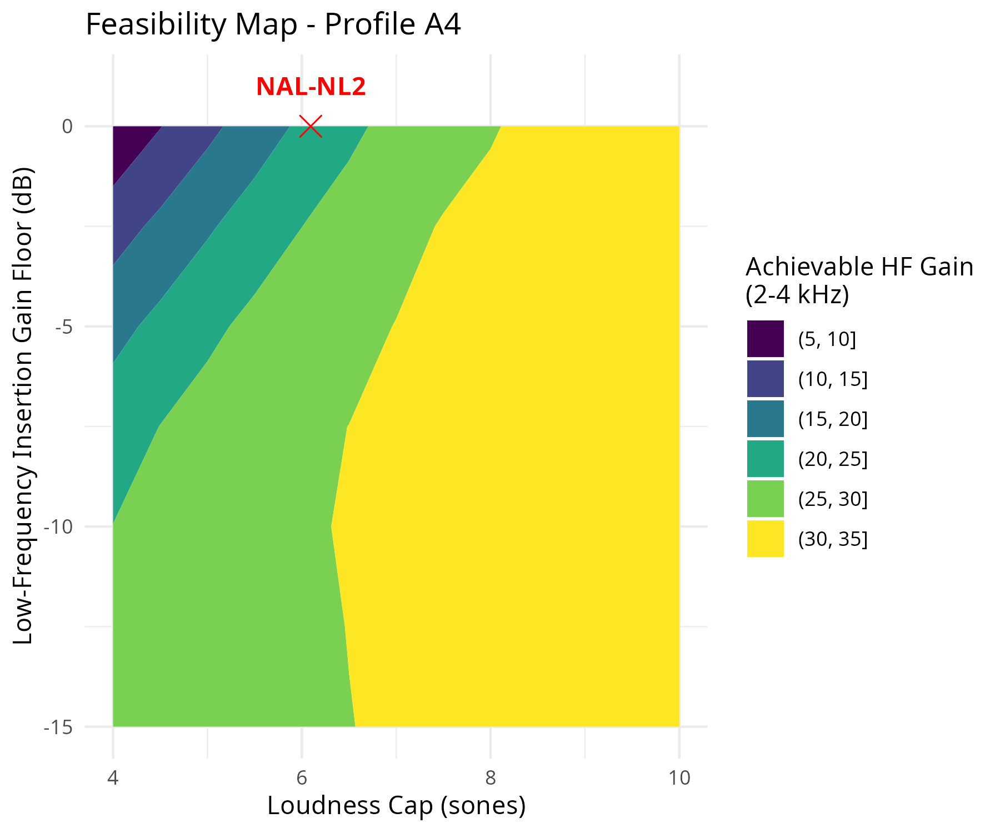
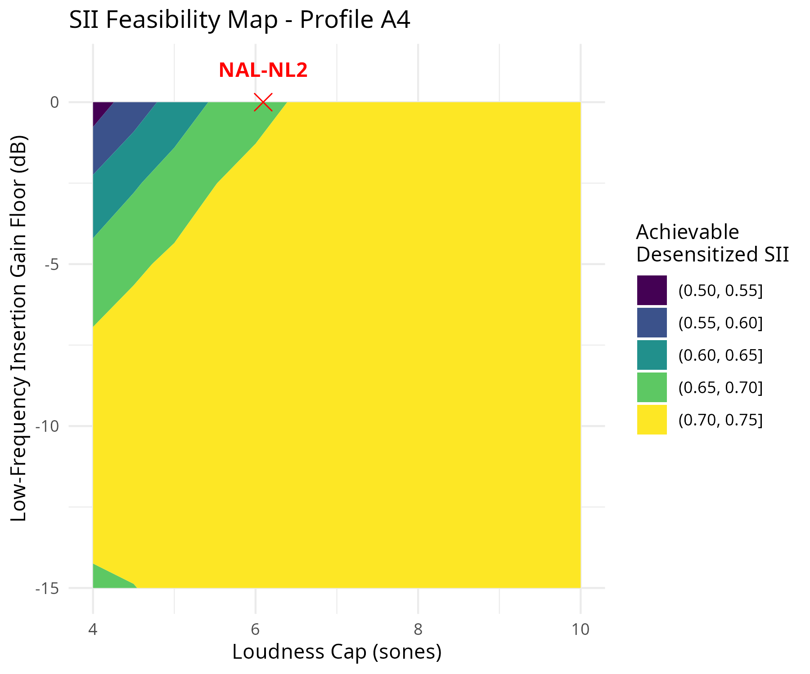
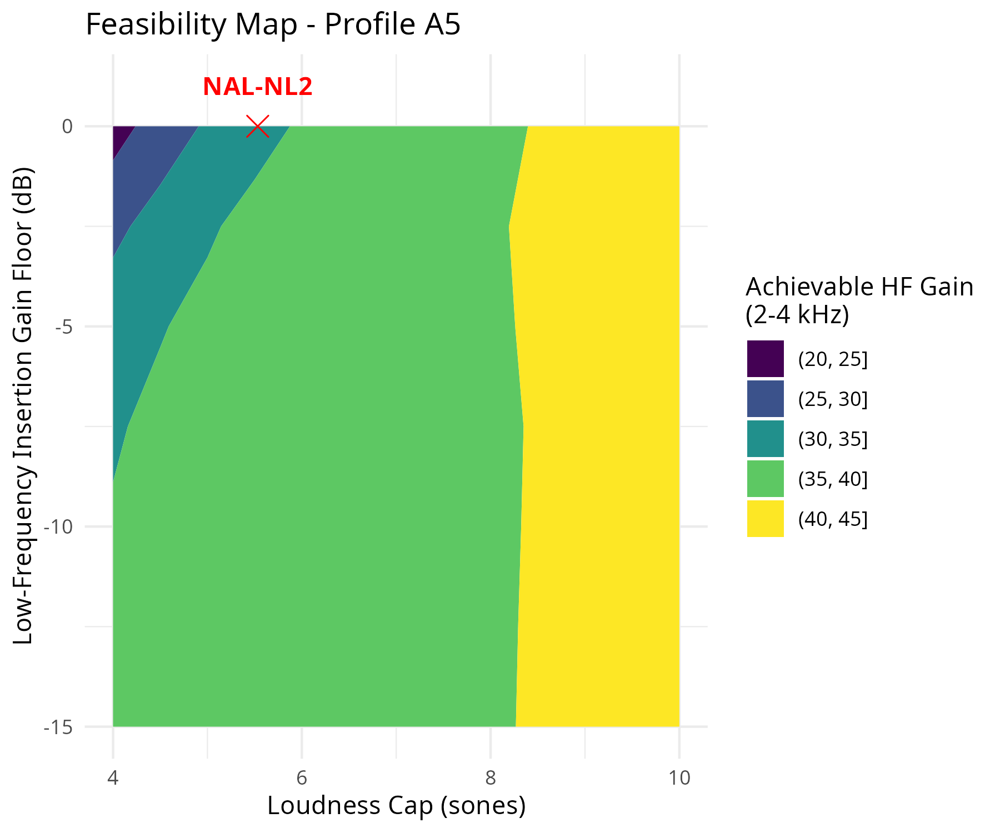
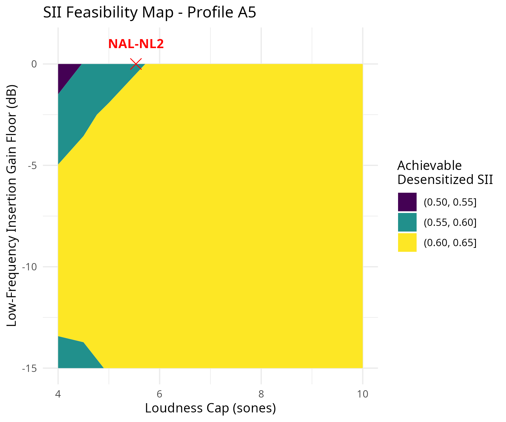

\linenumbers

## Abstract

**Background:** In precipitous high-frequency hearing loss, achieving sufficient audibility in the high frequencies is notoriously difficult. Historically, this limitation has been attributed to the choice of prescriptive fitting rationale or inherent physiological damage. 

**Purpose:** This study proposes an alternative explanation based on loudness budget arithmetic: unamplified speech energy in the residual normal-hearing low frequencies inherently consumes the majority of the patient's acceptable loudness budget, reducing the available capacity for the profoundly impaired high frequencies to achieve audibility.

**Research Design:** A computational modeling study using the AUDMOD specific-loudness model [@bramslow1993; @bramslow2004] alongside the Speech Intelligibility Index (SII) [@ansi1997].

**Study Sample:** N/A (Computational modeling of seven standardized, hypothetical audiometric profiles).

**Data Collection and Analysis:** The loudness budget is decomposed for seven canonical profiles at an average conversational speech level (65 dB SPL). Two-dimensional "feasibility maps" were generated to model achievable 2–4 kHz gain as a function of an absolute loudness cap ($L_{cap}$) and a low-frequency insertion gain floor. Finally, existing empirical formulae (NAL-NL2) and a constrained intelligibility maximizer (Open-NL) were evaluated against this feasibility frontier.

**Results:** For profiles with near-normal low-frequency hearing, unamplified speech already produces a substantial quantity of loudness ($L_0$) through residual hearing. When low-frequency insertion gain is floored at 0 dB, $L_0$ cannot be reduced, thus predetermining the remaining budget ($L_{cap} - L_0$). Feasibility maps quantify the magnitude of this trade-off, demonstrating that maximizing high-frequency gain under a typical loudness constraint necessitates active low-frequency attenuation (venting or negative insertion gain).

**Conclusions:** Loudness crowding-out is not unique to precipitous losses, but is a general structural boundary for any profile combining robust low-frequency hearing with recoverable high-frequency loss. Achieving theoretical SII maximums for these profiles physically requires intolerable low-frequency occlusion, highlighting the necessity of frequency-lowering signal processing.

## Introduction

In the fitting of precipitous or profound high-frequency hearing loss, achieving adequate high-frequency audibility without exceeding normative loudness targets is a central clinical challenge. Historically, the failure to restore high-frequency audibility has been attributed to the inherent physiological damage of the auditory periphery—specifically, hearing-loss desensitization and dead regions, which render severe high-frequency amplification effectively useless for speech recognition [@ching1998; @hogan1998]. Consequently, modern prescriptive rationales like NAL-NL2 deliberately limit high-frequency gain for profound thresholds to avoid prescribing "wasted" amplification. 

While desensitization dictates the *utility* of high-frequency gain, it is proposed that the fundamental arithmetic of broadband loudness summation acts as a parallel, independent structural constraint on the *capacity* to provide that gain. For a given audiogram and input level, unamplified speech inherently produces a baseline quantity of loudness ($L_0$) through residual hearing. If a patient's overall target loudness is constrained by a normative ceiling ($L_{cap}$), the model-predicted loudness budget available to "purchase" high-frequency audibility via prescriptive gain is defined as $L_{cap} - L_0$. Because this relationship is governed entirely by the auditory periphery and the acoustic speech spectrum, it acts as a fundamental boundary condition that profoundly constrains loudness-based rationales (e.g., NAL-NL2) and any theoretical attempt at intelligibility maximization.

While patient preference and some audiological paradigms often favor preserving or amplifying low-frequency cues in profound loss because they are the only remaining regions of robust functional hearing, the standard ANSI S3.5-1997 Speech Intelligibility Index (SII) assigns the bulk of its importance weighting to the 1-4 kHz speech bands, with relatively little weight applied below 500 Hz. Consequently, an unconstrained intelligibility-maximizing algorithm operating under a strict loudness budget will systematically attenuate low-frequency audibility to fund high-frequency gain. While it is a mathematical axiom that relaxing a constraint in an optimization algorithm yields a higher theoretical optimum, the clinical relevance lies in quantifying the sheer magnitude of this trade-off for realistic audiometric profiles. By framing this behavior as an efficiency statement relative to an absolute budget, this analysis quantifies the exact degree to which "broadband loudness crowding-out" limits high-frequency restoration, investigating whether it is uniquely tied to precipitous losses or represents a general property of near-normal low-frequency hearing.

## Methods

### The AUDMOD Specific-Loudness Model
To isolate the model-predicted loudness constraints operating on the speech spectrum, the canonical AUDMOD specific-loudness model was utilized the canonical AUDMOD specific-loudness model. This model converts acoustic excitation patterns into specific loudness (sones/ERB) and integrates them across the frequency spectrum to predict overall broadband loudness. By benchmarking the raw, unamplified long-term average speech spectrum (LTASS) through this model using the seven standard hypothetical audiometric profiles established by Johnson and Dillon [@johnson2011], the baseline loudness ($L_0$) natively generated by residual hearing was established the baseline loudness ($L_0$) natively generated by residual hearing.

### Study Sample and Audiometric Profiles
The study utilizes seven canonical audiometric profiles (A1–A7) representing standard clinical configurations (Table 3). For profiles A6 (Mixed) and A7 (Conductive), the conductive air-bone gap component is modeled in the AUDMOD specific-loudness engine as a linear attenuation block that strictly subtracts from the aided speech spectrum before it enters the cochlear simulation.

**Table 3. Canonical Audiometric Profiles (dB HL)**

| Profile | Description | 250 Hz | 500 Hz | 1000 Hz | 2000 Hz | 4000 Hz | 8000 Hz | Air-Bone Gap |
|:---|:---|---:|---:|---:|---:|---:|---:|---:|
| A1 | Mild | 15 | 20 | 30 | 40 | 50 | 60 | 0 |
| A2 | Reverse Slope | 60 | 50 | 40 | 30 | 20 | 15 | 0 |
| A3 | Moderate Sloping | 10 | 20 | 40 | 50 | 55 | 60 | 0 |
| A4 | Mod-Severe Precipitous | 0 | 0 | 10 | 40 | 70 | 80 | 0 |
| A5 | Profound Precipitous | 10 | 10 | 20 | 60 | 80 | 100 | 0 |
| A6 | Mixed | 50 | 55 | 60 | 65 | 75 | 80 | 30 |
| A7 | Conductive | 50 | 50 | 50 | 50 | 50 | 50 | 50 |

### The Open-NL Computational Instrument
To compute the theoretical limits of high-frequency amplification and map the boundary of achievable gain, Open-NL, a modular computational testbed, was employed Open-NL, a modular computational testbed. Open-NL couples a multi-start Nelder-Mead SII optimizer to the specific-loudness engine. Rather than serving as a clinical prescription, Open-NL functions here strictly as an analytical instrument. 

For the purposes of this study, all input speech was calibrated to the standard ANSI S3.5-1997 Long-Term Average Speech Spectrum (LTASS). Because the analysis focuses entirely on average conversational speech, the Wide Dynamic Range Compression (WDRC) capabilities of Open-NL were bypassed, reducing the optimizer to a single-level linear insertion gain solver at 65 dB SPL. 

The optimizer was subjected to a global minimum insertion gain constraint across all frequency bands (the `vent_floor` parameter). While mathematically enforced as a global floor, the penalized-optimal high-frequency gain for these profiles is strictly positive; thus, the floor acts exclusively as a ceiling on low-frequency attenuation. Baseline clinical targets were generated using NAL-NL2 Version 2 software at 65 dB SPL for a symmetrical, bilateral fitting for an experienced user of unknown gender. To isolate the rationale's fundamental prescription for the audiogram from the secondary acoustic effects of venting, the targets were intentionally generated using a fully occluded (#13 tubing) coupling rather than an open fitting. While an open fitting is the clinical standard of care for these profiles, generating NAL-NL2 targets with an open coupling instructs the software to automatically cut low-frequency prescribed gain. Utilizing an occluded setting ensures the baseline targets reflect the rationale's true theoretical intent. However, it must be noted that because NAL-NL2 was parameterized for a bilateral fitting, the rationale automatically applied a binaural loudness correction that systematically lowers prescribed gain. Because the computational instruments utilized in this analysis are strictly monaural, this introduces a methodological mismatch. While this binaural correction contributes slightly to NAL-NL2's lower overall predicted loudness, the magnitude of the discrepancy is small relative to the structural boundaries of the $L_{cap} - L_0$ budget.

### C++ Instrument Validation
Because Open-NL evaluates tens of thousands of candidate gain curves during optimization, evaluating loudness via external Python or MATLAB calls introduces prohibitive computational overhead. To achieve microsecond evaluation times, the AUDMOD specific-loudness engine (AMT 1.6.0 bramslow2004) was ported entirely to C++ using `Rcpp`. 

<!-- TO BE REPLACED: obsolete validation, old engine and mismatched inputs. Do not edit; awaiting new end-to-end results. -->
To validate this stationary implementation, a Bland-Altman cross-validation was performed against the Auditory Modeling Toolbox (AMT) [@majdak2022] implementation of `bramslow2004` [@bramslow2004]. The Bramslow (2004) model is a recognized, time-domain digital filterbank adaptation of the Moore and Glasberg (2004) framework. The validation sweep compared unamplified speech loudness ($L_0$) for the five sensorineural profiles (A1–A5) across 9 input levels from 50 to 90 dB SPL in 5 dB increments. The mixed and conductive profiles (A6 and A7) were excluded from this validation because the AMT reference implementation lacks an explicit air-bone gap parameterization.

![Figure 1. Log-transformed (ratio-based) Bland-Altman plot comparing the C++ engine against AMT's dynamic time-domain simulation (`bramslow2004`). The central dashed line indicates the mean ratio (1.004), and dotted lines indicate the 95% Limits of Agreement [0.90, 1.13].](figures/Figure4_BlandAltman_New.png)

As shown in Figure 1, the cross-validation yielded a back-transformed geometric mean ratio of 1.004 (indicating a negligible overall mean bias of +0.4%), with 95% Limits of Agreement (LoA) spanning from 0.90 to 1.13 (indicating worst-case bounds of roughly -10% to +13% error relative to the time-domain reference). The Bland-Altman plot reveals systematic bias between the implementations: the disagreement is most pronounced in the 2–6 sone range (precisely where the unamplified $L_0$ values of the precipitous profiles lie in this study) and varies by audiometric profile.

This worst-case error margin must be carried into the budget calculations. For profile A4, applying the maximum +13% upper bound of the 95% LoA to the 5.21 sone $L_0$ estimate yields a potential worst-case fluctuation of nearly 0.7 sones. While this represents a substantial fraction of the remaining 1.79 sone budget, propagating this extreme error bound does not alter the macroscopic structural conclusion: even in the worst-case scenario, the precipitous profiles remain severely constrained for loudness capacity compared to the mild and moderate baseline profiles. The divergence at these extremes simply reflects the inherent mathematical differences between a stationary power-spectrum integration (Open-NL) and a dynamic time-domain filterbank simulation (`bramslow2004`).

### Optimization Procedure and Grid Parameters
To construct the feasibility maps, the Open-NL optimizer was evaluated across a discretized grid spanning loudness caps from 4.0 to 9.0 sones (0.1 sone intervals) and low-frequency insertion floors from 0 to -15 dB (2.5 dB intervals). The underlying optimization routine utilized a Nelder-Mead simplex algorithm to fit a 3-parameter non-stationary gain curve (anchor gain, slope trigger, and bypass slope). 

The solutions generated are penalized-optimal rather than strictly SII-optimal. Specifically, the optimizer maximizes a nine-term penalized objective function, not raw SII. The objective consists of the SII (scaled by 100) minus eight penalty terms: an anchor penalty (`sum(abs(shifts)) * 0.1`) which acts as an L1 shrinkage toward the Open-NL heuristic prescription, a roughness penalty (`sum(diff(gain_oct)^2) * 0.001`), a loudness hinge penalty scaled at 2000 per sone over the cap, and additional out-of-bounds, SPL, order, compression ratio (CR), and air-bone gap (ABG) terms (see `R/open_nl.R` lines 268-284).

Because Nelder-Mead algorithms are prone to local minima in highly constrained, non-convex acoustic spaces, the maps exhibit minor optimization artifacts. For instance, in the A5 map, there is an isolated region of non-convergence near 8.0 sones, and occasional localized inversions (e.g., slightly lower gain achieved at a -10 dB floor compared to a -5 dB floor at strict caps). These artifacts represent local failures of the 3-parameter solver to perfectly converge on the absolute global optimum, rather than true physiological inversions. To mitigate this across the dataset, multi-start initialization was employed across a bounded parameter grid, and the highest achieved SII value was retained.

Additionally, the number of random restarts (`open_nl_starts`) is a fixed setting (set to 3) whose value alters the prescribed gains due to the non-convex parameter space. (Note that because the random number generator seed is deterministic based on the audiogram and level, repeated runs are bit-identical and cannot be used to estimate variability.)

## Results

### Loudness Budget Decomposition
To establish the model-predicted loudness constraints operating on high-frequency amplification, the unamplified loudness ($L_0$) produced by speech across three conversational input levels (50, 65, and 80 dB SPL) was first computed the unamplified loudness ($L_0$) produced by speech across three conversational input levels (50, 65, and 80 dB SPL). This baseline was then compared against a normative broadband loudness ceiling ($L_{cap}$) for each level. 

To avoid arbitrary definitions of tolerance, the normative target ceilings ($L_{cap}$) are strictly defined as the normal-hearing loudness of unaided speech at the evaluation level. When the 50, 65, and 80 dB SPL long-term average speech spectra are processed through the specific-loudness engine for a 0 dB HL profile, the model predicts overall loudnesses of 1.21, 6.81, and 20.52 sones, respectively. For the purposes of baseline comparison, the normative target ceilings $L_{cap}$ are defined as 1.21, 7.00, and 20.52 sones. These ceilings are identical for all listeners and are not listener-specific. The difference ($L_{cap} - L_0$) therefore represents the remaining model-predicted loudness budget available to "purchase" high-frequency audibility via prescriptive gain before exceeding normal-hearing loudness limits.

Table 1 presents this decomposition for the seven canonical audiometric profiles. For mild (A1) or moderate sloping (A3) profiles, unamplified speech consumes a minority of the normative loudness budget across all levels. This leaves ample capacity for prescriptive algorithms to apply positive insertion gain across the frequency spectrum. 

**Table 1. Loudness Budget Decomposition (Sones) across Audiometric Profiles at 50, 65, and 80 dB SPL**

| Profile | Description | $L_0$ (50) | $L_{cap}$ (50) | $L_0$ (65) | $L_{cap}$ (65) | $L_0$ (80) | $L_{cap}$ (80) |
|:---|:---|:---|:---|:---|:---|:---|:---|
| A1 | Mild | 0.39 | 1.21 | 2.71 | 7.00 | 9.55 | 20.52 |
| A2 | Reverse Slope | 0.03 | 1.21 | 1.31 | 7.00 | 6.67 | 20.52 |
| A3 | Moderate Sloping | 0.46 | 1.21 | 2.46 | 7.00 | 8.62 | 20.52 |
| A4 | Mod-Severe Precipitous | 1.11 | 1.21 | 5.21 | 7.00 | 15.26 | 20.52 |
| A5 | Profound Precipitous | 0.92 | 1.21 | 4.26 | 7.00 | 12.45 | 20.52 |
| A6 | Mixed | 0.00 | 1.21 | 0.00 | 7.00 | 0.14 | 20.52 |
| A7 | Conductive | 0.00 | 1.21 | 0.00 | 7.00 | 0.00 | 20.52 |

However, a severe structural bottleneck emerges in precipitous profiles (A4 and A5) across the entire dynamic range. For profile A4, near-normal low-frequency thresholds allow unamplified speech at 50 dB SPL to inherently generate 1.11 sones of loudness. Against the normative 1.21 sone ceiling, this leaves only a microscopic 0.10 sones of budget for amplification. At 80 dB SPL, the unamplified speech produces 15.26 sones against a 20.52 cap. Crucially, if a prescriptive formula enforces a rigid low-frequency insertion gain floor of 0 dB (preventing attenuation), these $L_0$ values cannot be reduced. The budget is thus exhausted before the algorithm can allocate the immense high-frequency gain required to cross the profound high-frequency thresholds, causing high-frequency audibility to be systematically crowded out by residual low-frequency hearing at all input levels.

### Feasibility Maps

Because true loudness discomfort or target loudness can vary significantly across individual patients and fitting rationales, analyzing a single fixed normative cap for 65 dB SPL speech (e.g., 7.00 sones) fails to capture the full optimization boundary. To address this, the loudness cap ($L_{cap}$) is re-conceptualized not as a fixed assumption, but as a continuous axis.

Figure 2 and Figure 3 present "Feasibility Maps" for the precipitous profiles A4 and A5, respectively. Rather than plotting absolute maximum achievable gain, these contour plots map the 2-4 kHz high-frequency gain of the *penalized-optimal solution* as a two-dimensional surface over the absolute loudness cap (X-axis) and the low-frequency insertion gain floor (Y-axis, extending down to -15 dB). To visualize the behaviorally realistic intelligibility impact, corresponding maps plotting the maximum achieved desensitized SII (applying the complete Johnson and Dillon (2011) penalty) across the same grid are also provided.

For these steeply sloping profiles, the contour gradient visualizes the structural interaction between the available budget and the low-frequency floor. As seen in the A5 map (Figure 3A), when the loudness cap exceeds approximately 6.0 sones, the contours become primarily vertical, indicating that the overall loudness budget is sufficiently large that the low-frequency floor is no longer a binding constraint; the optimizer simply reaches the upper gain bounds permitted by its internal parameterization (a saturation ceiling of roughly 45 dB of high-frequency gain for A5). 

However, at the stricter normative caps targeted by clinical rationales, the floor effect becomes highly binding. To quantify this magnitude, specific coordinates can be extracted from the A4 feasibility map. If a patient's target loudness is constrained specifically to NAL-NL2's baseline of 6.09 sones, restricting the insertion floor to 0 dB limits the maximum theoretical penalized-optimal 2–4 kHz gain to 21.3 dB. Relaxing the floor to -10 dB frees up enough model-predicted loudness capacity to push the penalized-optimal high-frequency gain to 29.9 dB—an increase of over 8 dB in the critical speech bands.

By relaxing the floor toward -10 or -15 dB (moving downward on the Y-axis), the optimizer is permitted to actively suppress the normal-hearing low frequencies. This suppression frees up loudness capacity, allowing the solver to prescribe substantially more high-frequency gain before hitting the target loudness cap.

When standard NAL-NL2 targets are projected onto these maps, the resulting dynamics align perfectly with physiological expectations. For profile A4 (Figure 2A), NAL-NL2 targets a loudness of 6.09 sones with an effective floor of exactly 0.0 dB at 250 and 500 Hz, and prescribes an average of 17.2 dB of 2-4 kHz insertion gain. This point sits inside the absolute efficiency frontier (which maxes out at 21.3 dB for that exact 6.09, 0 coordinate). Similarly, for the profound A5 profile (Figure 3A), NAL-NL2 prescribes 23.9 dB of high-frequency gain at 5.53 sones, well below the theoretical boundary. Because NAL-NL2 incorporates physiological desensitization and dead-region penalties, it appropriately limits high-frequency gain long before the absolute loudness budget is exhausted. Consequently, any clinical algorithm attempting to indiscriminately maximize raw audibility (pushing beyond NAL-NL2 to hit the boundary) will rapidly collide with the loudness constraint, at which point further high-frequency restoration mathematically requires negative low-frequency insertion gain.

### Formula Evaluation: Iso-Loudness Control
To isolate the exact SII cost of preventing low-frequency attenuation, an iso-loudness control experiment was conducted. The Open-NL intelligibility maximizer was constrained to match the *exact* mathematical loudness output generated by NAL-NL2 for each profile at 65 dB SPL. It was then optimized twice: once with a strict 0 dB low-frequency insertion gain floor, and once with a -10 dB floor. 

During optimization, Open-NL maximizes a modified SII incorporating a smoothed implementation of the Johnson and Dillon (2011) [@johnson2011] desensitization penalty, aligning its internal objective function closely with the physiological assumptions of NAL-NL2. To ensure rigorous evaluation, both formulas were scored in Table 2 using the complete Johnson and Dillon (2011) desensitized SII metric. By perfectly aligning the reported index with the metric the optimizer actually maximizes, any measured changes can be conclusively attributed to the mathematical boundaries rather than objective function mismatch. The primary goal is not to claim algorithmic superiority over the clinical rationale, but to isolate the exact efficiency cost of the 0 dB insertion floor within a rigidly controlled mathematical space.

Table 2 details the difference in achieved desensitized SII when both the formula and the optimizer are constrained to the same total sones. By separating the *optimizer effect* (the difference between Open-NL at 0 dB and NAL-NL2) from the *floor effect* (the difference between Open-NL at -10 dB and 0 dB), the precise mechanism of loudness crowding-out becomes clear. 

**Table 2. Iso-Loudness Control: Desensitized SII (Constrained to NAL-NL2 Loudness at 65 dB SPL)**

| Profile | NAL-NL2 Loudness | NAL-NL2 SII | Open-NL (0 dB) | Open-NL (-10 dB) | Optimizer Effect | Floor Effect |
|:---|:---|:---|:---|:---|:---|:---|
| A1 (Mild) | 4.29 sones | 0.764 | 0.769 | 0.783 | +0.005 | +0.013 |
| A2 (Reverse Slope) | 3.43 sones | 0.777 | 0.798 | 0.798 | +0.021 |  0.000 |
| A3 (Moderate Sloping) | 3.92 sones | 0.673 | 0.672 | 0.710 | -0.001 | +0.038 |
| A4 (Mod-Severe Precipitous) | 6.09 sones | 0.676 | 0.716 | 0.724 | +0.040 | +0.008 |
| A5 (Profound Precipitous) | 5.53 sones | 0.543 | 0.615 | 0.615 | +0.072 |  0.000 |
| A6 (Mixed) | 2.12 sones | 0.513 | 0.507 | 0.511 | -0.006 | +0.005 |
| A7 (Conductive) | 1.15 sones | 0.737 | 0.742 | 0.742 | +0.005 |  0.000 |

*Note: The identical value of 4.29 for A1's NAL-NL2 total loudness (Table 2) and A1's available budget (7.00 - 2.71 = 4.29 sones; Table 1) is a purely numerical coincidence.*

Scoring with the desensitized SII reveals a strikingly different decomposition than raw ANSI SII would suggest, and one that is far more clinically realistic. The floor effect is uniformly small across all profiles, with the moderate sloping profile A3 showing the largest benefit (+0.038) from relaxing the low-frequency floor. For the precipitous profiles A4 and A5, the floor effect is negligible (+0.008 and 0.000 respectively). Instead, nearly all of the desensitized SII improvement over NAL-NL2 comes from the optimizer effect: +0.040 for A4 and +0.072 for A5. Because the desensitization penalty heavily discounts audibility in the profoundly impaired high frequencies, freeing up additional loudness capacity via low-frequency attenuation yields almost no marginal desensitized SII benefit — the extra gain is prescribed into frequency regions where the Johnson and Dillon (2011) penalty renders it nearly valueless.

This result has two important implications. First, it confirms that NAL-NL2's conservative high-frequency gain limits are well-aligned with desensitized intelligibility: the gap between NAL-NL2 and the 0 dB optimizer is modest, and relaxing the floor beyond 0 dB adds almost nothing. Second, the structural loudness crowding-out documented in the feasibility maps remains a genuine acoustic boundary, but its *clinical* impact as measured by desensitized SII is substantially attenuated by the very physiological limits that motivated the desensitization correction. The crowding-out constraint is most consequential for profiles where high-frequency loss is moderate enough that the desensitization penalty is small — precisely the profiles (like A3) where the floor effect is largest.

## Discussion

The computational mapping of the $L_{cap} - L_0$ budget clearly visualizes that the achievable high-frequency gain for precipitous losses is bounded by acoustic arithmetic as an independent constraint. For a profile like A4 at 65 dB SPL, unamplified speech inherently generates 5.21 sones of loudness. If evaluated against a strict 7.00 sone normal-hearing ceiling, this unamplified energy consumes roughly 74% of the total capacity before a single decibel of prescriptive gain is applied, though this exact proportion is highly dependent on the chosen $L_{cap}$. While empirical rationales like NAL-NL2 correctly limit high-frequency gain in these profiles due to physiological desensitization (leaving a small fraction of the loudness budget unused), any clinical attempt to aggressively restore high-frequency audibility beyond these conservative limits (e.g., to maximize raw SII) will immediately collide with this budget constraint. When clinical software enforces a minimum 0 dB insertion gain floor, the remaining budget is quickly exhausted.

This constraint forces a harsh physical reality in clinical practice. The penalized-optimal solutions in the feasibility maps rely on negative low-frequency insertion gain to free up loudness capacity. However, digital gain reduction cannot bring the ear canal level below the direct sound path in an open fitting. To achieve true negative low-frequency insertion gain, a clinician must use a highly occluding earmold to physically attenuate the incoming low frequencies. Because precipitous profiles possess near-normal low-frequency hearing, occluding the ear canal will induce a severe, often intolerable occlusion effect (e.g., autophony and boomy own-voice). 

Conversely, if the clinician opts for an open or vented fitting to avoid occlusion (the standard standard of care for precipitous losses), the direct sound path locks the low-frequency insertion gain floor at $\ge 0$ dB. As demonstrated by the feasibility maps, this instantly traps the fitting at the 0 dB contour, drastically reducing the achievable high-frequency gain before the loudness cap is breached. This theoretical limitation is compounded by practical electroacoustic constraints: open fittings suffer from severe acoustic feedback, which independently limits the maximum stable high-frequency gain a device can deliver.

Crucially, this analysis does not suggest that clinicians should actively pursue these theoretical SII maximums by occluding patients and aggressively attenuating low frequencies. Due to physiological desensitization and cochlear dead regions, the standard ANSI SII is known to overpredict actual behavioral speech recognition in profound high-frequency losses. Applying massive high-frequency gain often yields diminishing or even negative behavioral returns for these patients. Rather, this index-level analysis serves to map the absolute boundaries of the acoustic parameter space. It demonstrates that even if a clinician *wished* to pursue higher high-frequency gain—perhaps for a patient with exceptionally robust high-frequency neural survival—they are structurally blocked by the loudness budget arithmetic of the open fitting.

Ultimately, maximizing the theoretical Speech Intelligibility Index through raw high-frequency gain in precipitous losses is fundamentally a direct trade-off against residual low-frequency hearing, and achieving it physically requires intolerable occlusion. This structural bottleneck perfectly illustrates why alternative signal processing strategies, such as nonlinear frequency compression or transposition, are so critical. By shifting high-frequency speech cues into lower-frequency regions, these algorithms bypass the need for massive high-frequency gain, circumventing both the broadband loudness budget and the limits of high-frequency physiological desensitization entirely.

### Limitations
Several methodological constraints should be noted when interpreting these computational results. First, the specific-loudness engine utilizes a monaural model; it does not explicitly capture the complex dynamics of bilateral loudness summation in impaired listeners. Second, the framework applies stationary loudness integration to a static long-term average speech spectrum (LTASS). Real-world speech is highly time-varying, and while cross-validation against the dynamic `bramslow2004` time-domain filterbank confirmed the macroscopic accuracy of the stationary approach, dynamic compression systems (WDRC) acting on fluctuating speech may yield different instantaneous loudness profiles. Furthermore, the analysis is fundamentally a theoretical, index-level optimization; it lacks behavioral validation and does not directly measure patient speech recognition outcomes. Finally, the simulations were deliberately constrained to a single standard speech spectrum and the seven hypothetical canonical audiograms defined by Johnson and Dillon (2011). While this standardizes the mathematical analysis, a broader corpus of real-world audiometric profiles and variable speech inputs would be required to generalize these constraints across the diverse clinical population.

## Data Availability
The code used to execute the computational simulations, reproduce the dataset, and generate all figures for this study is fully open-source and available on GitHub (https://github.com/r-gregmisc/SII).

## References

