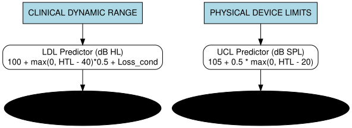

---
output:
  pdf_document: default
  html_document: default
---
# Supplementary Material: Open-NL Algorithmic Pipeline and Complete Parameter Specification

This supplementary document provides the exact mathematical formulations, closed-form piecewise functions, and complete numerical parameter specifications governing the twelve internal processing stages of the Open-NL algorithmic cascade.

## S.I. The Twelve-Stage Execution Cascade

Open-NL operates as a multi-stage parameterized shape generator. Rather than relying on static compiled lookup tables, Open-NL calculates target insertion gains dynamically through a series of twelve explicitly defined, cascaded mathematical modules. Each step in the gain derivation process is exposed natively in R, available for researchers to inspect, modify, and tune.

*Terminology Note:* Throughout this framework, the algorithm utilizes two distinct discomfort predictors for different theoretical purposes: an HL-domain "LDL" (Loudness Discomfort Level) predictor used for estimating clinical audiometric dynamic range (Stage 8), and an SPL-domain "UCL" (Uncomfortable Loudness Level) predictor for establishing physical device saturation limits (Stage 11). A visual flowchart mapping each predictor to its downstream algorithm function is provided in Diagram 1.

*Figure S1. Flowchart mapping the LDL and UCL discomfort predictors to their downstream algorithm functions.*

The twelve modules operate in a strictly defined cascaded execution order to prevent unintended interactions between additive boosters and soft limiters:

1. **Stage 1: Conductive Component Separation & Dynamic Range Baseline** (Section S.I.1)
2. **Stage 2: Decoupled Half-Gain Base Anchor Calculation** (Section S.I.2)
3. **Stage 3: Experience-Level Shaping & Log-Frequency $C_{vals}$ Interpolation** (Section S.I.3)
4. **Stage 4: Reverse-Slope Low-Frequency Attenuation Floor** (Section S.I.4)
5. **Stage 5: Slope-Dependent Low-Frequency Penalty (SD-LFP) with Profound HF Bypass** (Section S.I.5)
6. **Stage 6: Severe-Loss Audibility Booster** (Section S.I.6)
7. **Stage 7: Soft-Compression High-Frequency Desensitization** (Section S.I.7)
8. **Stage 8: Dynamic Range Mapping (LDL Squeeze)** (Section S.I.8)
9. **Stage 9: Transducer Bandwidth Roll-off** (Section S.I.9)
10. **Stage 10: Multi-Channel WDRC Mapping, Input/Output Pivot, and Demographic Adjustments** (Section S.I.10)
11. **Stage 11: Acoustic Venting, Coupling Loss, and Receiver Saturation Limits** (Section S.I.11)
12. **Stage 12: Embedded Nelder-Mead Simplex Optimization & Physiological Loudness Ceilings** (Section S.I.12)

---

## S.I.1. Stage 1: Conductive Component Separation & Dynamic Range Baseline

The algorithm first decomposes total hearing threshold levels ($\text{HTL}$) into their physiological constituents: the sensorineural threshold ($\text{HTL}_{sn}$) and the conductive component ($\text{Loss}_{cond}$, corresponding to the air-bone gap, ABG):

\begin{equation}
\text{Loss}_{cond}(f) = \text{ABG}(f)
\end{equation}

\begin{equation}
\text{HTL}_{sn}(f) = \max\left(0, \text{HTL}(f) - \text{Loss}_{cond}(f)\right)
\end{equation}

To ensure that equal-loudness reshaping penalties apply only to sensorineural pathology, the algorithm computes a frequency-specific sensorineural ratio $R_{sn}(f)$:

\begin{equation}
R_{sn}(f) = \begin{cases} 
\frac{\text{HTL}_{sn}(f)}{\text{HTL}(f)}, & \text{if } \text{HTL}(f) > 0 \\ 
0, & \text{otherwise} 
\end{cases}
\end{equation}

Pure conductive losses ($\text{Loss}_{cond} = \text{HTL}$) have normal outer and inner hair cell functioning and intact basilar membrane mechanics; thus, $R_{sn} = 0$, bypassing cochlear recruitment and equal-loudness correction arrays.

---

## S.I.2. Stage 2: Decoupled Half-Gain Base Anchor Calculation

The foundational WDRC anchor for average conversational speech (65 dB SPL) is derived using a frequency-specific adaptation of the half-gain rule (Lybarger, 1944). Unlike linear prescriptions that anchor to a broadband Pure Tone Average (PTA), this anchor is decoupled frequency-by-frequency:

\begin{equation}
G_{base}(f) = \alpha \cdot \text{HTL}_{sn}(f) + C_{interp}(f)
\end{equation}

where $\alpha = 0.46$ is the nominal half-gain multiplier (loosely derived from Byrne & Dillon, 1986), and $C_{interp}(f)$ is the frequency-shaping correction array derived in Stage 3.

---

## S.I.3. Stage 3: Experience-Level Shaping & Log-Frequency $C_{vals}$ Interpolation

To account for listener acclimatization and preferred listening levels (Keidser et al., 2012), Open-NL modulates the frequency-shaping array $C_{interp}$ across eight discrete anchor frequencies:
\begin{equation}
\mathbf{f}_c = [250, 500, 1000, 2000, 3000, 4000, 6000, 8000]\text{ Hz}
\end{equation}

The discrete shaping vectors $\mathbf{C}$ are defined as:
- **Experienced Users** (standard baseline):
  \begin{equation}
  \mathbf{C}_{exp} = [-8, -1, 3, 1, 0, 0, 0, 0]\text{ dB}
  \end{equation}
- **New Users** (nominal $-3$ dB reduction to combat occlusion and sharpness):
  \begin{equation}
  \mathbf{C}_{new} = \mathbf{C}_{exp} - 3 = [-11, -4, 0, -2, -3, -3, -3, -3]\text{ dB}
  \end{equation}
- **Power Users** (prioritizes raw audibility over acoustic comfort):
  \begin{equation}
  \mathbf{C}_{power} = \mathbf{C}_{exp} + 3 = [-5, +2, 6, 4, 3, 3, 3, 3]\text{ dB}
  \end{equation}

For any calculation frequency $f$, $C_{interp}(f)$ is evaluated via piecewise log-linear interpolation across $\mathbf{f}_c$ and scaled by the sensorineural proportion $R_{sn}(f)$:

\begin{equation}
C_{interp}(f) = \text{interp}_{\log_{10}}\left(f, \mathbf{f}_c, \mathbf{C}\right) \cdot R_{sn}(f)
\end{equation}

---

## S.I.4. Stage 4: Reverse-Slope Low-Frequency Attenuation Floor

For reverse-slope configurations (where low frequencies are significantly worse than high frequencies), attempting to fully restore low-frequency audibility risks upward spread of masking, where high-energy low-frequency vowels mask low-energy high-frequency consonants. The algorithm calculates the low-to-high sensorineural threshold difference:

\begin{equation}
\text{Diff}_{rs} = \max\left(0, \overline{\text{HTL}}_{sn, \le 500} - \overline{\text{HTL}}_{sn, \ge 2000}\right)
\end{equation}

where $\overline{\text{HTL}}_{sn, \le 500}$ is the mean threshold across $f \le 500$ Hz, and $\overline{\text{HTL}}_{sn, \ge 2000}$ is the mean threshold across $f \ge 2000$ Hz. If $\text{Diff}_{rs} > 15$ dB, a transition factor $RS_{factor} \in [0, 1]$ is computed:

\begin{equation}
RS_{factor} = \max\left(0, \min\left(1, \frac{\text{Diff}_{rs} - 15}{20}\right)\right)
\end{equation}

A log-linear low-frequency taper $W_{LF}(f)$ is applied below 1000 Hz:

\begin{equation}
W_{LF}(f) = \max\left(0, \min\left(1, 1 - \frac{\log_{10}(f) - \log_{10}(250)}{\log_{10}(1000/250)}\right)\right)
\end{equation}

Across octave bands, $W_{LF}(f)$ evaluates to $1.0$ at 250 Hz, $0.5$ at 500 Hz, and $0.0$ at $f \ge 1000$ Hz. The frequency-shaping array is then dynamically flattened toward a $-10$ dB floor:

\begin{equation}
C'_{interp}(f) = C_{interp}(f) \cdot \left(1 - RS_{factor} \cdot W_{LF}(f)\right) + \left(-10 \cdot RS_{factor} \cdot W_{LF}(f)\right)
\end{equation}

---

## S.I.5. Stage 5: Slope-Dependent Low-Frequency Penalty (SD-LFP) with Profound HF Bypass

For sloping high-frequency losses, applying excessive low-frequency gain causes normal low frequencies to dominate broadband loudness. Open-NL computes the high-frequency slope:

\begin{equation}
\text{Slope} = \max\left(0, \overline{\text{HTL}}_{sn, \ge 2000} - \overline{\text{HTL}}_{sn, \le 500}\right)
\end{equation}

To operationalize the empirical findings of Byrne, Parkinson, and Newall (1990)—who showed that listeners with high-frequency losses exceeding 70–95 dB HL require low-frequency speech cues—Open-NL incorporates a **Profound High-Frequency Bypass**:

\begin{equation}
PF_{bypass} = \max\left(0, \min\left(1, \frac{95 - \overline{\text{HTL}}_{sn, \ge 2000}}{25}\right)\right)
\end{equation}

The low-frequency penalty is scaled over a 20 dB slope window, capped at 15 dB:

\begin{equation}
\text{LF}_{penalty} = \max\left(0, \min\left(1, \frac{\text{Slope} - 15}{20}\right)\right) \cdot 15 \cdot PF_{bypass}
\end{equation}

The penalty is then tapered below 1000 Hz using $W_{LF}(f)$:

\begin{equation}
C''_{interp}(f) = C'_{interp}(f) - \left(\text{LF}_{penalty} \cdot W_{LF}(f)\right)
\end{equation}

The resulting baseline target at 65 dB SPL is:
\begin{equation}
G_{65}^{(0)}(f) = 0.46 \cdot \text{HTL}_{sn}(f) + C''_{interp}(f)
\end{equation}

### Ablation of SD-LFP Constraints
Table S1 provides the reference audiometric profiles (A1–A7, Johnson & Dillon, 2011). Table S2 demonstrates the mechanical impact of the SD-LFP constraint on the initial heuristic seeds.

**TABLE S1. Reference Audiometric Profiles (Adapted from Johnson & Dillon, 2011).**
*Thresholds are in dB HL. Profiles A1–A5 are purely sensorineural. A6 is mixed (30 dB ABG). A7 is conductive (50 dB ABG).*

| Profile | Type | 250 Hz | 500 Hz | 1000 Hz | 2000 Hz | 4000 Hz | 8000 Hz | ABG |
|:---|:---|:---:|:---:|:---:|:---:|:---:|:---:|:---:|
| **A1** | Flat moderate | 15 | 20 | 30 | 40 | 50 | 60 | 0 dB |
| **A2** | Reverse slope | 60 | 50 | 40 | 30 | 20 | 15 | 0 dB |
| **A3** | Moderately sloping | 10 | 20 | 40 | 50 | 55 | 60 | 0 dB |
| **A4** | Steeply sloping | 0 | 0 | 10 | 40 | 70 | 80 | 0 dB |
| **A5** | Steeply sloping | 10 | 10 | 20 | 60 | 80 | 100 | 0 dB |
| **A6** | Mixed | 50 | 55 | 60 | 65 | 75 | 80 | 30 dB |
| **A7** | Conductive | 50 | 50 | 50 | 50 | 50 | 50 | 50 dB |

**TABLE S2. Ablation of SD-LFP Constraints on Optimizer Seed (65 dB SPL Input).**

| Profile | Unconstrained Seed SII | Unconstrained Seed Sones | SD-LFP Seed SII | SD-LFP Seed Sones |
|---|---|---|---|---|
| A1 (Flat mod) | 0.86 | 7.2 | 0.86 | 7.2 |
| A2 (Reverse) | 0.88 | 6.3 | 0.88 | 6.0 |
| A3 (Mod sloping) | 0.79 | 6.8 | 0.79 | 6.8 |
| A4 (Steeply) | 0.81 | 6.9 | 0.81 | 6.9 |
| A5 (Steeply) | 0.68 | 7.1 | 0.68 | 6.0 |
| A6 (Mixed) | 0.82 | 3.0 | 0.82 | 3.0 |
| A7 (Conductive) | 0.97 | 1.0 | 0.97 | 1.0 |

*(Note: For profiles A1, A3, and notably A4, the SD-LFP ablation appears numerically inert despite their slopes mathematically triggering the penalty. This occurs because their unconstrained low-frequency target gain is already at or near 0 dB due to near-normal low-frequency thresholds. When the SD-LFP penalty drives the theoretical target negative, the universal insertion-gain floor—which prevents active attenuation—absorbs the penalty entirely. Consequently, the SD-LFP stage only demonstrably alters the initial seed for steeply sloping profiles that possess sufficient pre-existing low-frequency loss to elevate the baseline target above the floor, such as A5).*

---

## S.I.6. Stage 6: Severe-Loss Audibility Booster

To overcome inner hair cell loss in severe impairments, an opt-in, bounded **Severe-Loss Booster** can be applied:

\begin{equation}
G_{slb}(f) = B_{en} \cdot 0.15 \cdot \max\left(0, \min(80, \text{HTL}_{sn}(f)) - T_{onset}\right)
\end{equation}

where $B_{en} \in \{0, 1\}$ (default: 0, disabled), and $T_{onset} = 70$ dB HL (conservative default) or $60$ dB HL (aggressive ablation mode). The intermediate target is:

\begin{equation}
G_{65}^{(1)}(f) = G_{65}^{(0)}(f) + G_{slb}(f)
\end{equation}

---

## S.I.7. Stage 7: Soft-Compression High-Frequency Desensitization

To prevent unconstrained audibility maximization from prescribing intolerable high-frequency gain in steeply sloping losses, Open-NL applies a dynamic soft-compression envelope ($L_{gain}$):

\begin{equation}
L_{gain}(f) = 30 + 0.4 \cdot \max\left(0, \text{HTL}_{sn}(f) - 60\right)
\end{equation}

*(Note: For patients in "Moderate" or "High" distortion categories, $L_{gain}$ is reduced by 10 dB).*

Excess gain above this dynamic limit is:
\begin{equation}
\text{Excess}(f) = \max\left(0, G_{65}^{(1)}(f) - L_{gain}(f)\right)
\end{equation}

The sloping factor $S_{factor}(f)$ relative to the best low-frequency threshold ($\text{HTL}_{bestlow} = \min_{f' \le 1000} \text{HTL}_{sn}(f')$) and the high-frequency fade-in weight $W_{hf}(f)$ are:

\begin{equation}
S_{factor}(f) = \max\left(0, \min\left(1, \frac{\text{HTL}_{sn}(f) - \text{HTL}_{bestlow} - 25}{20}\right)\right)
\end{equation}

\begin{equation}
W_{hf}(f) = \max\left(0, \min\left(1, \frac{f - 2000}{2000}\right)\right)
\end{equation}

Applying 2:1 soft compression to the excess yields:

\begin{equation}
G_{65}^{(2)}(f) = G_{65}^{(1)}(f) - \left(W_{hf}(f) \cdot S_{factor}(f) \cdot 0.50 \cdot \text{Excess}(f)\right)
\end{equation}

If explicit cochlear dead regions ($f_{e\_hf}$, $f_{e\_lf}$) or distortion categories (Margolis et al., 2025) are defined, steep parametric roll-offs are applied:
\begin{equation}
G_{65}^{(2)}(f) \leftarrow G_{65}^{(2)}(f) - \max\left(0, \log_2\left(\frac{f}{1.7 f_{e\_hf}}\right)\right) \cdot 30 - \max\left(0, \log_2\left(\frac{0.57 f_{e\_lf}}{f}\right)\right) \cdot 30
\end{equation}

---

## S.I.8. Stage 8: Dynamic Range Mapping (LDL Squeeze)

To accommodate reduced clinical dynamic ranges (DSL v5.0 philosophy; Scollie et al., 2005), Open-NL predicts an HL-domain Loudness Discomfort Level:

\begin{equation}
\text{LDL}_{pred}(f) = 100 + 0.5 \cdot \max\left(0, \text{HTL}_{sn}(f) - 40\right) + \text{Loss}_{cond}(f)
\end{equation}

When measured $\text{LDL}_{meas}(f)$ is lower than predicted, the dynamic range discrepancy $\Delta_{LDL}(f)$ is quantified:

\begin{equation}
\Delta_{LDL}(f) = \text{LDL}_{meas}(f) - \text{LDL}_{pred}(f)
\end{equation}

Target gain is attenuated by 0.2 dB per dB of dynamic range squeeze:

\begin{equation}
G_{65}^{(3)}(f) = G_{65}^{(2)}(f) + \left(0.2 \cdot \Delta_{LDL}(f)\right)
\end{equation}

Simultaneously, the baseline compression ratio increases by $+0.02$ per dB of squeeze (Stage 10).

---

## S.I.9. Stage 9: Transducer Bandwidth Roll-off

Acoustic transducers physically struggle to reproduce frequencies at the extremes of the spectrum ($\le 250$ Hz and $\ge 6000$ Hz), where excessive gain leads to distortion and feedback. Open-NL applies a continuous fractional bandwidth roll-off multiplier $M_{bw}(f)$ defined over seven anchor frequencies:

\begin{equation}
\mathbf{f}_{bw} = [250, 500, 1000, 2000, 4000, 6000, 8000]\text{ Hz}
\end{equation}
\begin{equation}
\mathbf{w}_{bw} = [0.7, 1.0, 1.0, 1.0, 1.0, 0.8, 0.5]
\end{equation}

The closed-form continuous multiplier is obtained via piecewise log-linear interpolation:

\begin{equation}
M_{bw}(f) = \text{interp}_{\log_{10}}\left(f, \mathbf{f}_{bw}, \mathbf{w}_{bw}\right)
\end{equation}

\begin{equation}
G_{65}^{(4)}(f) = G_{65}^{(3)}(f) \cdot M_{bw}(f)
\end{equation}

---

## S.I.10. Stage 10: Multi-Channel WDRC Mapping, Input/Output Pivot, and Demographic Adjustments

Target gain at arbitrary overall input level $L_{in}$ (e.g., 50, 65, 80 dB SPL) is computed using a multi-channel wide dynamic range compression architecture pivoted around the Long-Term Average Speech Spectrum (LTASS).

1. **Speech Spectrum Pivot**: Let $P(f)$ be the critical-band normal speech level at 65 dB SPL overall. The band-specific input level is:
   \begin{equation}
   L_{band}(f) = P(f) + (L_{in} - 65)
   \end{equation}

2. **Dynamic Compression Ratio Calculation**:
   \begin{equation}
   \text{CR}_{base}(f) = 1 + \frac{\max\left(0, \text{HTL}_{sn}(f) - 20\right)}{40} - \left(0.02 \cdot \Delta_{LDL}(f)\right)
   \end{equation}
   For severe loss ($\text{HTL}_{sn} > 65$ dB HL), compression reduces back toward linear to preserve the temporal speech envelope (Keidser et al., 2007):
   \begin{equation}
   W_{freq}(f) = \max\left(0, \min\left(1, \frac{f - 500}{2500}\right)\right)
   \end{equation}
   \begin{equation}
   \text{CR}_{loud}(f) = \text{CR}_{base}(f) - \left(\frac{\max(0, \text{HTL}_{sn}(f) - 65)}{30} \cdot (1.5 - 0.5 \cdot W_{freq}(f))\right)
   \end{equation}
   $\text{CR}_{loud}(f)$ is clamped between $1.0$ and a maximum $\text{CR}_{max}(f) = 1.5 + 0.9 \cdot W_{freq}(f)$ (further relaxed for age $> 60$). In Comfort in Noise (CIN) mode, $\text{CR}_{loud}$ is clamped to $\le 1.5$.
   
   *(Note on Evidentiary Asymmetry: The 1.5:1 CIN clamp is an asserted engineering heuristic inspired by NAL-NL3 to curb listening fatigue in noise, lacking direct empirical derivation. In contrast, the global upper ceiling on compression ratios ($\le 3.0:1$) is directly supported by extensive psychoacoustic literature [Souza, 2002; Souza et al., 2006], which demonstrates that compression ratios exceeding 3.0:1 cause severe temporal envelope flattening and acoustic contrast degradation).*

3. **Variable Compression Threshold (CT)**:
   Overall CT ($\text{CT}_{overall}$) scales from 30 to 45 dB SPL as a function of threshold. The band-level threshold is $\text{CT}_{band}(f) = P(f) + (\text{CT}_{overall} - 65)$ (reduced by 10 dB in CIN mode).

4. **Piecewise Linear-Compressive Spline**:
   Gain at the compression threshold is:
   \begin{equation}
   G_{CT}(f) = \begin{cases} 
   G_{65}^{(4)}(f), & \text{if } \text{CT}_{band}(f) > P(f) \\ 
   G_{65}^{(4)}(f) + \left(P(f) - \text{CT}_{band}(f)\right)\left(1 - \frac{1}{\text{CR}_{loud}(f)}\right), & \text{if } \text{CT}_{band}(f) \le P(f) 
   \end{cases}
   \end{equation}
   The level-dependent WDRC target gain is:
   \begin{equation}
   G_{target}(f, L_{in}) = \begin{cases} 
   G_{CT}(f), & \text{if } L_{band}(f) \le \text{CT}_{band}(f) \\ 
   G_{CT}(f) - \left(L_{band}(f) - \text{CT}_{band}(f)\right)\left(1 - \frac{1}{\text{CR}_{loud}(f)}\right), & \text{if } L_{band}(f) > \text{CT}_{band}(f) 
   \end{cases}
   \end{equation}

5. **Demographic Adjustments**:
   \begin{equation}
   G_{target}(f, L_{in}) \leftarrow G_{target}(f, L_{in}) + \Delta_{gender} + \Delta_{config} + \Delta_{exp}
   \end{equation}
   where $\Delta_{gender} = -1.5$ dB (female), $\Delta_{config} = +3.0$ dB (unilateral), and $\Delta_{exp} = -\min\left(6.0, 0.3 \cdot \max\left(0, \text{PTA}_{500,1k,2k} - 40\right)\right)$ for new users.

**TABLE S3. Interval-Specific Compression Ratios (50–65 and 65–80 dB SPL) across A1-A7 Audiograms.** *Note: Dashes (-) indicate frequency regions where prescribed gain is exactly 0 dB across the input interval (linear amplification, CR = 1.0). NAL-NL2 naturally exceeds the 3.0:1 threshold at high input levels (e.g., A1 at 4000 Hz, A3 at 4000 Hz, A4 at 4000 Hz). To incorporate the 3.0:1 target bound natively, Open-NL evaluates the 3.0:1 constraint via a heavy soft quadratic penalty ($\lambda_{cr} = 200.0$) directly inside the objective wrapper. This strongly discourages pure intelligibility maximization from prescribing values that violate empirical psychoacoustic limits, flattening the realized CRs well below 3.0:1.*

| Profile | Formula | Interval | 250 Hz | 500 Hz | 1000 Hz | 2000 Hz | 4000 Hz | 8000 Hz |
|:---|:---|:---|:---:|:---:|:---:|:---:|:---:|:---:|
| A1 | NAL-NL2 | 50-65 | 1.02 | 1.15 | 1.52 | 1.97 | 2.03 | 1.74 |
| A1 | NAL-NL2 | 65-80 | 1.00 | 1.00 | 1.90 | 2.68 | 3.75 | 2.88 |
| A1 | Open-NL | 50-80 | - | - | 1.34 | 1.65 | 1.97 | 2.06 |
| A2 | NAL-NL2 | 50-65 | 1.61 | 2.14 | 1.76 | 1.65 | 1.46 | 1.21 |
| A2 | NAL-NL2 | 65-80 | 3.06 | 2.63 | 2.50 | 2.14 | 1.35 | 1.36 |
| A2 | Open-NL | 50-80 | 1.73 | 1.88 | 1.91 | 1.74 | 1.20 | - |
| A3 | NAL-NL2 | 50-65 | 1.00 | 1.22 | 1.67 | 2.03 | 2.00 | 1.70 |
| A3 | NAL-NL2 | 65-80 | 1.00 | 1.00 | 2.14 | 3.19 | 4.17 | 3.06 |
| A3 | Open-NL | 50-80 | - | - | 1.68 | 1.99 | 2.16 | 2.06 |
| A4 | NAL-NL2 | 50-65 | 1.00 | 1.00 | 1.17 | 1.81 | 1.67 | 1.47 |
| A4 | NAL-NL2 | 65-80 | 1.00 | 1.00 | 1.06 | 2.73 | 3.33 | 2.59 |
| A4 | Open-NL | 50-80 | - | - | - | 1.50 | 1.50 | 1.50 |
| A5 | NAL-NL2 | 50-65 | 1.00 | 1.00 | 1.46 | 1.69 | 1.50 | 1.40 |
| A5 | NAL-NL2 | 65-80 | 1.00 | 1.00 | 1.74 | 2.83 | 2.94 | 2.46 |
| A5 | Open-NL | 50-80 | - | - | - | 1.00 | 1.00 | - |
| A6 | NAL-NL2 | 50-65 | 1.58 | 1.55 | 1.47 | 1.81 | 1.83 | 1.60 |
| A6 | NAL-NL2 | 65-80 | 1.14 | 1.30 | 1.79 | 2.24 | 2.88 | 2.38 |
| A6 | Open-NL | 50-80 | 1.16 | 1.27 | 1.38 | 1.47 | 1.65 | 1.71 |
| A7 | NAL-NL2 | 50-65 | 1.00 | 1.00 | 1.00 | 1.00 | 1.01 | 1.00 |
| A7 | NAL-NL2 | 65-80 | 1.00 | 1.00 | 1.00 | 1.00 | 1.00 | 1.00 |
| A7 | Open-NL | 50-80 | 1.00 | 1.00 | 1.00 | 1.00 | 1.00 | 1.00 |

---

## S.I.11. Stage 11: Passive Insertion Loss and Receiver Saturation Limits

Real-Ear Aided Responses (REAR) are heavily constrained by physical acoustic coupling. The maximum physical attenuation (passive insertion loss) afforded by the hearing aid physical form factor is modeled by log-frequency interpolation over anchor frequencies $\mathbf{f}_{vent} = [250, 500, 1000, 2000, 4000, 8000]\text{ Hz}$:

\begin{equation}
V_{loss}(f) = \text{interp}_{\log_{10}}\left(f, \mathbf{f}_{vent}, \mathbf{v}_c\right)
\end{equation}

where $\mathbf{v}_c$ is the coupling-specific passive attenuation vector defined in Table S4.

**Table S4: Passive Acoustic Attenuation Vectors ($\mathbf{v}_c$) in dB**
| Coupling Type | 250 Hz | 500 Hz | 1000 Hz | 2000 Hz | 4000 Hz | 8000 Hz |
| :--- | :--- | :--- | :--- | :--- | :--- | :--- |
| `custom_occluded` | -15 | -15 | -20 | -25 | -30 | -35 |
| `open_dome` | 0 | 0 | 0 | 0 | 0 | 0 |
| `tulip_dome` | -2 | -2 | -5 | -10 | -15 | -20 |
| `double_dome` | -5 | -5 | -10 | -15 | -20 | -25 |
| `vent_1mm_solid` | -25 | -25 | -25 | -30 | -30 | -35 |
| `vent_2mm_solid` | -20 | -20 | -25 | -25 | -30 | -35 |
| `vent_3mm_solid` | -15 | -15 | -20 | -25 | -30 | -35 |
| `vent_1mm_hollow` | -15 | -15 | -20 | -25 | -30 | -35 |
| `vent_2mm_hollow` | -5 | -5 | -10 | -15 | -20 | -25 |
| `vent_3mm_hollow` | -2 | -2 | -5 | -10 | -15 | -20 |

Conductive air-bone gaps are restored linearly with a 75% fraction: $G_{cond}(f) = 0.75 \cdot \text{Loss}_{cond}(f)$ *(Note: This 75% restoration fraction is a pragmatic engineering convention—adapted from clinical practice to prevent excessive output demands and MPO clipping; Johnson, 2013—without direct empirical derivation from listener preference)*. To physically ground the heuristic and prevent mathematically hallucinating active anti-phase cancellation, insertion gain is floored slightly below the passive insertion loss of the specified coupling:

\begin{equation}
G_{heuristic}(f, L_{in}) = \max\left(G_{target}(f, L_{in}) + 0.75 \cdot \text{Loss}_{cond}(f) + V_{loss}(f),\, V_{floor}\right)
\end{equation}

Hardware receiver limits (MPO/SSPL90) are established to avoid severe saturation distortion:
\begin{equation}
\text{MPO}(f) = \min\left(120,\, 105 + 0.5 \cdot \max(0, \text{HTL}_{sn}(f) - 20) + \text{Loss}_{cond}(f)\right)
\end{equation}

---

## S.I.12. Stage 12: Embedded Nelder-Mead Simplex Optimization & Physiological Loudness Ceilings

When `optimize = TRUE`, Open-NL adjusts the heuristic targets by minimizing an unconstrained multi-objective loss function via Nelder-Mead simplex search (`stats::optim`).

### Parameter Vector and Execution Flow
The optimization parameter vector generated by the Nelder-Mead simplex is the raw shift vector $\boldsymbol{\delta} = [\delta_{250}, \delta_{500}, \delta_{1000}, \delta_{2000}, \delta_{4000}, \delta_{8000}]^T \in \mathbb{R}^6$.

To evaluate a candidate vector, the engine executes the following sequential steps:

1. **Boundary Penalty Evaluation:** The out-of-bounds penalty ($P_{bounds}$) is evaluated strictly on the *raw, unclamped* vector $\boldsymbol{\delta}$. This step is critical; if the penalty were evaluated on the clamped vector, it would be identically zero. Evaluating on the raw vector ensures the Nelder-Mead simplex receives a continuous, mathematically steep gradient when exploring outside the feasible region.
2. **Parameter Clamping:** The raw vector is then strictly clamped into the feasible acoustic domain:
\begin{equation}
\delta_{clamped, j} = \max(-60, \min(30, \delta_j))
\end{equation}
3. **Gain Interpolation and Floor Limits:** The clamped shifts are interpolated to calculation frequencies and bounded by the physical attenuation limit of the specified coupling ($V_{floor}$) and receiver saturation limits (80 dB):
\begin{equation}
G(f) = \max\left(V_{floor}, \min\left(80, G_{heuristic}(f) + \delta_{clamped}(f)\right)\right)
\end{equation}
4. **Downstream Objective Evaluation:** The resulting clamped gain vector $\mathbf{G}$ is then routed through the C++ engine to compute the final desensitized SII and evaluate all remaining acoustic and physiological penalties (e.g., $P_{loud}$, $P_{cr}$).

### Loss Function Formulation
The Nelder-Mead solver minimizes:

\begin{equation}
\mathcal{L}(\boldsymbol{\delta}) = -100 \cdot \text{SII}_{desens}(\mathbf{G}) + P_{anchor} + P_{bounds} + P_{loud} + P_{spl} + P_{rough} + P_{order} + P_{cr} + P_{abg}
\end{equation}

where $\text{SII}_{desens}$ is the effective Speech Intelligibility Index calculated using the `johnson2011_smoothed` transfer function.

### Explicit Penalty Terms and Exact Weights ($\lambda$)

1. **Anchor Penalty** ($\lambda_{anchor} = 0.1$):
   \begin{equation}
   P_{anchor} = 0.1 \sum_{j=1}^6 |\delta_j|
   \end{equation}

2. **Out-of-Bounds Penalty** ($\lambda_{bounds} = 1000.0$):
   \begin{equation}
   P_{bounds} = 1000.0 \left[\sum_{j=1}^6 \max(0, \delta_j - 30)^2 + \sum_{j=1}^6 \max(0, -\delta_j - 60)^2\right]
   \end{equation}

3. **Physiological Loudness Ceiling Penalty** ($\lambda_{loud} = 2000.0$):
   \begin{equation}
   P_{loud} = 2000.0 \cdot \max(0, \text{Sones}_{MG04}(\mathbf{G}) - \text{Cap})
   \end{equation}
   *(Note: While gain-based penalties in this framework are squared to strongly penalize large deviations, the loudness penalty is explicitly linear. This is a deliberate choice: because sones inherently represent a compressive power-law transformation of physical acoustic energy, a linear penalty in the sone domain naturally exerts an exponentially growing restriction on the underlying insertion gain. Squaring the sone error introduces severe mathematical stiffness and destabilizes the simplex gradient. Furthermore, coupling a linear penalty slope of $\lambda_{loud} = 2000.0$ against the intelligibility objective term ($-100 \cdot \text{SII}$) means that violating the cap requires a marginal objective benefit of $\partial \text{SII}/\partial S > 20 \text{ sone}^{-1}$. Because the SII is strictly bounded between 0 and 1, this condition is physically impossible to satisfy, turning the soft penalty into a rigorous, guaranteed mathematical boundary.)*
   where $\text{Sones}_{MG04}$ is the Moore & Glasberg (2004) specific-loudness integration computed via native C++. The dynamic U-shaped cap is interpolated across Pure Tone Average knots $\mathbf{PTA}_{knots} = [10, 32.5, 52.5, 72.5, 90]$ dB HL from level-specific monaural sone vectors (note: these vectors represent single-ear monaural limits, which equal exactly half of their binaural equivalents under the simple-doubling convention of the 2004 framework):
   - $L_{in} = 50$ dB SPL: $\mathbf{K}_{50} = [1.5, 1.0, 0.8, 1.2, 1.2]$ monaural sones
   - $L_{in} = 65$ dB SPL: $\mathbf{K}_{65} = [7.0, 5.0, 5.5, 6.5, 6.5]$ monaural sones
   - $L_{in} = 80$ dB SPL: $\mathbf{K}_{80} = [20.0, 12.0, 10.0, 15.0, 14.0]$ monaural sones
   \begin{equation}
   \text{Cap}_{base} = \text{interp}\left(\text{PTA}_{sn}, \mathbf{PTA}_{knots}, \mathbf{K}_{L_{in}}\right)
   \end{equation}
   where $\text{PTA}_{sn}$ is defined as the four-frequency pure-tone average of the sensorineural component at 500, 1000, 2000, and 4000 Hz.
   
   *Profile Adjustments:*
   - Reverse-slope restriction ($L_{in} \ge 75$ dB SPL and low-to-high threshold difference $> 10$ dB):
     $\text{Cap} = \text{Cap}_{base} - 0.10 \cdot (\overline{\text{HTL}}_{\le 500} - \overline{\text{HTL}}_{\ge 4000})$.
   - Conductive air-bone gap adjustment:
     $\text{Cap} \leftarrow \text{Cap} - 0.25 \cdot \text{PTA}_{ABG}$ (if $L_{in} \ge 75$ dB SPL) or $+0.10 \cdot \text{PTA}_{ABG}$ (if $L_{in} < 75$ dB SPL).

4. **Broadband SPL Saturation Ceiling Penalty** ($\lambda_{spl} = 2000.0$):
   \begin{equation}
   P_{spl} = 2000.0 \cdot \max\left(0, \text{SPL}_{aided} - 110.0\right)
   \end{equation}
   *(Note: This 110 dB SPL penalty evaluates the summed broadband RMS power of the entire amplified signal to enforce an overall physiological safety limit. It operates independently of the 120 dB SPL Maximum Power Output (MPO) ceiling defined in Eq. 43, which dictates the absolute hardware saturation threshold for individual narrow bands. For example, while multiple individual frequency bands may operate safely below their respective 120 dB SPL MPO limits, their combined acoustic energy can still sum to a broadband level that triggers this 110 dB SPL overall penalty, ensuring aggregate exposure remains bounded.)*

5. **Spectral Roughness Penalty** ($\lambda_{rough} = 0.5$):
   \begin{equation}
   P_{rough} = 0.5 \sum_{j=1}^5 (\delta_{j+1} - \delta_j)^2
   \end{equation}

6. **Inter-Level Order Monotonicity Penalty** ($\lambda_{order} = 2000.0$):
   Enforces $G_{50} \ge G_{65}$ and $G_{80} \le G_{65}$:
   \begin{equation}
   P_{order} = \begin{cases} 
   2000.0 \sum_{j=1}^6 \max(0, G_{65, j} - G_{50, j})^2, & \text{for } L_{in} = 50 \\ 
   2000.0 \sum_{j=1}^6 \max(0, G_{80, j} - G_{65, j})^2, & \text{for } L_{in} = 80 
   \end{cases}
   \end{equation}

7. **Compression Ratio Ceiling Penalty** ($\lambda_{cr} = 200.0$):
   \begin{equation}
   P_{cr} = \begin{cases} 
   200.0 \sum_{j=1}^6 \max\left(0, (G_{50, j} - G_{65, j}) - \Delta_{max, j}\right)^2, & \text{for } L_{in} = 50 \\ 
   200.0 \sum_{j=1}^6 \max\left(0, (G_{65, j} - G_{80, j}) - \Delta_{max, j}\right)^2, & \text{for } L_{in} = 80 
   \end{cases}
   \end{equation}
   where $\Delta_{max, j} = 10.0 \cdot (1 - \text{ABG}_j / \max(0.001, \text{HTL}_j))$ for soft speech, bounding emergent compression ratios safely below 3.0:1 for sensorineural loss while enforcing linear amplification for conductive components. This 3.0:1 ceiling represents the best-supported parameter in the algorithm, firmly grounded in empirical psychoacoustic literature (Souza, 2002; Souza et al., 2006) demonstrating severe envelope flattening, loss of acoustic contrast, and speech-in-noise deficits for CRs $> 3.0:1$. Because this is enforced as a soft penalty ($\lambda_{cr} = 200.0$) rather than a hard algorithmic clamp, the solver can mathematically violate it when pushed against even stronger boundaries (e.g., yielding CRs $> 3.0$ in profound losses like A4 or A5), effectively transitioning from wide dynamic range compression to hard limiting.

8. **Air-Bone Gap Excursion Penalty** ($\lambda_{abg} = 1.0$):
   \begin{equation}
   P_{abg} = \begin{cases} 
   1.0 \sum_{j=1}^6 \max(0, \delta_j)^2, & \text{if } \exists j, \text{Loss}_j > 0 \\ 
   0, & \text{otherwise} 
   \end{cases}
   \end{equation}

### Solver Controls and Convergence Tolerances
- **Algorithm**: Nelder-Mead Simplex via R's `stats::optim()`.
- **Iteration Ceiling**: `control = list(maxit = 800)`.
- **Convergence Tolerance**: Relative convergence tolerance `reltol = sqrt(.Machine$double.eps) \approx 1.49 \times 10^{-8}`.
- **Initial Simplex Seeding**: Seeding incorporates an audibility projection $\boldsymbol{\delta}_{start} = \min(20, \max(0, \text{target\_aided} - G_{heuristic}))$, where $\text{target\_aided} = \min(\text{UCL} - 5, \max(L_{in}, \text{HTL} + 10))$. Soft inputs receive $+3$ dB shift; loud inputs receive $\max(-10, \boldsymbol{\delta}_{start} - 5)$ dB shift.
- **Multi-Start Strategy**: A 3-iteration multi-start routine (seeding the initial simplex with the NAL-R target and executing two additional randomized restarts with uniform random jitter $\boldsymbol{\delta}_{start} \leftarrow \boldsymbol{\delta}_{start} + \mathcal{U}(-5, +5)$) is deployed to stabilize numerical convergence, though Nelder-Mead inherently lacks formal global convergence guarantees.

---

## S.II. Full Objective Reference Tables

The following tables provide the complete prescriptive target data for all seven reference profiles (A1-A7; Johnson & Dillon, 2011) evaluated at 65 dB SPL. These tables report canonical single-ear monaural loudness calculations exclusively (binaural equivalence requires propagating the dynamic full-range signal through a non-linear binaural loudness engine).

**TABLE S5. Monaural Loudness (Sones) and Desensitized SII across A1-A7 Audiograms (65 dB SPL Input).**

| Profile | Formula | Monaural Loudness (sones) | Desensitized SII |
|---|---|---|---|
| A1 | NAL-NL2 | 3.99 | 0.73 |
|  | Open-NL (Occluded) | 4.44 | 0.81 |
|  | Open-NL (Vented) | 4.43 | 0.78 |
| A2 | NAL-NL2 | 3.10 | 0.77 |
|  | Open-NL (Occluded) | 4.44 | 0.83 |
|  | Open-NL (Vented) | 4.45 | 0.84 |
| A3 | NAL-NL2 | 3.51 | 0.61 |
|  | Open-NL (Occluded) | 4.28 | 0.76 |
|  | Open-NL (Vented) | 4.28 | 0.72 |
| A4 | NAL-NL2 | 5.96 | 0.67 |
|  | Open-NL (Occluded) | 4.78 | 0.76 |
|  | Open-NL (Vented) | 5.21 | 0.56 |
| A5 | NAL-NL2 | 5.36 | 0.54 |
|  | Open-NL (Occluded) | 4.24 | 0.65 |
|  | Open-NL (Vented) | 4.26 | 0.46 |
| A6 | NAL-NL2 | 2.32 | 0.78 |
|  | Open-NL (Occluded) | 3.33 | 0.82 |
|  | Open-NL (Vented) | 3.32 | 0.82 |
| A7 | NAL-NL2 | 1.15 | 0.98 |
|  | Open-NL (Occluded) | 1.63 | 0.96 |
|  | Open-NL (Vented) | 1.63 | 0.96 |

**TABLE S6. Insertion Gain Targets (dB) across A1-A7 Audiograms (65 dB SPL Input).**

| Profile | Formula | 250 Hz | 500 Hz | 1000 Hz | 2000 Hz | 4000 Hz | 8000 Hz |
|---|---|---|---|---|---|---|---|
| A1 | NAL-NL2 | 0.0 | 0.0 | 7.3 | 12.1 | 18.0 | 19.1 |
| A1 | Open-NL (Occluded) | -0.2 | -5.5 | -3.6 | 7.6 | 22.2 | 14.0 |
| | Open-NL (Vented) | -2.6 | -4.8 | -2.7 | 8.0 | 22.0 | 12.7 |
| A2 | NAL-NL2 | 10.1 | 9.3 | 12.2 | 8.3 | 3.9 | 4.0 |
| A2 | Open-NL (Occluded) | -2.3 | -5.9 | 6.4 | 17.5 | 26.2 | 23.4 |
| | Open-NL (Vented) | -0.5 | -5.0 | 5.1 | 17.6 | 26.2 | 13.8 |
| A3 | NAL-NL2 | 0.0 | 0.0 | 9.9 | 16.8 | 20.7 | 21.6 |
| A3 | Open-NL (Occluded) | -3.7 | -5.7 | 17.4 | 36.0 | 36.8 | 33.8 |
| | Open-NL (Vented) | -5.4 | -6.1 | 14.9 | 37.3 | 40.8 | 19.5 |
| A4 | NAL-NL2 | 0.0 | 0.0 | 10.5 | 18.0 | 21.8 | 21.8 |
| A4 | Open-NL (Occluded) | -5.3 | -10.0 | 10.2 | 36.0 | 48.8 | 23.0 |
| | Open-NL (Vented) | -5.2 | -8.7 | 7.3 | 39.4 | 41.4 | 29.8 |
| A5 | NAL-NL2 | 0.0 | 0.0 | 14.9 | 24.3 | 27.5 | 27.5 |
| A5 | Open-NL (Occluded) | 12.7 | 21.4 | 34.9 | 48.9 | 41.4 | 23.0 |
| | Open-NL (Vented) | 18.5 | 18.8 | 34.1 | 49.1 | 41.7 | 23.8 |
| A6 | NAL-NL2 | 18.5 | 18.5 | 24.0 | 25.7 | 25.7 | 11.6 |
| A6 | Open-NL (Occluded) | 34.6 | 38.9 | 43.9 | 47.0 | 50.5 | 49.6 |
| | Open-NL (Vented) | 0.0 | 11.0 | 29.0 | 45.1 | 50.5 | 49.6 |
| A7 | NAL-NL2 | 34.7 | 34.7 | 34.7 | 36.6 | 38.0 | 35.1 |
| A7 | Open-NL (Occluded) | 34.6 | 38.9 | 40.2 | 39.5 | 39.2 | 34.6 |
| | Open-NL (Vented) | 0.0 | 11.0 | 25.4 | 37.6 | 39.2 | 34.6 |

## References

Byrne, D., & Dillon, H. (1986). The National Acoustic Laboratories' (NAL) new procedure for selecting the gain and frequency response of a hearing aid. *Ear and Hearing*, 7(4), 257-265.

Byrne, D., Parkinson, A., & Newall, P. (1990). Hearing aid gain and frequency response requirements for the severely/profoundly hearing impaired. *Ear and Hearing*, 11(1), 40-49.

Ching, T. Y., Dillon, H., & Byrne, D. (2001). Children's amplification needs—same or different from adults? *The Hearing Journal*, 54(11), 43-48.

Cox, R. M., Johnson, J. A., & Xu, J. (2014). Impact of hearing aid technology on outcomes in daily life I: the patients' perspective. *Ear and Hearing*, 35(6), 663-679.

Dao, A., Folkeard, P., Baker, S., Pumford, J., & Scollie, S. (2021). Fit-to-target and real-ear-to-coupler difference (RECD) in adult hearing aid fittings. *International Journal of Audiology*, 60(9), 676-684.

Denk, F., Oetting, D., Latzel, M., Bonsel, H., & Husstedt, H. (2025). Prevalence of excess binaural broadband loudness summation in the hearing-impaired population and implications for hearing aid gain targets. *PLOS ONE*, 20(3), e0319236. https://doi.org/10.1371/journal.pone.0319236

Dillon, H. (2012). *Hearing Aids* (2nd ed.). Boomerang Press.

Herzke, T., Kaysko, P., & Hohmann, V. (2017). OpenMHA—An open-source software platform for hearing aid research. *Trends in Hearing*, 21.

Johnson, E. E. (2013). Hearing aid benefit in patients with mild sensorineural hearing loss: a systematic review. *Journal of the American Academy of Audiology*, 24(4), 293-310.

Johnson, E. E., & Dillon, H. (2011). A comparison of gain for adults from generic hearing aid prescriptive methods: impacts on predicted loudness, frequency bandwidth, and speech intelligibility. *Journal of the American Academy of Audiology*, 22(7), 441-459.

Kates, J. M., & Arehart, K. H. (2022). The Hearing-Aid Speech Perception Index (HASPI) Version 2. *Speech Communication*, 138, 54-65.

Keidser, G., Brew, C., & Peck, A. (2007). Proprietary fitting algorithms compared with one another and with generic formulas. *The Hearing Journal*, 60(3), 28-36.

Keidser, G., Dillon, H., Carter, L., & O'Brien, A. (2012). NAL-NL2 empirical adjustments. *Trends in Amplification*, 16(4), 211-223.

Kitterick, P. T., Zakis, J. A., & Edwards, B. (2026). Evolving the philosophy: From the NAL rule to NAL-NL3. Advance online publication. 1-10. https://doi.org/10.1080/14992027.2026.2690236

Lybarger, S. F. (1944). U.S. Patent Application SN 543,278.

Majdak, P., Hollmach, V., & Baumgartner, R. (2022). AMT: A Python/MATLAB toolbox for auditory modeling. *Acta Acustica*, 6, 19.

Margolis, R. H., Hornsby, B. W. Y., Saly, G. L., & Wilson, R. H. (2025). Predicted and measured word-recognition scores unmask distortion in the impaired auditory system. *The Journal of the Acoustical Society of America*, 157(2), 555–568. https://doi.org/10.1121/10.0036461

Moore, B. C. (2001). Dead regions in the cochlea: Diagnosis, perceptual consequences, and implications for the fitting of hearing aids. *Trends in Amplification*, 5(1), 1-34.

Moore, B. C., & Glasberg, B. R. (2004). A revised model of loudness perception applied to cochlear hearing loss. *Hearing Research*, 188(1-2), 70-88.

Moore, B. C., Glasberg, B. R., & Stone, M. A. (2010). Development of a new method for deriving initial fittings for hearing aids with multi-channel compression: CAMEQ2-HF. *International Journal of Audiology*, 49(3), 216-227.

Moore, B. C., Glasberg, B. R., Varathanathan, A., & Schlittenlacher, J. (2014). A loudness model for time-varying sounds incorporating binaural inhibition. *The Journal of the Acoustical Society of America*, 136(6), 3187-3209.

Oetting, D., Hohmann, V., Appell, J. E., Kollmeier, B., & Ewert, S. D. (2016). Restoring perceived loudness for listeners with hearing loss. *Ear and Hearing*, 37(6), 666-678.

Oetting, D., Hohmann, V., Appell, J. E., Kollmeier, B., & Ewert, S. D. (2017). trueLOUDNESS: A loudness-based fitting procedure. *International Journal of Audiology*, 56(7), 498-508.

Pieper, I., Hohmann, V., & Ewert, S. D. (2021). A loudness model for hearing-impaired listeners with individualized binaural summation. *The Journal of the Acoustical Society of America*, 149(3), 1636-1647.

Scollie, S., Seewald, R., Cornelisse, L., Moodie, S., Bagatto, M., Laurnagaray, D., Beaulac, S., & Pumford, J. (2005). The Desired Sensation Level multistage input/output algorithm. *Trends in Amplification*, 9(4), 159-197.

Souza, P. E. (2002). Effects of compression on speech acoustics, intelligibility, and sound quality. *Trends in Amplification*, 6(4), 131-165.

Souza, P. E., Jenstad, L. M., & Boike, K. T. (2006). Measuring the acoustic effects of compression amplification on speech in noise. *The Journal of the Acoustical Society of America*, 119(1), 41-44. https://doi.org/10.1121/1.2108861

Valente, M., Oeding, K., Brockmeyer, A., Smith, S., & Kalluri, S. (2018). Differences in word and phoneme recognition in quiet, sentence recognition in noise, and subjective outcomes between manufacturer first-fit and hearing aids programmed to NAL-NL2 using real-ear measures. *Journal of the American Academy of Audiology*, 29(8), 706-721.

van Beurden, M. F., Boymans, M., Kraaijenga, V. J., & Dreschler, W. A. (2021). Validation of a loudness model for hearing impaired listeners. *International Journal of Audiology*, 60(3), 177-185.