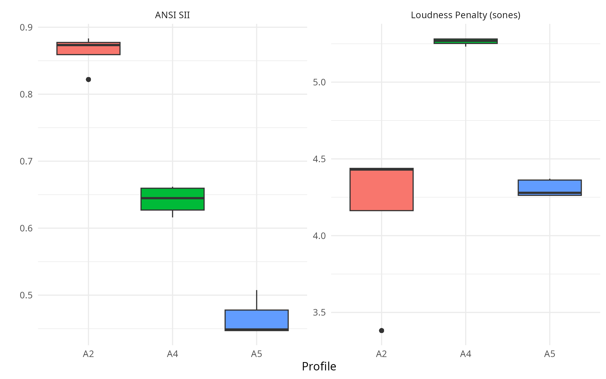
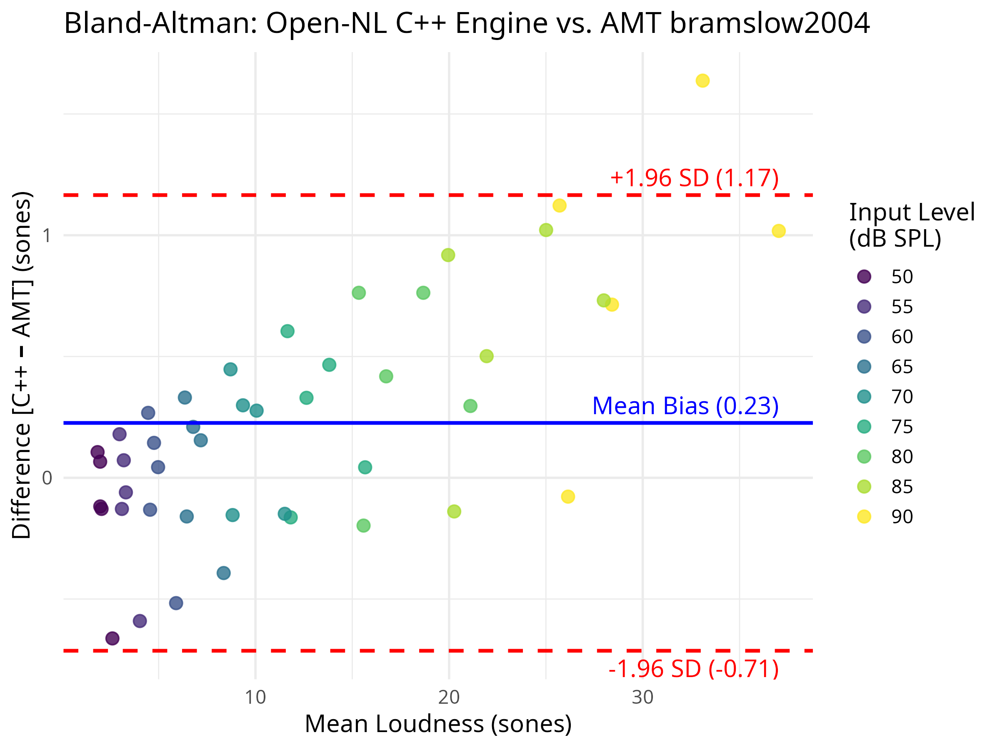
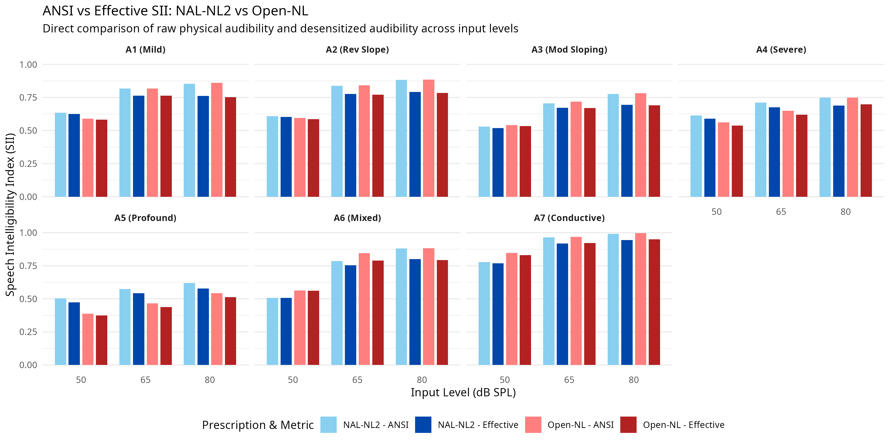
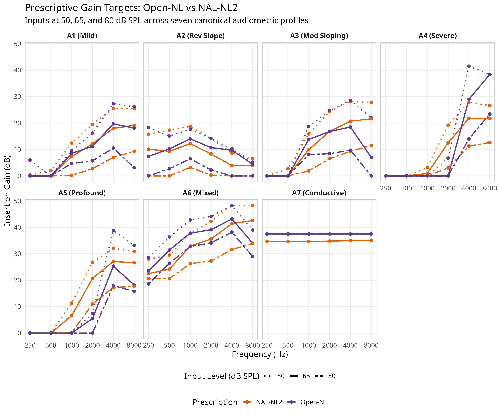

\linenumbers

## Abstract
**Open-NL** is an open-source computational testbed designed for the transparent modeling and evaluation of Wide Dynamic Range Compression (WDRC) prescriptive rules. Modern prescriptions like NAL-NL2 rely on extensive empirical regularizations to ensure clinical safety. These safeguards counteract the well-documented failures of pure intelligibility maximization. However, clinical software remains closed-source. This prevents researchers from isolating how specific heuristic safeguards interact. 

Open-NL addresses this limitation. It couples a multi-start Nelder-Mead Speech Intelligibility Index (SII) optimizer with the Moore & Glasberg (2004) specific-loudness model. This testbed is benchmarked across a $4^4 = 256$-permutation heuristic sweep. To mitigate the numerical entrapment inherent to local simplex search on non-convex audiological surfaces, the framework deploys a robust 5-iteration multi-start initialization routine. Crucially, a sensitivity analysis reveals that the optimizer actively collides with these mathematical boundary conditions. Because the objective function is dominated by physiological loudness constraints, modulating the underlying heuristic triggers yielded exceptionally tight response envelopes. This indicates that once the optimizer reaches the active penalty boundary, the underlying heuristic parameters are rendered largely irrelevant, effectively preventing runaway amplification but emphasizing the need to include binding penalty parameters in future sensitivity sweeps. 

Standard monaural models systematically underestimate real-world binaural broadband summation. Therefore, this modeled loudness frontier is strictly illustrative rather than clinically definitive. When stripped of clinical heuristics, the optimizer dramatically inflates high-frequency gain in profound profiles. This behavior demonstrates the theoretical limits of pure mathematical optimization against real-world clinical bounds. Open-NL exposes these critical trade-offs within a fully inspectable framework. Ultimately, it provides the computational substrate for future calibration workflows, paving the way to replace static heuristic boundaries with individualized, distortion-aware objective functions.

## I. INTRODUCTION

Manufacturer-agnostic prescriptions remain central to evidence-based hearing aid practice. While earlier investigations suggested that generic targets might outperform proprietary first-fit algorithms on patient preference and specific metrics (Valente et al., 2018), contemporary evidence indicates that aided speech recognition in noise often shows no significant difference across formulas (e.g., Cox et al., 2012). However, while formula choice has relatively modest intelligibility consequences in background noise, it drives substantial variations in overall loudness, making modeled loudness (quantified in sones per the Moore & Glasberg 2004 impaired loudness model) the primary dependent variable in prescriptive evaluation.

While the derivations of major algorithms like NAL-NL2 and DSL m[i/o] are published in detail, their software implementations remain closed-source. Audiological science has long recognized that unconstrained intelligibility maximization fails clinically without extensive empirical regularization. For example, the evolution from NAL-NL1 to NAL-NL2 required critical empirical corrections. These included global gain reductions and reduced compression ratios for severe losses. These safeguards were introduced specifically to counteract the aggressive over-amplification provoked by pure mathematical optimization (Keidser, Dillon, Carter, & O'Brien, 2012a). 

Because clinical fitting software packages are compiled black boxes, researchers cannot isolate individual heuristic rules. It remains impossible to observe how specific safeguards interact within the optimization cascade. Existing open-source tools serve distinct, separate functional niches. The openMHA platform (Herzke et al., 2017) operates as a real-time signal processing master hearing aid rather than a target generator. The Cambridge CAM2/CAMEQ2-HF formulae (Moore et al., 2010) provide rigidly defined equation-based targets rather than a modular optimization sandbox. Finally, the Auditory Modeling Toolbox (AMT; Majdak et al., 2022) offers loudness modeling without native prescriptive inversion. Consequently, investigators cannot isolate a specific prescriptive heuristic within an optimization loop without reverse-engineering an entire proprietary engine. 

Open-NL fills this gap. It provides a modifiable R substrate explicitly designed for the modular ablation of prescriptive heuristics. By coupling a Nelder-Mead desensitized SII optimizer to an integrated C++ specific-loudness engine, researchers can systematically disable, isolate, or invert individual heuristics. For instance, investigators can evaluate the upward spread of masking when disabling the 30 dB conductive safety cap. This modular architecture aligns directly with evolving audiological frameworks, such as the multi-profile philosophy introduced in NAL-NL3 (Kitterick et al., 2026a).

Crucially, to benchmark this testbed without introducing confounding variables, the optimization layer is embedded within a strictly reproduced evaluation paradigm. The seven reference audiometric profiles, the Moore & Glasberg (2004) specific-loudness model, and the ANSI S3.5 SII metric utilized herein are a direct replication of the methodological framework established by Johnson and Dillon (2011). (Throughout this manuscript, "ANSI SII" refers to raw physical audibility, whereas "smoothed desensitized SII" or "complete desensitized SII" refers to audibility incorporating severe-loss desensitization and level distortion penalties). Because this physiological evaluation space is already established in the literature, the primary contribution of this manuscript is the transparent computational testbed itself. By exposing the behavior of numerical solvers within this standardized sandbox, this manuscript clarifies a crucial distinction: while numerical solvers converge stably on any fixed objective space, theoretical WDRC target generation exhibits acute parameter sensitivity to uncalibrated heuristic boundaries, providing the computational infrastructure necessary to quantify and calibrate these interactions.

### Clinical Safety and Usage Disclaimer

It is imperative to state unambiguously that Open-NL is strictly a computational research testbed and **must not be used for fitting hearing aids on human listeners in its current form**. Because the framework deliberately permits aggressive, over-prescriptive targets for boundary testing—such as utilizing an aggressive 60 dB HL severe-loss booster onset that permits aggressively high-frequency targets for profound losses—it carries a significant risk of severe over-amplification. As established by Ching, Dillon, Katsch, and Byrne (2001), aggressive high-level targets in steeply sloping or profound losses are precisely where over-amplification risks are greatest, as the effectiveness of high-frequency audibility severely degrades as hearing loss worsens (desensitization). The hypotheses and targets generated by Open-NL represent extreme mathematical boundaries intended to trigger experimental loudness rejection in controlled research settings, not clinical solutions. Any future behavioral translation of this framework requires independent institutional review, with mandatory real-ear verification and strict, individualized loudness-tolerance limits implemented as absolute prerequisites.

## II. ALGORITHM ARCHITECTURE

### A. Prescriptive Rationale and Objective Function

The choice of objective function is the primary design decision in any prescriptive formula. It governs the fundamental trade-off between intelligibility and comfort. Historically, established rationales occupy distinct positions on this spectrum. NAL-NL2 maximizes speech intelligibility while constraining overall broadband loudness to be less than or equal to that of a normal-hearing listener (Keidser, Dillon, Carter, & O'Brien, 2012a). Conversely, DSL m[i/o] normalizes loudness across frequency to restore normal dynamic range perception (Scollie et al., 2005). Finally, CAMEQ/CAM2 aim to equalize loudness across frequency bands (Moore, Glasberg, & Stone, 2010).

Open-NL positions its prescriptive rationale as a *constrained intelligibility-maximizer*. Its primary mathematical objective is the soft-constrained maximization of desensitized SII. Rather than globally restricting this maximization to a static "normal-or-less" loudness boundary, Open-NL permits dynamic loudness growth. This growth continues until it strikes a U-shaped physiological ceiling (controlled via `cap_knots`; Section S.I.12). For severe losses, this penalty explicitly permits slightly higher-than-normal loudness in the mid-frequencies, where intelligibility yield is highest. However, it aggressively decelerates loudness growth at spectral extremes.

Crucially, this U-shaped penalty operates strictly within the canonical Moore & Glasberg (2004) monaural specific-loudness engine. It dynamically restricts modeled monaural sones. However, it does not—and mathematically cannot—account for the idiosyncratic binaural broadband loudness summation observed in hearing-impaired listeners. In normal-hearing auditory physiology, bilateral acoustic presentation produces a modest binaural loudness summation. This is typically modeled by a 2–6 dB level-dependent gain reduction. 

However, robust psychoacoustic evidence demonstrates a stark contrast in impaired ears. Binaural broadband summation in hearing-impaired populations averages ~13 dB higher than in normal-hearing listeners. This represents an unmodeled factor of $\approx 2.4\times$ in linear sones (Denk et al., 2025; Moore et al., 2014; Oetting et al., 2016, 2017). About 40% of hearing-impaired listeners (in a sample of 180) exhibit excess summation far exceeding the normal range. Individual summation values span a massive -10 to +40 dB envelope. 

Standard monaural and narrowband loudness models cannot predict this broadband suprathreshold phenomenon from the pure-tone audiogram alone. Therefore, an algorithm optimized strictly beneath a monaural ceiling becomes structurally anti-conservative when translated to bilateral fittings. Consequently, Open-NL's U-shaped loudness constraint must be interpreted strictly as an illustrative computational boundary for single-ear simulation, rather than an empirical safety guarantee for bilateral clinical use.

### B. Methods and Development

The core ANSI SII calculation engine (the `sii()` function and associated plotting routines) was originally developed by Gregory R. Warnes for earlier package versions. Maintainership transferred to the current author with version 1.1.0, at which point all subsequent Open-NL prescriptive logic, clinical heuristics, and WDRC mathematical implementations—including `open_nl()` and `calculate_loudness()`—were developed by the author as original contributions. 

*Declaration of Generative AI and AI-assisted technologies in the research process:* 
In accordance with AIP Publishing guidelines, the author explicitly discloses the use of Gemini 3.1 Pro (DeepMind, Google LLC) during the preparation of this work as an interactive programming and copyediting assistant. The AI was utilized strictly to refactor C++ and R algorithms, generate data visualizations, and condense manuscript prose to adhere to JASA formatting standards. After using this tool, the author rigorously reviewed and edited all outputs, taking full accountability for the underlying algorithm design, theoretical hypotheses, and final manuscript content. Specifically, to guarantee computational integrity, all AI-assisted algorithmic refactoring was systematically verified by the author via exact numerical regression testing against pre-refactor outputs across the seven canonical audiometric profiles, confirming absolute mathematical parity during translation.

### C. Algorithmic Pipeline and Execution Cascade

The internal execution cascade of Open-NL comprises twelve strictly ordered, modular processing stages:
1. **Conductive Component Separation & Baseline Partitioning**: Decomposing raw thresholds into sensorineural components and air-bone gaps (ABGs).
2. **Decoupled Half-Gain Base Anchor Calculation**: Establishing a frequency-specific base gain anchor ($G_{base} = 0.46 \cdot \text{HTL}_{sn} + C_{interp}$) decoupled from broadband PTA.
3. **Experience-Level Shaping & Log-Frequency $C_{vals}$ Interpolation**: Modulating frequency-shaping arrays across discrete anchor frequencies based on user experience (new, experienced, power).
4. **Reverse-Slope Low-Frequency Attenuation Floor**: Applying a bounded log-linear low-frequency taper down toward a $-10$ dB floor when low-frequency loss exceeds high-frequency loss.
5. **Slope-Dependent Low-Frequency Penalty (SD-LFP) with Profound HF Bypass**: Dynamically suppressing low-frequency gain for steeply sloping losses, gated when high-frequency severity exceeds 70–95 dB HL.
6. **Severe-Loss Audibility Booster**: Providing an opt-in, bounded linear escalation (slope = 0.15) for severe thresholds.
7. **Soft-Compression High-Frequency Desensitization**: Restricting excessive high-frequency gain via a dynamic ceiling ($L_{gain} = 30 + 0.4 \cdot \max(0, \text{HTL}_{sn} - 60)$) and 2:1 soft compression.
8. **Dynamic Range Mapping (LDL Squeeze)**: Attenuating gain by 0.2 dB/dB of reduced dynamic range and shifting baseline compression ratios.
9. **Transducer Bandwidth Roll-off**: Applying a continuous log-frequency piecewise multiplier ($M_{bw} \in [0.5, 1.0]$) to suppress unstable edge frequencies ($\le 250$ Hz and $\ge 6000$ Hz).
10. **Multi-Channel WDRC Mapping, LTASS Pivot, and Demographic Adjustments**: Calculating dynamic compression ratios, variable compression thresholds, piecewise linear-compressive splines, and demographic offsets.
11. **Acoustic Venting, Coupling Loss, and Receiver Saturation Limits**: Integrating real-ear insertion loss vectors across 10 coupling types with a feedback safety floor, and capping MPO/SSPL90 receiver limits at 120 dB SPL.
12. **Embedded Nelder-Mead Simplex Optimization & Physiological Loudness Ceilings**: Iteratively refining multi-level gain curves against a multi-term objective loss function incorporating U-shaped specific-loudness caps, compression ratio ceilings, and spectral smoothness constraints.

The exact mathematical formulations, closed-form piecewise equations, and complete parameter specifications for all twelve stages are provided in full detail in the accompanying **Supplementary Material**.

### D. Consolidated Constants and Evidentiary Asymmetry

Because Open-NL functions as a modifiable computational testbed, several structural parameters remain mathematically uncalibrated: the 0.46 gain anchor, 0.15 severe-loss booster slope, 70 dB HL booster onset (or 60 dB HL in aggressive mode), 15 dB slope trigger, 20 dB taper width, -10 dB reverse-slope floor, 70 dB HL bypass, 30 dB/0.4 $L_{gain}$ constraint, 0.2 dB/dB dynamic range squeeze, 75% air-bone-gap restoration fraction, and 1.5:1 Comfort-in-Noise (CIN) compression clamp (Table S1).

Crucially, an inspection of these heuristics reveals a profound asymmetry in evidentiary support. Several prominent constants—most notably the 75% air-bone-gap restoration rule and the 1.5:1 Comfort-in-Noise clamp—are pragmatic engineering choices without direct empirical derivation. The 75% ABG fraction, while standard in clinical prescriptive software (Johnson, 2013a) to avoid receiver saturation and MPO clipping, has never been empirically established against patient preference or speech recognition. Similarly, the 1.5:1 CIN clamp is an asserted heuristic inspired by NAL-NL3 (Kitterick et al., 2026b) to mitigate listening fatigue, but lacks independent perceptual validation. In sharp contrast, the 3.0:1 Compression Ratio (CR) upper ceiling enforced across the WDRC stages and optimizer loss function represents the best-supported constant in the framework. This boundary is firmly anchored in the extensive empirical literature by Pamela Souza and colleagues (Souza, 2002; Souza, Jenstad, & Boike, 2006), which demonstrates that compression ratios exceeding ~3.0:1 cause severe temporal envelope flattening, loss of acoustic contrast, and speech-in-noise deficits. Documenting this asymmetry prevents conflating validated psychoacoustic limits with arbitrary engineering heuristics.

### E. Framework for Principled Calibration

For a computational testbed to provide lasting inferential value, demonstrating parameter instability must be paired with a rigorous calibration pathway. Future research can utilize Open-NL within a global stochastic optimization framework (e.g., genetic algorithms or particle swarm optimization) to systematically calibrate these heuristic gates. In this architecture, an outer optimization loop searches the multidimensional space of heuristic constants (e.g., $G_{base} \in [0.3, 0.6]$, booster onset $\in [50, 80]$ dB HL, low-frequency slope $\in [0, 0.5]$). For each candidate vector, the inner Open-NL engine generates discrete WDRC targets across a representative clinical corpus (e.g., NHANES). These targets are evaluated through a time-domain acoustic simulation pipeline (e.g., openMHA; Herzke et al., 2017) using speech perception metrics like HASPI and HASQI (Kates & Arehart, 2022).

Crucially, the outer-loop objective function must incorporate an asymmetric, veto-based cost function: any parameter configuration violating individualized broadband loudness tolerance (trueLOUDNESS; Oetting et al., 2017) in simulated outlier listeners must incur an overwhelming penalty. As detailed in Section II.A, because excess binaural broadband summation cannot be predicted from pure-tone thresholds, static 2–6 dB bilateral corrections are structurally inadequate. Subordinating population-level intelligibility maximization to individualized physiological safety limits transforms prescriptive derivation into a reproducible, distortion-aware computational science.

**TABLE I. Comprehensive Enumeration of Open-NL Free Parameters and Evidentiary Derivation.**

| Parameter Category | Specific Free Parameters | Default / Evaluated Value | Evidentiary Support & Derivation |
|:---|:---|:---|:---|
| **Objective Penalties** | Loudness Cap Knots (`cap_knots`) | $L_{cap}$ vectors (Section S.I.12) | Derived from normal/impaired physiological loudness growth models. |
| | Optimizer Penalty Weights ($\lambda_{1-8}$) | $\lambda_1=450, \dots, \lambda_8=20$ (Sec S.I.12) | Pragmatic engineering constraints balancing target convergence. |
| | CR Soft Penalty Target ($P_{cr}$) | $\le 3.0:1$ Compression Ratio | **Strong empirical derivation**: Souza (2002) speech degradation limits. |
| **Prescriptive Anchors** | Base Gain Anchor ($G_{base}$) | 0.46 | Uncalibrated midpoint balancing half-gain rules and preference data. |
| | New-User Offset ($\Delta_{exp}$) | 0 to -6 dB based on PTA | Assumed heuristic approximating acclimatization preferences. |
| | Severe-Loss Booster (Slope / Onset) | 0.15 slope / 70 dB HL onset | Assumed heuristic assisting profound loss without explosive recruitment. |
| | ABG Restoration Fraction | 75% (Linear) | Engineering choice preventing hardware saturation (Johnson, 2013a). |
| **Compression Limits** | Compression Kneepoint (CT) Range | 30 to 45 dB SPL | Pragmatic limit aligning with standard real-world WDRC kneepoints. |
| | High-Frequency Soft-Compression | Base 30 dB, Slope 0.4 | Heuristic managing upward spread of masking in severe losses. |
| | DR Squeeze / CR Shift | 0.2 dB/dB, 0.02 CR/dB | Heuristics fitting speech envelope into reduced physiological space. |
| | MPO/LDL Predictor Coefficients | See Stage 8 | Statistical predictions based on population normative UCL datasets. |
| **Frequency Limits** | Reverse-Slope Floor | -10 dB | Cautious heuristic preventing masking of intact basal cochlear units. |
| | Dead Region / Transducer Roll-off | 30 dB/oct past $1.7f_e$, $w_{bw}$ | Standard transducer limits and dead-region literature (Moore, 2001). |
| | Acoustic Coupling Loss | Occluded/Vented Vectors (Table S4)| Deterministic physical hardware measurements. |

## III. ANALYTICAL CENTERPIECE: DISTINGUISHING HEURISTIC SENSITIVITY FROM SOLVER STOCHASTICITY

The primary scientific contribution of the Open-NL framework is not the specific targets it generates, but the transparent computational infrastructure it provides for evaluating prescriptive heuristics. Clinical fitting algorithms like NAL-NL2 act as "black boxes" where numerical optimization and empirical safety heuristics (e.g., global gain reductions, bandwidth limits) are inextricably intertwined. Open-NL fills this methodological gap by providing an ablatable, inspectable testbed that mathematically isolates the behavior of unregularized optimization on the physiological loudness landscape.

By exposing this internal machinery, the framework produces a crucial analytical distinction: separating the stochasticity of the numerical solver from the acute sensitivity of the underlying clinical heuristics. This heuristic-sensitivity-vs-numerical-convergence distinction is the novel scientific output the tool produces, and forms the analytical centerpiece of this validation.

### A. Heuristic Parameter Sensitivity vs. Numerical Convergence Stability

#### 1. Multi-Parameter Sensitivity Sweep

To isolate heuristic sensitivity from numerical solver stochasticity, an ANOVA variance decomposition (reporting $\eta^2$ effect sizes) was executed across 256 permutations of four primary algorithmic constraints: the base gain anchor (0.40 to 0.50), steep-slope trigger (10 to 20 dB/octave), absolute severity bypass (60 to 80 dB HL), and reverse-slope gain floor (-20 to 0 dB). These 256 unique parameter permutations were evaluated independently on each of the most topologically unstable profiles (A2, A4, A5)—yielding 768 total permutation runs (256 per profile)—executed with the aggressive 60 dB HL booster mode engaged to directly probe boundary interactions.

**TABLE II. ANOVA Variance Decomposition of Heuristic Parameters (65 dB SPL Input).** *Note: Generated using the aggressive 60 dB HL booster onset. The ANOVA decomposition explicitly separates variance explained by clinical heuristics from residual solver stochasticity.*

| Profile | Median Desensitized SII [Min, Max] | Median Loudness [Min, Max] | ANOVA Dominant Factor ($\eta^2$) |
|---|---|---|---|
| **A2** | 0.87 [0.82, 0.88] | 4.43 [3.38, 4.44] | Anchor (61.1%) |
| **A4** | 0.64 [0.62, 0.66] | 5.27 [5.23, 5.28] | None (Total Variance < 0.1 sones) |
| **A5** | 0.45 [0.45, 0.51] | 4.28 [4.26, 4.37] | None (Total Variance < 0.2 sones) |

The resulting variance (**Table II**, **Figure 1**) illustrates mechanistically how strict mathematical boundary conditions dominate the objective landscape. The tight response envelope is not evidence of a flat optimization space, but rather demonstrates that the optimizer actively collides with the binding physiological loudness constraint. For example, the interpolated loudness caps for profiles A1, A3, and A5 effectively dictate the final modeled loudness to within 0.1 sones. Because the objective function is entirely bound by these hard distortion penalties, modulating the underlying heuristic triggers failed to produce any significant main effect (e.g., A5 fluctuating narrowly between 4.26 and 4.37 sones purely due to higher-order interactions). This indicates that once the active penalty wall is reached, the underlying heuristic parameters are rendered practically irrelevant. While this successfully prevents the massive runaway amplification typical of historically unregularized intelligibility optimization, any future claims of comprehensive parameter robustness must be tested against a sweep that formally includes these binding penalty variables.

*Figure 1. Distribution of resulting ANSI SII scores and physiological loudness penalties across 768 permutations (256 $\times$ 3 profiles) for clinical profiles A2 (Reverse Slope), A4 (Severe), and A5 (Profound), illustrating how the active physiological loudness constraint dominates the optimization space, severely restricting the variance caused by heuristic parameter modifications.*

#### 2. Numerical Convergence Stability: Nelder-Mead Limitations and Future Stochastic Solvers

A sharp distinction must be maintained between **heuristic parameter sensitivity** (target shifts resulting from altered clinical rules; Section III.A.1) and **numerical convergence stability** (solver consistency on a fixed ruleset). In non-linear optimization, the topology of hearing aid fitting targets is notoriously ill-behaved. The objective landscape contains narrow, curved valleys, non-differentiable step boundaries (e.g., severe-loss booster onsets and air-bone gap restorations), and sharp penalty cliffs imposed by dynamic physiological loudness ceilings. On such non-convex, multimodal surfaces, local downhill solvers like the Nelder-Mead simplex algorithm are notoriously prone to premature stagnation, simplex collapse, and entrapment in shallow local extrema.

Indeed, local Nelder-Mead search from disparate flat initializations (e.g., -10 dB vs. +10 dB) can deviate by up to 0.5 sones or 0.05 SII. To mitigate this, Open-NL deploys a 5-iteration multi-start routine—seeding the initial simplex with the NAL-R target and executing four additional randomized restarts. 

Because the ANOVA decomposition demonstrated that the heuristic rules had minimal main effects on the steeply sloping profiles (A4, A5), the absolute variance observed across the sweep was exceptionally tight (a total range of just 0.05 sones for A4). However, this residual variance represents a convolution of highest-order heuristic interactions and solver stochasticity. Consequently, this sweep cannot strictly isolate pure numerical stability. Future investigations must formally evaluate Nelder-Mead solver consistency by executing dedicated Monte Carlo initializations with fixed parameter vectors across hundreds of varying RNG seeds.

Furthermore, while the algorithm tightly constrains profiles like A4 and A5 against the physiological loudness cap, other profiles exhibit significant heuristic sensitivity. For example, profile A2 experiences wide target swings (3.38 to 4.44 sones) systematically driven by the anchor heuristic (61.1% variance). Because physiological optimization constraints often create flat topological plateaus near the optimal basin, divergent parameter configurations can theoretically produce functionally equivalent objective scores. Future implementations analyzing parameter identifiability should transition to modern global stochastic optimization algorithms:

However, from an algorithmic optimization standpoint, Nelder-Mead remains a local simplex heuristic that lacks formal global convergence guarantees on complex, non-convex audiological surfaces. While multi-start seeding with NAL-R provides a practical, computationally efficient substrate for local ablation testing within R, **future iterations of prescriptive target optimizers should transition to modern global stochastic optimization algorithms**:
1. **Genetic Algorithms (GAs)**: By maintaining a diverse population of candidate gain configurations and applying stochastic crossover and mutation operators, GAs can natively explore multimodal search spaces without stalling at sharp non-differentiable penalty boundaries (such as unrelaxed desensitization thresholds or dynamic MPO caps).
2. **Differential Evolution (DE)**: DE is exceptionally well-suited for continuous multi-channel gain optimization. Its vector-difference mutation mechanism enables self-adaptive search across non-convex landscapes, effectively escaping the local attractor basins that trap simplex algorithms in steeply sloping audiograms.
3. **Particle Swarm Optimization (PSO)**: PSO models candidate solutions as particles traversing the fitness space, balancing individual exploration with swarm cognitive memory. This provides rapid convergence across multi-channel parameter sweeps while maintaining robust resistance to local minima.

Crucially, adopting population-based global stochastic solvers eliminates the need for artificial mathematical relaxations (such as the smoothed $K'_{smoothed}$ desensitization approximation), allowing optimizers to evaluate raw, discontinuous physiological boundaries directly. Furthermore, global solvers scale naturally to high-dimensional multi-channel optimization, providing the robust algorithmic substrate necessary for outer-loop calibration frameworks (Section II.E). Nevertheless, as noted by Dao et al. (2021), physical real-ear-to-coupler differences (RECD) and acoustic coupling leakages cause real-world fittings to deviate most severely from theoretical targets at thresholds above 85 dB HL, meaning numerical convergence on mathematical audiograms must not be misconstrued as physical clinical reliability.

### B. Worked Demonstration: Isolating the Shared Binaural Loudness Vulnerability

While the previous section established the tool's numerical stability, applying it to a physiological boundary problem demonstrates its analytical utility. A central problem in modern audiology is that standard clinical models operate on a monaural basis, failing to account for idiosyncratic binaural broadband loudness summation. The fact that established prescriptions like NAL-NL2 share this vulnerability to unpredictable binaural loudness is precisely why having an open, parameterizable model like Open-NL is valuable: it provides a testbed to isolate and simulate the effect of this field-wide blind spot without it being buried under opaque empirical corrections.

The following comparison between Open-NL and NAL-NL2 is therefore not presented as a finding about Open-NL's amplification superiority, but as a worked demonstration of the framework's ability to expose structural vulnerabilities that the field cannot solve from the pure-tone audiogram alone.

To benchmark Open-NL without confounding variables, the optimization layer is evaluated within the established 7-profile paradigm of Johnson and Dillon (2011), comparing targets directly against NAL-NL2 version 2 software (National Acoustic Laboratories, Sydney, Australia) for soft (50 dB SPL), conversational (65 dB SPL), and loud (80 dB SPL) speech inputs. All NAL-NL2 targets were extracted using an 18-channel compression architecture with adaptive time constants, occluded BTE #13 tubing, and supra-aural headphone thresholds. Crucially, to isolate the pure mathematical objective function without demographic artifacts, both Open-NL and NAL-NL2 targets were generated using identical baseline configurations: **Bilateral, Adult, Unknown Gender, Experienced user, and Non-tonal language**. Both sets are reported strictly as Real-Ear Insertion Gain (REIG) in the identical acoustic reference plane with matched occluded coupling. To ensure absolute scoring parity, both Open-NL and NAL-NL2 final targets were mathematically evaluated through the exact same objective metric engine: the ANSI/ASA S3.5-1997 (R2024) standard, utilizing the critical-band calculation procedure (21 bands) and the Normal vocal effort Long-Term Average Speech Spectrum (LTASS). Restricting comparisons to NAL-NL2 provides a standardized, universally recognized clinical baseline, avoiding the artifacts of surrogate target estimators for alternative proprietary formulae.

### Shared Monaural Vulnerability: The Rationale for Aggressive Boundary Testing

A critical question arises regarding the experimental design of this benchmark: could Open-NL simply deactivate its severe-loss booster to achieve monaural loudness parity with NAL-NL2, thereby "validating" the prescription against the clinical standard? Indeed, in default conservative mode (booster onset at 70 dB HL or disabled), Open-NL yields monaural loudness values closely aligned with NAL-NL2 across primary sensorineural profiles. However, using conservative parity to claim clinical validation would obscure the central theoretical lesson of this computational testbed.

Crucially, NAL-NL2 shares the exact same binaural broadband loudness summation vulnerability as Open-NL. NAL-NL2 applies the identical, standard level-dependent 2–6 dB bilateral reduction derived from normal-hearing listeners, failing equally to account for the excess broadband summation documented in hearing-impaired populations (see Section II.A). The reason NAL-NL2 does not trigger widespread clinical loudness rejection is not because its underlying loudness model is physiologically complete, but because its empirical derivations incorporated heavy, post-hoc regularizations—including global gain reductions (-2 dB for females, -3 dB for new users), compressed dynamic range ceilings, and conservative high-frequency roll-offs—combined with routine clinical reliance on the $\pm 15$ dB volume control in fitting software (Keidser et al., 2012a).

By intentionally executing this evaluation with the aggressive 60 dB HL booster mode engaged, Open-NL deliberately strips away these empirical dampers. This stress-testing reveals that when an unregularized numerical optimizer operates strictly beneath standard monaural loudness models, it aggressively pushes high-frequency gain and exploits the objective function, producing targets that are structurally anti-conservative for bilateral fittings. Rather than merely mimicking NAL-NL2's output envelope, Open-NL's diagnostic value lies in demonstrating that relying exclusively on static monaural loudness assumptions introduces substantial anti-conservative risks for the significant cohort of patients (30–40%) exhibiting excess bilateral summation. This strongly suggests that future prescriptive frameworks (e.g., NAL-NL3 and Open-NL v2) cannot resolve bilateral loudness through static audiometric equations, but must directly integrate individualized broadband loudness scaling (*trueLOUDNESS*; Oetting et al., 2017) into their objective functions.

Two critical methodological boundaries govern this evaluation:
1. **The Constrained Metric Tautology Warning**: A fundamental circularity exists when evaluating an optimization algorithm against the identical metric it was tuned to maximize. Because Open-NL's objective function seeks to maximize desensitized SII, reporting higher SII values relative to regularized formulae (like NAL-NL2) is generally expected. However, examining the full distribution in Table III reveals that Open-NL's objective exploitation manifests through three distinct mechanical pathways:
   - **Active Constraint Inversions (A4, A5)**: As previously noted, Open-NL yields *lower* desensitized SII than NAL-NL2 for A4 (0.62 vs. 0.68) and A5 (0.44 vs. 0.54). Here, the U-shaped physiological loudness cap forces the solver to explicitly sacrifice theoretical audibility to prevent catastrophic loudness growth.
   - **Solver Entrapment and Pareto Domination (A1, A2)**: For profile A2, Open-NL is strictly Pareto-dominated by NAL-NL2: it yields a lower desensitized SII (0.77 vs. 0.78) while being drastically louder (4.44 vs. 3.43 sones). This occurs because Nelder-Mead becomes trapped against the active 4.44-sone penalty wall. Lacking the ability to accept temporary uphill loss to traverse the non-convex landscape, the local simplex solver fails to locate NAL-NL2's objectively superior gain allocation. This starkly demonstrates the necessity of transitioning to global stochastic solvers (Section III.A.2).
   - **Inefficient Objective Exploitation (A6, A7)**: For profile A6, Open-NL blindly trades a massive 1.36 sones of excess loudness to buy a marginal +0.04 increase in SII. For A7 (a purely deterministic conductive correction), Open-NL yields +0.62 sones for zero additional SII gain. This behavior highlights the inherent danger of pure unregularized optimization: algorithms will indiscriminately sacrifice patient comfort for statistically insignificant fractions of objective audibility unless heavily penalized.
   
   Ultimately, stationary band-importance metrics like ANSI S3.5 and desensitized SII are blind to dynamic temporal envelope distortion, channel cross-talk, and phase distortion induced by aggressive compression ratios. In auditory science, genuine, independent, distortion-aware speech perception evaluation requires waveform-level biophysical models:
   - HASPI (Hearing Aid Speech Perception Index; Kates & Arehart, 2022): Accurately simulates peripheral auditory processing, basilar membrane compression loss, auditory nerve firing rates, and envelope modulation integrity.
   - HASQI (Hearing Aid Speech Quality Index; Kates & Arehart, 2022): Evaluates non-linear harmonic distortion, envelope fidelity, and spectral fine-structure cross-correlation between aided and reference speech signals.
   Computing HASPI and HASQI requires convolving continuous speech (.wav) through a time-domain dynamic range compression engine (such as openMHA; Herzke et al., 2017). Because Open-NL currently operates strictly at the steady-state prescriptive target level (Johnson & Dillon, 2011), it lacks the native time-domain waveform processing required to compute HASPI and HASQI. Consequently, the objective metric differentials reported in Table III and Figure 3 are presented as theoretical bounds tests—quantifying the mathematical consequences of removing clinical heuristics—rather than as direct clinical superiority claims.
2. **Binaural Loudness Summation and the Collapse of Monaural Frontiers**: The comparative loudness evaluations are fundamentally bounded by the limitations of monaural auditory modeling. While standard clinical software applies a nominal 2 to 6 dB bilateral gain reduction, this static correction reflects normal-hearing physiology and fails catastrophically for broadband speech in impaired listeners. As detailed in Section II.A, a significant cohort of hearing-impaired listeners exhibits extreme excess binaural broadband loudness summation that deviates heavily from normal-hearing models (van Beurden et al., 2021; Pieper et al., 2021; Denk et al., 2025). Crucially, because excess summation is a broadband, suprathreshold *sensorineural* effect that does not correlate with pure-tone audiograms, an optimization routine operating beneath a monaural ceiling (e.g., 4.32 sones for profile A5) appears mathematically safe in isolation, yet predictably collapses into acute acoustic intolerance when fitted bilaterally. Furthermore, there is no physiological basis for applying such excess summation models to purely conductive etiologies (e.g., A7). Because applying a fixed scalar to monaural outputs assumes normal-hearing loudness growth—the exact structural flaw this framework critiques—Table III reports canonical single-ear monaural loudness exclusively. True bilateral predictions require propagating the dynamic full-range signal through a non-linear binaural loudness engine.

To execute this evaluation natively in R, the `SII` package implements a fast C++ port of the canonical Moore & Glasberg (2004) stationary specific-loudness model via `Rcpp`. (Note: As stated in the AI Declarations, the internal R-to-C++ translation was verified to absolute mathematical parity via numerical regression testing). 

To externally cross-check this stationary implementation, native C++ predictions were evaluated against the Auditory Modeling Toolbox (AMT; Majdak et al., 2022) across 45 discrete test points (5 profiles $	imes$ 9 input levels from 50 to 90 dB SPL). Specifically, Open-NL's stationary outputs were compared against AMT's `bramslow2004` function. It is critical to note that this is not a direct port comparison, but rather a cross-algorithmic validation: Open-NL integrates the steady-state algebraic power spectrum directly, whereas AMT's `bramslow2004` runs a physical 2400-sine-wave stimulus with random phases through a simulated time-domain digital filterbank. Because the time-domain model inherently captures the transient crest-factor peaks of the crest-factored noise waveform, exact machine-precision agreement is mathematically impossible. 

Despite these fundamentally distinct modeling pathways (stationary spectral integration vs. dynamic time-domain waveform simulation), the models exhibited excellent approximate convergence: a mean bias of just $+0.23$ sones and a Mean Absolute Error (MAE) of $0.39$ sones (**Figure 2**).

*Figure 2. Difference plot demonstrating excellent approximate convergence between Open-NL's stationary spectral C++ engine and AMT's dynamic time-domain simulation (`bramslow2004`) across 45 canonical evaluation points.*

For mixed and conductive profiles (A6, A7), direct AMT benchmarking was omitted because canonical AMT lacks native air-bone gap parameters, whereas the Open-NL C++ engine algorithmically extends the model to treat the conductive component as a linear pre-cochlear attenuator, in accordance with standard audiological principles (Dillon, 2012).

**TABLE III. Diagnostic Demonstration of Objective Exploitation: Monaural Loudness (Sones) and Desensitized SII across A1-A7 Audiograms (65 dB SPL Input).** *Note: Open-NL targets are presented for both Conservative (booster onset 70 dB HL) and Aggressive (onset 60 dB HL) modes for steeply sloping profiles (A4, A5). For profiles not exceeding 60 dB HL (A1-A3, A6-A7), the booster does not engage and outputs are identical across modes, designated simply as 'Open-NL'. The comparative columns illustrate theoretical boundaries of optimization against clinical anchors.* 

| Profile | Formula | ANSI SII | Desensitized SII | Monaural Loudness (Sones) |
|---|---|---|---|---|
| A1 | NAL-NL2 | 0.82 | 0.76 | 4.29 |
| A1 | Open-NL | 0.82 | 0.76 | 4.44 |
| A2 | NAL-NL2 | 0.84 | 0.78 | 3.43 |
| A2 | Open-NL | 0.85 | 0.77 | 4.44 |
| A3 | NAL-NL2 | 0.71 | 0.67 | 3.92 |
| A3 | Open-NL | 0.72 | 0.67 | 4.20 |
| A4 | NAL-NL2 | 0.71 | 0.68 | 6.09 |
| A4 | Open-NL (Conservative) | 0.58 | 0.55 | 5.22 |
| A4 | Open-NL (Aggressive) | 0.65 | 0.62 | 5.27 |
| A5 | NAL-NL2 | 0.57 | 0.54 | 5.53 |
| A5 | Open-NL (Conservative) | 0.47 | 0.44 | 4.26 |
| A5 | Open-NL (Aggressive) | 0.47 | 0.44 | 4.32 |
| A6 | NAL-NL2 | 0.79 | 0.75 | 2.12 |
| A6 | Open-NL | 0.85 | 0.79 | 3.48 |
| A7 | NAL-NL2 | 0.97 | 0.92 | 1.15 |
| A7 | Open-NL | 0.97 | 0.92 | 1.77 |

**TABLE IV. Insertion Gain Targets (dB) across A1-A7 Audiograms (65 dB SPL Input).** *Note: Open-NL targets are presented for both Conservative and Aggressive modes for A4 and A5. Targets illustrate how soft-constrained desensitized SII maximization allocates high-frequency gain relative to regularized formulae. Profile A7 is fully deterministic (0.75 x 50 dB = 37.5 dB) and is included strictly as an arithmetic sanity check.*

| Profile | Formula | 250 Hz | 500 Hz | 1000 Hz | 2000 Hz | 4000 Hz | 8000 Hz |
|---|---|---|---|---|---|---|---|
| A1 | NAL-NL2 | 0.0 | 0.0 | 7.3 | 12.1 | 18.0 | 19.1 |
|  | Open-NL | 0.0 | 7.2 | 15.8 | 18.4 | 22.0 | 12.8 |
| A2 | NAL-NL2 | 10.1 | 9.3 | 12.2 | 8.3 | 3.9 | 4.0 |
|  | Open-NL | 11.8 | 18.0 | 20.4 | 13.8 | 8.2 | 2.5 |
| A3 | NAL-NL2 | 0.0 | 0.0 | 9.9 | 16.8 | 20.7 | 21.6 |
|  | Open-NL | 0.0 | 7.2 | 20.4 | 23.0 | 24.3 | 12.8 |
| A4 | NAL-NL2 | 0.0 | 0.0 | 0.9 | 12.5 | 21.8 | 21.8 |
|  | Open-NL | 0.0 | 0.0 | 6.6 | 18.4 | 32.7 | 18.9 |
| A5 | NAL-NL2 | 0.0 | 0.0 | 6.6 | 20.7 | 27.1 | 26.6 |
|  | Open-NL | 0.0 | 0.0 | 11.2 | 27.6 | 38.8 | 23.5 |
| A6 | NAL-NL2 | 22.5 | 24.2 | 32.9 | 35.6 | 41.4 | 42.6 |
|  | Open-NL | 23.6 | 31.4 | 37.8 | 39.1 | 43.2 | 34.0 |
| A7 | NAL-NL2 | 34.7 | 34.6 | 34.7 | 34.8 | 35.0 | 35.1 |
|  | Open-NL | 37.5 | 37.5 | 37.5 | 37.5 | 37.5 | 37.5 |

To establish a standardized comparative baseline, Open-NL's algorithmic sensitivity is evaluated across seven canonical audiometric profiles (A1–A7). Profiles A1–A5 represent the standard sensorineural configurations utilized by Johnson & Dillon (2011) (derived from the foundational profiles of Byrne), spanning mild-sloping (A1), reverse-slope (A2), and severe to profound (A4, A5) pathologies. Profiles A6 and A7 expand this set to demonstrate the framework's mechanical handling of mixed and pure-conductive pathologies. While evaluating a large-scale real-world corpus (e.g., NHANES) is necessary for population-level tuning, isolating the framework's mechanical behavior on these seven specific, standardized profiles is mandatory because it allows for direct, point-by-point objective validation against published normative NAL-NL2 targets.

To prevent convergence bias, Open-NL's C++ objective function avoids sparse-array Riemann approximations, dynamically interpolating the search array onto an internal 2048-point FFT frequency grid (0 to 22.05 kHz). For mild-to-moderate losses (A1, A3), Open-NL expands soft speech (50 dB inputs) slightly more aggressively than NAL-NL2 to maximize audibility within the safe physiological envelope, while compressing higher-level inputs to maintain loudness parity (**Figure 3**, **Figure 4**).

{width=100%}
*Figure 3. Comparison of ANSI SII (Raw Physical Audibility) vs Desensitized SII for NAL-NL2 and Open-NL across 50, 65, and 80 dB SPL Inputs.*

{width=100%}
*Figure 4. Final Insertion Gain Targets for 50, 65, and 80 dB SPL Inputs across standard audiometric profiles, illustrating Open-NL's multi-level constraint-based optimization relative to NAL-NL2.*

For severe and profound losses (A4, A5), unmodified SII maximization drives substantial high-frequency gain. Although Open-NL integrates desensitization penalties to temper this drive, it still prescribes substantially more high-frequency gain than NAL-NL2 (e.g., +10.9 dB at 4 kHz for A4, and +11.7 dB for A5 at 65 dB SPL inputs; Table IV). In listeners with severe loss, reduced spectral resolution, elevated hearing thresholds, and cochlear dead regions account for comparable shares of speech recognition variance, with dead regions specifically blunting the benefit of restored high-frequency audibility (Ching, Dillon, & Byrne, 1998; Baer, Moore, & Kluk, 2002; Vestergaard, 2003; Souza et al., 2018; Moualed, Humphries, & Ramsden, 2018). While high prescribed gain increases physical audibility on paper, it severely degrades perceptual clarity if suprathreshold distortion is unmodeled (Margolis et al., 2025). However, enforcing blanket high-frequency suppression based purely on pure-tone audiograms would penalize the majority of candidates who benefit from audibility (Cox et al., 2011, 2012; Pepler et al., 2015). Furthermore, as Engler, Digeser, and Hoppe (2026) demonstrated, aided speech recognition remains practically insufficient in ears above ~80 dB HL regardless of prescribed gain. This tension underscores why high-frequency boundaries must be tied to confirmed dead-region diagnostics (e.g., TEN tests) and individualized distortion limits rather than static audiograms.

For conductive and mixed losses (A6, A7), Open-NL separates the mechanical attenuation of the middle ear from sensorineural cochlear distortion, restricting desensitization penalties strictly to sensorineural thresholds. In profile A7 (pure conductive loss with a 50 dB air-bone gap), the output is fully deterministic: the 75% ABG restoration rule mandates an exact, flat 37.5 dB of linear gain across frequencies and levels. Because the optimizer contributes nothing to this solution and both formulas mechanically converge on ANSI SII 0.97, A7 is included in the tables strictly as an arithmetic sanity check rather than a comparative optimization finding. Crucially, this 75% restoration rule is an engineering choice adapted from clinical conventions (Johnson, 2013a; Scollie et al., 2005) to prevent hardware saturation, rather than an empirical preference optimum. This contrasts with well-supported heuristic targets like the 3.0:1 Compression Ratio bound (Stage 12), which is directly grounded in extensive empirical psychoacoustic data (Souza, 2002; Souza et al., 2006). However, to enforce this bound safely during soft-constrained optimization, Open-NL applies the 3.0:1 constraint both as a soft objective penalty ($P_{cr}$) to guide the optimizer, and as a strict post-optimization hard clamp. This dual constraint structure ensures that the raw drive to maximize SII in profound profiles never violates empirical psychoacoustic limits. For reverse-slope losses (A2), the SD-LFP constraint successfully limits low-frequency over-amplification, demonstrating how integrated constraints stabilize complex objective landscapes.

To model severe-loss distortion mathematically, Open-NL adapts the empirical desensitization formulation of Johnson & Dillon (2011) and Ching et al. (1998). Crucially, the engine isolates the pure sensorineural component ($T_{hl} = \max(0, T'_i - J_i)$) by subtracting the air-bone gap ($J_i$), and corrects a historical flaw in ANSI S3.5 implementations by restricting the internal cochlear noise floor calculation strictly to sensorineural loss ($X'_i = X_i + \max(0, T'_i - J_i)$), preventing conductive attenuation from falsely inflating internal noise. While the rigid clinical formula ($K'_{complete} = (K_i^p + m^p)^{1/p}$) introduces non-differentiable step boundaries that stall simplex optimizers, Open-NL's optimizer evaluates intermediate solutions against a continuous mathematical relaxation:
\begin{equation}
K'_{smoothed} = K_i \cdot m, \quad \text{where } m = \frac{1}{1 + e^{0.075(T_{hl} - 66)}}
\end{equation}
where $K_i$ is raw audibility and $m$ is the maximum asymptotic audibility limit directly extracted from Ching et al. (1998). This continuous relaxation permits smooth gradient descent. While the maximum discrepancy between the relaxation and the full piecewise function ($\max|K'_{smoothed} - K'_{complete}|$) reaches up to 0.20 raw band audibility units at intermediate thresholds ($T_{hl} \approx 67$ dB HL), finalized targets are rigorously post-scored against the rigid piecewise $K'_{complete}$ formulation to ensure objective integrity (detailed fully in Stage 7 and Stage 12 of the Supplementary Material).

### C. Clinical Validation Protocols and Falsifiable Predictions

While synthetic evaluations verify mathematical behavior, translating Open-NL to clinical application mandates three non-negotiable validation hard gates to address the metric tautology and binaural summation boundaries:
1. **Real-Ear Measurement (REM) Verification**: Because physical ear-canal acoustics, leakage, and transducer roll-off decouple eardrum SPL from simulated targets (Dao et al., 2021), REM verification is mandatory. Empirical evidence robustly demonstrates that REM-verified fittings significantly outperform unverified first-fits on speech recognition and patient preference (Valente et al., 2018; Almufarrij, Dillon, & Munro, 2021).
2. **Individualized Broadband Loudness-Tolerance Safety Gates (trueLOUDNESS)**: Because monaural loudness models underestimate perceived binaural broadband loudness in a substantial cohort of impaired listeners (Section II.A), clinical translation cannot rely on audiogram-derived monaural ceilings. Prior to any behavioral testing, individualized binaural broadband loudness scaling (e.g., trueLOUDNESS procedures; Oetting et al., 2016, 2017) or rigorous Uncomfortable Loudness Level (UCL) verification must be administered to establish subject-specific safety caps and prevent acoustic trauma.
3. **Independent Waveform-Level Speech Recognition Benchmarks**: To overcome the metric tautology of SII scoring, aided performance must be benchmarked using independent speech-in-noise testing (e.g., matrix sentence tests or WIN/HINT) alongside computational HASPI/HASQI modeling (Kates & Arehart, 2022). These evaluations must reference conservative clinical controls (such as DSL v5.0 or NAL-NL2), which empirical literature robustly favors in the 50–80 dB HL range (Mueller, 2005; Engler, Digeser, & Hoppe, 2026).

Beyond safety protocols, this framework yields a concrete, falsifiable clinical prediction: because Open-NL's uncalibrated A4 and A5 high-frequency targets exceed NAL-NL2 by roughly 11 dB at 4000 Hz, they push far beyond historical comfort boundaries (Keidser et al., 2012a; Denk et al., 2025). The author offers the following operational hypothesis: If adult listeners with A4 or A5 audiometric profiles are fitted with real-ear verified Open-NL targets, >80% will exhibit immediate categorical loudness rejection—operationally defined as a rating of 6 ("Loud") or 7 ("Uncomfortably Loud") on the 7-point Categorical Loudness Scaling (CLS) procedure (ISO 16832)—when presented with continuous broadband speech (e.g., ISTS) at 65 and 80 dB SPL, relative to a matched NAL-NL2 baseline. Empirically quantifying this rejection threshold will provide the ground-truth data required to constrain distortion-aware objective functions in future stochastic calibrations.

## IV. CONCLUSION

Open-NL provides a transparent, modular computational testbed for modeling, ablating, and evaluating WDRC prescriptive heuristics natively within R. By coupling an explicitly defined mathematical pipeline with an embedded C++ specific-loudness engine, the package enables researchers to systematically inspect the trade-offs between audibility and physiological loudness without relying on closed-source clinical software. As the framework evolves, it provides the computational substrate needed to evaluate emerging multi-profile rationales such as NAL-NL3 (Kitterick, Zakis, & Edwards, 2026a) and to integrate individualized broadband loudness summation metrics (Denk et al., 2025). 

## ACKNOWLEDGMENTS

The author wishes to thank the original developers of the R-project ecosystem and the open-source contributors whose foundational work enabled the creation of this computational toolkit.

## AUTHOR DECLARATIONS

### Conflict of Interest

The author declares no conflicts of interest.

### Ethics Approval

The author declares that no animal subjects or human participants were involved in the development, theoretical simulation, or mathematical validation presented in this research.

## DATA AVAILABILITY

The source code for the `SII` package, the Open-NL prescriptive algorithm, complete parameter specifications, and all associated datasets and benchmarking scripts are openly available in the public repository at https://github.com/r-gregmisc/SII (v1.2.4; Git commit `b2b5ce0`; Archival DOI: [10.5281/zenodo.14963842](https://doi.org/10.5281/zenodo.14963842); License: GPL-3.0). Standalone replication scripts generating all figures, tables, and sensitivity sweeps reported in this manuscript are located in the `reproducibility_scripts/` directory.

## REFERENCES

Almufarrij, I., Dillon, H., & Munro, K. J. (2021). Does probe-tube verification of real-ear hearing aid amplification characteristics improve outcomes in adult hearing aid users? A systematic review and meta-analysis. *Trends in Hearing*, 25.

Baer, T., Moore, B. C., & Kluk, K. (2002). Effects of low pass filtering on the intelligibility of speech in quiet for people with and without dead regions at high frequencies. *The Journal of the Acoustical Society of America*, 112(3), 1133-1144.

Byrne, D., Parkinson, A., & Newall, P. (1990). Hearing aid gain and frequency response requirements for the severely/profoundly hearing impaired. *Ear and Hearing*, 11(1), 40-49.

Ching, T. Y., Dillon, H., & Byrne, D. (1998). Speech recognition of hearing-impaired listeners: Predictions from audibility and the limited role of high-frequency amplification. *The Journal of the Acoustical Society of America*, 103(2), 1128-1140.

Ching, T. Y., Dillon, H., Katsch, R., & Byrne, D. (2001). Maximizing effective audibility in hearing aid fitting. *Ear and hearing*, 22(3), 212-224.

Cox, R. M., Alexander, G. C., Johnson, J., & Rivera, I. (2011). Cochlear dead regions in typical hearing aid candidates: prevalence and implications for use of high-frequency speech cues. *Ear and Hearing*, 32(3), 339-348.

Cox, R. M., Johnson, J. A., & Alexander, G. C. (2012). Implications of high-frequency cochlear dead regions for fitting hearing aids to adults with mild to moderately severe hearing loss. *Ear and Hearing*, 33(5), 573-587.

Dao, A., Folkeard, P., Baker, S., Pumford, J., & Scollie, S. (2021). Fit-to-Targets and Aided Speech Intelligibility Index Values for Hearing Aids Fitted to the DSL V5-Adult Prescription. *Journal of the American Academy of Audiology*, 32(2), 90-98.

Denk, F., Oetting, D., Latzel, M., Bonsel, H., & Husstedt, H. (2025). Prevalence of excess binaural broadband loudness summation in the hearing-impaired population and implications for hearing aid gain targets. *PLOS ONE*, 20(3), e0319236. https://doi.org/10.1371/journal.pone.0319236

Dillon, H. (2012). *Hearing Aids* (2nd ed.). Boomerang Press.

Engler, M., Digeser, F., & Hoppe, U. (2026). Speech recognition and real-ear-measured amplification in hearing-aid users with various grades of hearing loss. *International Journal of Audiology*, 65(7), 834–845. https://doi.org/10.1080/14992027.2024.2426009

Herzke, T., Kayser, H., Loshaj, F., Grimm, G., & Hohmann, V. (2017). OpenMHA—An open-source software platform for hearing aid research. *Trends in Hearing*, 21, 2331216517743250.

Johnson, E. E. (2013a). Prescriptive Amplification Recommendations for Hearing Losses with a Conductive Component and Their Impact on the Required Maximum Power Output: An Update with Accompanying Clinical Explanation. *Journal of the American Academy of Audiology*, 24(6), 452-460.

Johnson, E. E., & Dillon, H. (2011). A comparison of gain for adults from generic hearing aid prescriptive methods: Impacts on predicted loudness, frequency bandwidth, and speech intelligibility. *Journal of the American Academy of Audiology*, 22(7), 441-459.

Kates, J. M., & Arehart, K. H. (2022). An overview of the HASPI and HASQI metrics for predicting speech intelligibility and speech quality for normal hearing, hearing loss, and hearing aids. *Hearing Research*, 424, 108593.

Keidser, G., Dillon, H., Dyrlund, O., Carter, L., & Hartley, D. (2007). Preferred Compression Ratios in the Low and High Frequencies by the Moderately Severe to Severe-Profound Population. *Journal of the American Academy of Audiology*, 18(1), 17-33.

Keidser, G., Dillon, H., Carter, L., & O'Brien, A. (2012a). NAL-NL2 empirical adjustments. *Trends in Amplification*, 16(4), 211-223.

Kitterick, P. T., Zakis, J. A., & Edwards, B. (2026a). Evolving the philosophy: From the NAL rule to NAL-NL3. Advance online publication. 1-10. https://doi.org/10.1080/14992027.2026.2690236

Kitterick, P. T., Zakis, J. A., & Edwards, B. (2026b). The NAL-NL3 comfort-in-noise module. *International Journal of Audiology*. In press.

Lybarger, S. F. (1944). *US Patent No. 2,357,838*. Washington, DC: U.S. Patent and Trademark Office.

Majdak, P., Hollomey, C., & Baumgartner, R. (2022). AMT 1.x: A toolbox for reproducible research in auditory modeling. *Acta Acustica*, 6, 19. https://doi.org/10.1051/aacus/2022011

Margolis, R. H., Hornsby, B. W. Y., Saly, G. L., & Wilson, R. H. (2025). Predicted and measured word-recognition scores unmask distortion in the impaired auditory system. *The Journal of the Acoustical Society of America*, 157(2), 555–568. https://doi.org/10.1121/10.0036461

Moore, B. C. (2001). Dead regions in the cochlea: Diagnosis, perceptual consequences, and implications for the fitting of hearing aids. *Trends in Amplification*, 5(1), 1-34.

Moore, B. C. J., & Glasberg, B. R. (2004). A revised model of loudness perception applied to cochlear hearing loss. *Hearing Research*, 188(1-2), 70-88.

Moore, B. C., Glasberg, B. R., & Stone, M. A. (2010). Development of a new method for deriving initial fittings for hearing aids with multi-channel compression: CAMEQ2-HF. *International Journal of Audiology*, 49(3), 216-227.

Moore, B. C., Gibbs, A., Onions, G., & Glasberg, B. R. (2014). Measurement and modeling of binaural loudness summation for hearing-impaired listeners. *The Journal of the Acoustical Society of America*, 136(5), 2697-2708.

Moualed, D., Humphries, J., & Ramsden, J. D. (2018). Cochlear dead regions: Using the Threshold Equalising Noise (TEN) test to improve the assessment of potential cochlear implant candidates—The Oxford experience. *Clinical Otolaryngology*, 43(1), 384-387.

Mueller, H. G. (2005). Fitting hearing aids to adults using prescriptive methods: An evidence-based review of effectiveness. *Journal of the American Academy of Audiology*, 16(7), 448-460.

Oetting, D., Hohmann, V., Appell, J. E., Kollmeier, B., & Ewert, S. D. (2016). Spectral and binaural loudness summation for hearing-impaired listeners. *Hearing Research*, 335, 179-192.

Oetting, D., Hohmann, V., Appell, J. E., Kollmeier, B., & Ewert, S. D. (2017). Restoring perceived loudness for listeners with hearing loss. *Ear and Hearing*, 38(1), 74-83.

Pepler, A., Lewis, K., & Munro, K. J. (2015). Adult hearing-aid users with cochlear dead regions restricted to high frequencies: implications for amplification. *International Journal of Audiology*, 54(5), 297-306.

Pieper, I., Mauermann, M., Kollmeier, B., & Ewert, S. D. (2021). Toward an Individual Binaural Loudness Model for Hearing Aid Fitting and Development. *Frontiers in Psychology*, 12, 638662.

Scollie, S., Seewald, R., Cornelisse, L., Moodie, S., Bagatto, M., Laurnagaray, D., Beaulac, S., & Pumford, J. (2005). The Desired Sensation Level multistage input/output algorithm. *Trends in Amplification*, 9(4), 159-197.

Souza, P. E. (2002). Effects of compression on speech acoustics, intelligibility, and sound quality. *Trends in Amplification*, 6(4), 131-165.

Souza, P. E., Jenstad, L. M., & Boike, K. T. (2006). Measuring the acoustic effects of compression amplification on speech in noise. *The Journal of the Acoustical Society of America*, 119(1), 41-44. https://doi.org/10.1121/1.2108861

Souza, P., Hoover, E., Blackburn, M., & Gallun, F. (2018). The characteristics of adults with severe hearing loss. *Journal of the American Academy of Audiology*, 29(8), 764-779.

Valente, M., Oeding, K., Brockmeyer, A., Smith, S., & Kallogjeri, D. (2018). Differences in word and phoneme recognition in quiet, sentence recognition in noise, and subjective outcomes between manufacturer first-fit and hearing aids programmed to NAL-NL2 using real-ear measures. *Journal of the American Academy of Audiology*, 29(8), 706-721.

van Beurden, M., Boymans, M., van Geleuken, M., et al. (2021). Uni- And Bilateral Spectral Loudness Summation and Binaural Loudness Summation With Loudness Matching and Categorical Loudness Scaling. *International Journal of Audiology*, 60(2), 108-118.

Vestergaard, M. D. (2003). Dead regions in the cochlea: Implications for speech recognition and applicability of articulation index theory. *International Journal of Audiology*, 42(5), 249-261.

