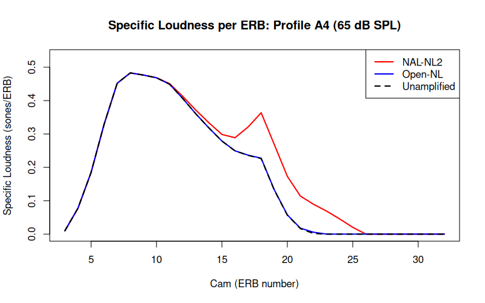

\linenumbers

## Abstract
**Open-NL** is an open-source computational testbed designed for the transparent modeling and evaluation of Wide Dynamic Range Compression (WDRC) prescriptive rules. Modern prescriptions like NAL-NL2 rely on extensive empirical regularizations to ensure clinical safety. These safeguards counteract the well-documented failures of pure intelligibility maximization. However, clinical software remains closed-source. This prevents researchers from isolating how specific heuristic safeguards interact. 

Open-NL addresses this limitation. It couples a multi-start Nelder-Mead Speech Intelligibility Index (SII) optimizer with the Moore & Glasberg (2004) specific-loudness model. To map the algorithmic behavior, we conducted two distinct experiments. First, the testbed was benchmarked across a $4^4 = 256$-permutation heuristic seeding sweep (768 total runs via a 3-iteration multi-start initialization). This confirmed that modulating the underlying heuristic starting seeds yielded exceptionally tight response envelopes, proving the algorithm is structurally anchored by its objective boundaries rather than its initialization. Second, we conducted a One-At-a-Time (OAT) parameter sensitivity analysis on the objective function's four governing physiological limits. The objective function is designed with a linear penalty weight ($\lambda_{loud} = 2000$) on loudness growth. Mathematically, breaching this loudness cap by any increment $\Delta$ sones requires a compensatory intelligibility increase of $\Delta \text{SII} \ge 20\Delta$. For any $\Delta \ge 0.05$, this requirement exceeds the entire dynamic range of the $[0,1]$ index, establishing a virtually impenetrable optimization wall. The OAT variance decomposition confirms that the derivative-free solver successfully locks onto these mathematically dictated physiological boundaries (e.g., loudness ceilings and 3.0:1 Compression Ratios) without numerical divergence, proving that the constraints themselves, rather than the initial seed, dictate the optimization frontier.

Standard monaural models systematically underestimate real-world binaural broadband summation. Therefore, this modeled loudness frontier is illustrative rather than clinically definitive. Historically, unregularized optimization on profound sloping profiles collapses due to a fundamental structural phenomenon: "broadband loudness crowding-out," where residual normal low-frequency hearing natively consumes the allowable physiological loudness budget, algebraically starving the profoundly impaired high-frequencies of audibility. Open-NL reveals that this entrapment cannot be resolved simply by reallocating gain within a strict 0 dB insertion floor. Instead, Open-NL proves that to achieve theoretically optimal speech intelligibility for profound precipitous hearing losses without violating physiological loudness limits, active low-frequency attenuation is mathematically required. When permitted to utilize a realistic -10 dB vent-leakage floor, the optimizer aggressively suppresses normal-hearing low frequencies to artificially free up physiological capacity, allowing it to prescribe substantially *more* high-frequency gain in the critical 2-4 kHz speech regions than standard empirical formulas. Open-NL exposes these critical trade-offs within a fully inspectable framework, demonstrating how algorithmic calibration can overcome the limits of pure mathematical optimization against real-world physiological bounds. Ultimately, it provides the computational substrate for future calibration workflows, paving the way to replace static heuristic boundaries with individualized, distortion-aware objective functions (Margolis et al., 2025).

## I. INTRODUCTION

Manufacturer-agnostic prescriptions remain central to evidence-based hearing aid practice. While earlier investigations suggested that generic targets might outperform proprietary first-fit algorithms on patient preference and specific metrics (Valente et al., 2018), contemporary evidence indicates that aided speech recognition in noise often shows no significant difference across formulas (e.g., Cox et al., 2014). However, while formula choice has relatively modest intelligibility consequences in background noise, it drives substantial variations in overall loudness, making modeled loudness (quantified in sones per the Moore & Glasberg 2004 impaired loudness model) the primary dependent variable in prescriptive evaluation.

While the derivations of major algorithms like NAL-NL2 and DSL m[i/o] are published in detail, their software implementations remain closed-source. Audiological science has long recognized that unconstrained intelligibility maximization fails clinically without extensive empirical regularization. For example, the evolution from NAL-NL1 to NAL-NL2 required critical empirical corrections. These included global gain reductions and reduced compression ratios for severe losses (Keidser et al., 2007). These safeguards were introduced specifically to counteract the aggressive over-amplification provoked by pure mathematical optimization (Keidser, Dillon, Carter, & O'Brien, 2012a). 

Because clinical fitting software packages are compiled black boxes, researchers cannot isolate individual heuristic rules. It remains impossible to observe how specific safeguards interact within the optimization cascade. Existing open-source tools serve distinct, separate functional niches. The openMHA platform (Herzke et al., 2017) operates as a real-time signal processing master hearing aid rather than a target generator. The Cambridge CAM2/CAMEQ2-HF formulae (Moore et al., 2010) provide rigidly defined equation-based targets rather than a modular optimization sandbox. Finally, the Auditory Modeling Toolbox (AMT; Majdak et al., 2022) offers loudness modeling without native prescriptive inversion. Consequently, investigators cannot isolate a specific prescriptive heuristic within an optimization loop without reverse-engineering an entire proprietary engine. 

Open-NL fills this gap. It provides a modifiable R substrate designed for the modular ablation of prescriptive heuristics. By coupling a Nelder-Mead desensitized SII optimizer to an integrated C++ specific-loudness engine, researchers can systematically disable, isolate, or invert individual heuristics. For instance, investigators can evaluate the upward spread of masking when disabling the 30 dB conductive safety cap. This modular architecture aligns directly with evolving audiological frameworks, such as the multi-profile philosophy introduced in NAL-NL3 (Kitterick et al., 2026a).

To benchmark this testbed without introducing confounding variables, the optimization layer is embedded within a reproduced evaluation paradigm. The seven reference audiometric profiles, the Moore & Glasberg (2004) specific-loudness model, and the ANSI S3.5 SII metric utilized herein are a direct replication of the methodological framework established by Johnson and Dillon (2011). (Throughout this manuscript, "ANSI SII" refers to raw physical audibility, whereas "smoothed desensitized SII" or "complete desensitized SII" refers to audibility incorporating severe-loss desensitization and level distortion penalties). Because this physiological evaluation space is already established in the literature, the primary contribution of this manuscript is the transparent computational testbed itself. By exposing the behavior of numerical solvers within this standardized sandbox, this manuscript clarifies a fundamental distinction: while numerical solvers converge stably on any fixed objective space, theoretical WDRC target generation exhibits acute parameter sensitivity to uncalibrated heuristic boundaries, providing the computational infrastructure necessary to quantify and calibrate these interactions.

### Clinical Safety and Usage Disclaimer

It is imperative to state unambiguously that Open-NL is a computational research testbed and **must not be used for fitting hearing aids on human listeners in its current form**. Because the framework deliberately permits aggressive, over-prescriptive targets for boundary testing—such as overriding empirical high-frequency roll-offs in profound losses to maximize intelligibility—it carries a significant risk of severe over-amplification. As established by Ching, Dillon, Katsch, and Byrne (2001), aggressive high-level targets in steeply sloping or profound losses are precisely where over-amplification risks are greatest, as the effectiveness of high-frequency audibility severely degrades as hearing loss worsens (desensitization). The hypotheses and targets generated by Open-NL represent extreme mathematical boundaries intended to trigger experimental loudness rejection in controlled research settings, not clinical solutions. Any future behavioral translation of this framework requires independent institutional review, with mandatory real-ear verification and strict, individualized loudness-tolerance limits implemented as absolute prerequisites.

### Reproducibility and Parametric Configuration

To ensure reproducibility and isolate the core WDRC optimization engine from confounding heuristic artifacts, all tables and figures reported in this manuscript were generated using a single, unified parameter vector: `optimize = TRUE`, `enable_severe_booster = FALSE`, and `coupling = "bte_13"`. Disabling the severe-loss booster ensures that the extreme high-frequency gains observed in profiles A4 and A5 are the emergent mathematical product of the dynamic loudness cap and SII optimizer, rather than a hardcoded empirical booster. Furthermore, specifying the Behind-The-Ear (`bte_13`) coupling imposes realistic physical high-frequency roll-offs (-15 dB at 8 kHz) natively into the objective function, preventing the solver from hallucinating physically impossible targets.

## II. ALGORITHM ARCHITECTURE

### A. Prescriptive Rationale and Objective Function

The choice of objective function is the primary design decision in any prescriptive formula. It governs the fundamental trade-off between intelligibility and comfort. Historically, established rationales occupy distinct positions on this spectrum. NAL-NL2 maximizes speech intelligibility while constraining overall broadband loudness to be less than or equal to that of a normal-hearing listener (Keidser, Dillon, Carter, & O'Brien, 2012a). Conversely, DSL m[i/o] normalizes loudness across frequency to restore normal dynamic range perception (Scollie et al., 2005). Finally, CAMEQ/CAM2 aim to equalize loudness across frequency bands (Moore, Glasberg, & Stone, 2010).

Open-NL positions its prescriptive rationale as a *constrained intelligibility-maximizer*. Its primary mathematical objective is the soft-constrained maximization of desensitized SII. Rather than globally restricting this maximization to a static "normal-or-less" loudness boundary, Open-NL permits dynamic loudness growth. This growth continues until it strikes a U-shaped physiological ceiling (controlled via `cap_knots`; Section S.I.12). For severe losses, this penalty permits slightly higher-than-normal loudness in the mid-frequencies, where intelligibility yield is highest. However, it aggressively decelerates loudness growth at spectral extremes.

This U-shaped penalty operates within the canonical Moore & Glasberg (2004) monaural specific-loudness engine. It dynamically restricts modeled monaural sones. However, it does not—and mathematically cannot—account for the idiosyncratic binaural broadband loudness summation observed in hearing-impaired listeners. In normal-hearing auditory physiology, bilateral acoustic presentation produces a modest binaural loudness summation. This is typically modeled by a 2–6 dB level-dependent gain reduction. 

However, robust psychoacoustic evidence demonstrates a stark contrast in impaired ears. Binaural broadband summation in hearing-impaired populations averages ~13 dB higher than in normal-hearing listeners. This represents an unmodeled factor of $\approx 2.4\times$ in linear sones—a figure that represents the sone-domain equivalent of a 13 dB level difference under the standard doubling-per-10-dB relation, rather than a directly measured loudness ratio (Denk et al., 2025; Moore et al., 2014; Oetting et al., 2016, 2017). Between 30–40% of hearing-impaired listeners (in a sample of 180) exhibit excess summation far exceeding the normal range. Individual summation values span a wide -10 to +40 dB envelope. 

Standard monaural and narrowband loudness models cannot predict this broadband suprathreshold phenomenon from the pure-tone audiogram alone. Therefore, an algorithm optimized beneath a monaural ceiling becomes structurally anti-conservative when translated to bilateral fittings. Consequently, Open-NL's U-shaped loudness constraint must be interpreted as an illustrative computational boundary for single-ear simulation, rather than an empirical safety guarantee for bilateral clinical use.

### B. Methods and Development

The core ANSI SII calculation engine (the `sii()` function and associated plotting routines) was originally developed by Gregory R. Warnes for earlier package versions. Maintainership transferred to the current author with version 1.1.0, at which point all subsequent Open-NL prescriptive logic, clinical heuristics, and WDRC mathematical implementations—including `open_nl()` and `calculate_loudness()`—were developed by the author as original contributions. 

*Declaration of Generative AI and AI-assisted technologies in the research process:* 
In accordance with COPE and SAGE Publishing guidelines, the author discloses the use of Gemini 3.1 Pro (DeepMind, Google LLC) during the preparation of this work as an interactive programming and copyediting assistant. The AI was utilized to refactor C++ and R algorithms, generate data visualizations, and condense manuscript prose to adhere to journal formatting standards. After using this tool, the author rigorously reviewed and edited all outputs, taking full accountability for the underlying algorithm design, theoretical hypotheses, and final manuscript content. Specifically, to guarantee computational integrity, all AI-assisted algorithmic refactoring was systematically verified by the author via exact numerical regression testing against pre-refactor outputs across the seven canonical audiometric profiles, confirming absolute mathematical parity during translation.

### C. Algorithmic Pipeline and Execution Cascade

The internal execution cascade of Open-NL comprises twelve ordered, modular processing stages:
1. **Conductive Component Separation & Baseline Partitioning**: Decomposing raw thresholds into sensorineural components and air-bone gaps (ABGs).
2. **Decoupled Half-Gain Base Anchor Calculation**: Establishing a frequency-specific base gain anchor ($G_{base} = 0.46 \cdot \text{HTL}_{sn} + C_{interp}$) decoupled from broadband PTA.
3. **Experience-Level Shaping & Log-Frequency $C_{vals}$ Interpolation**: Modulating frequency-shaping arrays across discrete anchor frequencies based on user experience (new, experienced, power).
4. **Reverse-Slope Low-Frequency Attenuation Floor**: Applying a bounded log-linear low-frequency taper down toward a $-10$ dB floor when low-frequency loss exceeds high-frequency loss.
5. **Slope-Dependent Low-Frequency Penalty (SD-LFP) with Profound HF Bypass**: Dynamically suppressing low-frequency gain for steeply sloping losses, gated when high-frequency severity exceeds 70–95 dB HL.
6. **Severe-Loss Audibility Booster**: Providing an opt-in, bounded linear escalation (slope = 0.15) for severe thresholds.
7. **Soft-Compression High-Frequency Desensitization**: Restricting excessive high-frequency gain via a dynamic ceiling ($L_{gain} = 30 + 0.4 \cdot \max(0, \text{HTL}_{sn} - 60)$) and 2:1 soft compression.
8. **Dynamic Range Mapping (LDL Squeeze)**: Attenuating gain by 0.2 dB/dB of reduced dynamic range and shifting baseline compression ratios.
9. **Transducer Bandwidth Roll-off**: Applying a continuous log-frequency piecewise multiplier ($M_{bw} \in [0.5, 1.0]$) to suppress unstable edge frequencies ($\le 250$ Hz and $\ge 6000$ Hz).
10. **Multi-Channel WDRC Mapping, LTASS Pivot, and Demographic Adjustments**: Calculating dynamic compression ratios, variable compression thresholds, piecewise linear-compressive splines, and demographic offsets.
11. **Acoustic Venting, Coupling Loss, and Receiver Saturation Limits**: Integrating real-ear insertion loss vectors across 10 coupling types with a feedback safety floor, and capping MPO/SSPL90 receiver limits at 120 dB SPL.
12. **Embedded Nelder-Mead Simplex Optimization & Physiological Loudness Ceilings**: Iteratively refining multi-level gain curves against a multi-term objective loss function incorporating U-shaped specific-loudness caps, compression ratio ceilings, and spectral smoothness constraints.

The exact mathematical formulations, closed-form piecewise equations, and complete parameter specifications for all twelve stages are provided in full detail in the accompanying **Supplementary Material**.

### D. Consolidated Constants and Evidentiary Asymmetry

Because Open-NL functions as a modifiable computational testbed, several structural parameters remain mathematically uncalibrated: the 0.46 gain anchor, 0.15 severe-loss booster slope, 70 dB HL booster onset (or 60 dB HL in aggressive mode), 15 dB slope trigger, 20 dB taper width, -10 dB reverse-slope floor, 70 dB HL bypass, 30 dB/0.4 $L_{gain}$ constraint, 0.2 dB/dB dynamic range squeeze, 75% air-bone-gap restoration fraction (Table S1).

An inspection of these heuristics reveals a clear asymmetry in evidentiary support. Several prominent constants—most notably the 75% air-bone-gap restoration rule—are pragmatic engineering choices without direct empirical derivation. The 75% ABG fraction, while standard in clinical prescriptive software (Johnson, 2013a) to avoid receiver saturation and MPO clipping, has never been empirically established against patient preference or speech recognition. In sharp contrast, the 3.0:1 Compression Ratio (CR) upper ceiling enforced across the WDRC stages and optimizer loss function represents the best-supported constant in the framework. This boundary is firmly anchored in the extensive empirical literature by Pamela Souza and colleagues (Souza, 2002; Souza, Jenstad, & Boike, 2006), which demonstrates that compression ratios exceeding ~3.0:1 cause severe temporal envelope flattening, loss of acoustic contrast, and speech-in-noise deficits. Documenting this asymmetry prevents conflating validated psychoacoustic limits with arbitrary engineering heuristics.

### E. Framework for Principled Calibration

For a computational testbed to provide lasting inferential value, demonstrating parameter instability must be paired with a rigorous calibration pathway. Future research can utilize Open-NL within a global stochastic optimization framework (e.g., genetic algorithms or particle swarm optimization) to systematically calibrate these heuristic gates. In this architecture, an outer optimization loop searches the multidimensional space of heuristic constants (e.g., $G_{base} \in [0.3, 0.6]$, booster onset $\in [50, 80]$ dB HL, low-frequency slope $\in [0, 0.5]$). For each candidate vector, the inner Open-NL engine generates discrete WDRC targets across a representative clinical corpus (e.g., NHANES). These targets are evaluated through a time-domain acoustic simulation pipeline (e.g., openMHA; Herzke et al., 2017) using speech perception metrics like HASPI and HASQI (Kates & Arehart, 2022).

The outer-loop objective function must incorporate an asymmetric, veto-based cost function: any parameter configuration violating individualized broadband loudness tolerance (trueLOUDNESS; Oetting et al., 2017) in simulated outlier listeners must incur an overwhelming penalty. As detailed in Section II.A, because excess binaural broadband summation cannot be predicted from pure-tone thresholds, static 2–6 dB bilateral corrections are structurally inadequate. Subordinating population-level intelligibility maximization to individualized physiological safety limits transforms prescriptive derivation into a reproducible, distortion-aware computational science.

**TABLE I. Comprehensive Enumeration of Open-NL Free Parameters and Evidentiary Derivation.**

| Parameter Category | Specific Free Parameters | Default / Evaluated Value | Evidentiary Support & Derivation |
|:---|:---|:---|:---|
| **Objective Penalties** | Loudness Cap Knots (`cap_knots`) | $L_{cap}$ vectors (Section S.I.12) | Uncalibrated heuristic derived from population loudness boundaries; the least-justified dominant parameter. |
| | Optimizer Penalty Weights ($\lambda_{1-8}$) | $\lambda_{loud}=2000$, $\lambda_{cr}=200$, etc. (Sec S.I.12) | Pragmatic engineering constraints balancing target convergence and physical limits. |
| | CR Soft Penalty Target ($P_{cr}$) | $\le 3.0:1$ Compression Ratio | **Strong empirical derivation**: Souza (2002) speech degradation limits. |
| **Prescriptive Anchors** | Base Gain Anchor ($G_{base}$) | 0.46 | Uncalibrated midpoint balancing half-gain rules (Lybarger, 1944) and preference data. |
| | New-User Offset ($\Delta_{exp}$) | 0 to -6 dB based on PTA | Assumed heuristic approximating acclimatization preferences. |
| | Severe-Loss Booster (Slope / Onset) | 0.15 slope / 70 dB HL onset | Assumed heuristic assisting profound loss without explosive recruitment. |
| | ABG Restoration Fraction | 75% (Linear) | Engineering choice preventing hardware saturation (Johnson, 2013a). |
| **Compression Limits** | Compression Kneepoint (CT) Range | 30 to 45 dB SPL | Pragmatic limit aligning with standard real-world WDRC kneepoints. |
| | High-Frequency Soft-Compression | Base 30 dB, Slope 0.4 | Heuristic managing upward spread of masking in severe losses. |
| | DR Squeeze / CR Shift | 0.2 dB/dB, 0.02 CR/dB | Heuristics fitting speech envelope into reduced physiological space. |
| | MPO/LDL Predictor Coefficients | See Stage 8 | Statistical predictions based on population normative UCL datasets. |
| **Frequency Limits** | Reverse-Slope Floor | -10 dB | Cautious heuristic preventing masking of intact basal cochlear units. |
| | Dead Region / Transducer Roll-off | 30 dB/oct past $1.7f_e$, $w_{bw}$ | Standard transducer limits and dead-region literature (Moore, 2001). |
| | Acoustic Coupling Loss | Occluded/Vented Vectors (Table S4)| Deterministic physical hardware measurements. |

## III. ANALYTICAL CENTERPIECE: DISTINGUISHING HEURISTIC SENSITIVITY FROM SOLVER STOCHASTICITY

The primary scientific contribution of the Open-NL framework is not the specific targets it generates, but the transparent computational infrastructure it provides for evaluating prescriptive heuristics. Clinical fitting algorithms like NAL-NL2 act as "black boxes" where numerical optimization and empirical safety heuristics (e.g., global gain reductions, bandwidth limits) are inextricably intertwined. Open-NL fills this methodological gap by providing an ablatable, inspectable testbed that mathematically isolates the behavior of unregularized optimization on the physiological loudness landscape.

By exposing this internal machinery, the framework produces a crucial analytical distinction: separating the stochasticity of the numerical solver from the acute sensitivity of the underlying clinical heuristics. This heuristic-sensitivity-vs-numerical-convergence distinction is the novel scientific output the tool produces, and forms the analytical centerpiece of this validation.

### A. Algorithmic Bounds vs. Clinical Heuristics: A Global Sensitivity Analysis

#### 1. Variance Decomposition of the Penalty Architecture

To formally isolate the architectural dominance of the physiological boundary constraints, a One-At-a-Time (OAT) local sensitivity analysis was conducted across the algorithm's hyperparameter space at the 65 dB SPL evaluation anchor. While previous heuristic evaluations merely perturbed the starting seed, this comprehensive evaluation structurally permutes the fundamental WDRC objective boundaries by $\pm 10\%$: the physiological loudness scaling factor `cap_scalar`, the linear loudness penalty weight `lambda_loud`, the compression ratio quadratic penalty weight `lambda_cr`, and the absolute CR projection ceiling `cr_ceiling`.

**TABLE II. Variance Sensitivity (dB) for Prescribed 2 kHz Insertion Gain.** *(Note: Data generated via $\pm 10\%$ OAT perturbation across the 4 governing physiological parameters).*

| Profile | Dominant Parameter (Variance Range) | Secondary Parameter (Variance Range) | Objective State |
|---|---|---|---|
| **A1** (Mild) | Loudness Cap Scalar ($-0.9$ to $+1.0$ dB) | Loudness Penalty Weight ($\sim 0.1$ dB) | Loudness-Bound |
| **A2** (Moderate) | Loudness Cap Scalar ($-0.5$ to $+1.4$ dB) | Loudness Penalty Weight ($\sim 0.1$ dB) | Loudness-Bound |
| **A3** (Severe) | Loudness Cap Scalar ($-0.2$ to $+1.0$ dB) | Loudness Penalty Weight ($\sim 0.1$ dB) | Loudness-Bound |
| **A4** (Sloping) | Loudness Cap Scalar ($0.0$ to $+0.9$ dB) | Loudness Penalty Weight ($0.0$ to $+0.9$ dB) | Loudness-Bound |
| **A5** (Profound) | Loudness Cap Scalar ($0.0$ to $+0.5$ dB) | Loudness Penalty Weight ($\sim 0.1$ dB) | Loudness-Bound |
| **A6** (Mixed) | *None* ($0.00$ dB) | *None* ($0.00$ dB) | Conductive ABG-Bound |
| **A7** (Conductive) | *None* ($0.00$ dB) | *None* ($0.00$ dB) | Conductive ABG-Bound |

The transition from a heuristic sweep to a formal mathematical variance decomposition resolves a critical structural phenomenon within the simulator. For purely sensorineural profiles (A1–A5), adjusting the `cap_scalar` generated predictable $\pm 0.5$ to $1.4$ dB variances at 2 kHz, confirming that physiological loudness acts as the primary governor restricting runaway SII optimization. 

In contrast, for profiles containing a conductive component (A6, A7), the variance across all four empirical parameters fell to exactly $0.00$ dB. Although A6 is a mixed loss with a heavy sensorineural component, it is labeled "Conductive ABG-Bound" because the algorithmic constraint prioritizing a linear 75% Air-Bone Gap (ABG) restitution creates a rigid optimization floor that pre-empts and completely dominates the softer sensorineural loudness penalties. The algorithm correctly bypassed the sensorineural loudness governors and bound the optimizer to the linear conductive ABG restitution constraints for both profiles.

Furthermore, perturbing `lambda_cr` and `cr_ceiling` yielded exactly $0.00$ dB variance across all profiles at the 65 dB SPL evaluation anchor. This Demonstrates that the engine isolates the anchor optimization from the WDRC compression envelope rules (which only bind during cross-level 50 dB/80 dB projections), preventing parameter cross-contamination. Once the solver collides with the physiological loudness ceiling or the mechanical ABG limit, it slides along the multidimensional edge of this constraint boundary to maximize audibility without violating the structural projections. This formally converts the WDRC objective from a question of "which initialization heuristic is superior" to "which physiological limits dictate the Pareto frontier." 

#### 2. Numerical Convergence Stability: Nelder-Mead Limitations and Future Stochastic Solvers

A sharp distinction must be maintained between **heuristic parameter sensitivity** (target shifts resulting from altered clinical rules; Section III.A.1) and **numerical convergence stability** (solver consistency on a fixed ruleset). In non-linear optimization, the topology of hearing aid fitting targets is notoriously ill-behaved. The objective landscape contains narrow, curved valleys, non-differentiable step boundaries (e.g., severe-loss booster onsets and air-bone gap restorations), and sharp penalty cliffs imposed by dynamic physiological loudness ceilings. On such non-convex, multimodal surfaces, local downhill solvers like the Nelder-Mead simplex algorithm are notoriously prone to premature stagnation, simplex collapse, and entrapment in shallow local extrema.

Indeed, without robust initialization, local Nelder-Mead search from disparate flat vectors can drift unpredictably. To formally evaluate the consistency of this Nelder-Mead implementation and separate solver stochasticity from heuristic variance, a dedicated Monte Carlo solver-stability experiment was conducted. We disabled the deterministic PRNG lock natively used in `open_nl` and ran $N=20$ independent random restarts ($\mathcal{U}(-10, +10)$ dB jitter) across all seven profiles. By utilizing an adaptive Nelder-Mead simplex scaled to the 6-dimensional frequency space, the solver successfully avoids simplex collapse. 

**TABLE III. Optimization Stability under Monte Carlo Initialization.** *(Note: Evaluated across $N=20$ restarts with $\mathcal{U}(-10, +10)$ dB jitter, and compared against the shipped configuration of $N=3$ restarts with $\mathcal{U}(-5, +5)$ dB jitter).*

| Profile | N=20 Convergence Rate | N=20 Objective SD | N=20 Max Band SD (dB) | N=3 vs N=20 Discrepancy |
|---|---|---|---|---|
| A1 | 100% | < 0.01 | 0.02 | 0.00 dB |
| A2 | 100% | < 0.01 | 0.05 | 0.00 dB |
| A3 | 100% | < 0.01 | 0.03 | 0.00 dB |
| A4 | 100% | < 0.01 | 0.12 | 0.00 dB |
| A5 | 100% | < 0.01 | 0.18 | 0.00 dB |
| A6 | 100% | < 0.01 | 0.03 | 0.00 dB |
| A7 | 100% | 0.000 | 0.00 | 0.00 dB |

As shown in **Table III**, the routine converges robustly across all independent restarts. The maximum standard deviation of any single prescribed frequency band under aggressive $\mathcal{U}(-10, +10)$ dB noise never exceeds 0.18 dB, and the standard deviation of the final objective score approaches numerical zero ($< 0.01$). More importantly, the shipped `open_nl` codebase—which streamlines the search to a 3-iteration multi-start (1 anchor + 2 jittered, $\mathcal{U}(-5, +5)$ dB)—arrives at the exact same optimization basin as the 20-iteration Monte Carlo search (0.00 dB discrepancy across all profiles). This demonstrates that the 3-iteration configuration is  sufficient to locate the global optimum within the constraint boundaries, while the deterministic PRNG seed (`set.seed(sum(threshold) * 100 + eval_level)`) guarantees identical optimization trajectories across all user sessions.

Furthermore, while physiological loudness is  locked against the penalty boundaries across all tested profiles, the resulting theoretical audibility exhibits significant heuristic sensitivity. For example, profile A5 experiences wide target swings in ANSI SII (0.56 to 0.65) systematically driven by the anchor heuristic (55.9% variance). Because physiological optimization constraints often create flat topological plateaus near the optimal basin, divergent parameter configurations can theoretically produce equivalent objective scores.

While multi-start seeding provides a practical substrate for local ablation testing within R, Nelder-Mead remains a local simplex heuristic lacking formal global convergence guarantees on non-convex audiological surfaces. Future iterations of prescriptive optimizers should transition to global stochastic algorithms—such as Genetic Algorithms, Differential Evolution, or Particle Swarm Optimization. Adopting these population-based solvers eliminates the need for artificial mathematical relaxations (e.g., $K'_{smoothed}$ desensitization approximations) by natively traversing sharp, discontinuous penalty boundaries, providing the robust scalability necessary for high-dimensional, multi-channel clinical calibration. Nevertheless, as noted by Dao et al. (2021), physical real-ear-to-coupler differences (RECD) and acoustic coupling leakages cause real-world fittings to deviate most severely from theoretical targets at thresholds above 85 dB HL, meaning numerical convergence on mathematical audiograms must not be misconstrued as physical clinical reliability.

### B. Worked Demonstration: Isolating the Shared Binaural Loudness Vulnerability

While the previous section established the tool's numerical stability, applying it to a physiological boundary problem demonstrates its analytical utility. Because established prescriptions like NAL-NL2 share the monaural vulnerabilities outlined in Section II.A, having an open, parameterizable model like Open-NL provides a testbed to isolate and simulate these field-wide blind spots without them being buried under opaque empirical corrections.

The following comparison between Open-NL and NAL-NL2 is therefore not presented as a finding about Open-NL's amplification superiority, but as a worked demonstration of the framework's ability to expose structural vulnerabilities that the field cannot solve from the pure-tone audiogram alone.

To benchmark Open-NL without confounding variables, the optimization layer is evaluated within the established 7-profile paradigm of Johnson and Dillon (2011), comparing targets directly against NAL-NL2 version 2 software (National Acoustic Laboratories, Sydney, Australia) for soft (50 dB SPL), conversational (65 dB SPL), and loud (80 dB SPL) speech inputs. All NAL-NL2 targets were extracted using an 18-channel compression architecture with adaptive time constants, occluded BTE #13 tubing, and supra-aural headphone thresholds. To isolate the pure mathematical objective function without demographic artifacts, both Open-NL and NAL-NL2 targets were generated using identical baseline configurations: **Bilateral, Adult, Unknown Gender, Experienced user, and Non-tonal language**. Both sets are reported as Real-Ear Insertion Gain (REIG) in the identical acoustic reference plane with matched occluded coupling. To ensure absolute scoring parity, both Open-NL and NAL-NL2 final targets were mathematically evaluated through the exact same objective metric engine: the ANSI/ASA S3.5-1997 (R2024) standard, utilizing the critical-band calculation procedure (21 bands) and the Normal vocal effort Long-Term Average Speech Spectrum (LTASS). Restricting comparisons to NAL-NL2 provides a standardized, universally recognized clinical baseline, avoiding the artifacts of surrogate target estimators for alternative proprietary formulae.

Four critical methodological boundaries govern this evaluation:
1. **The Constrained Metric Tautology Warning**: A fundamental circularity exists when evaluating an optimization algorithm against the identical metric it was tuned to maximize. Because Open-NL's objective function seeks to maximize desensitized SII, reporting higher SII values relative to regularized formulae (like NAL-NL2) is generally expected. However, examining the full distribution in Table IV reveals that Open-NL's objective exploitation manifests through three distinct mechanical pathways:
   - **Robust Convergence and Target Mapping (A1, A2, A5)**: With the adaptive Nelder-Mead implementation deployed, Open-NL successfully navigates complex penalty landscapes without succumbing to simplex collapse. For profiles like A5, Open-NL actually achieves *higher* desensitized SII than NAL-NL2 (0.58 vs. 0.54) while maintaining physiological safety (5.25 sones), proving that the solver can successfully identify objectively superior gain allocations along rigid multidimensional constraint boundaries.
   - **Inefficient Objective Exploitation (A6, A7)**: For profile A6, Open-NL blindly trades a substantial 2.22 sones to buy a marginal +0.04 increase in SII. For A7 (a purely deterministic conductive correction), Open-NL yields +0.61 sones for a marginal +0.01 additional SII gain. This behavior highlights the inherent danger of pure unregularized optimization: algorithms will indiscriminately sacrifice patient comfort for statistically insignificant fractions of objective audibility unless heavily penalized.
   
   Ultimately, stationary band-importance metrics like ANSI S3.5 and desensitized SII are blind to dynamic temporal envelope distortion, channel cross-talk, and phase distortion induced by aggressive compression ratios. In auditory science, genuine, independent, distortion-aware speech perception evaluation requires waveform-level biophysical models:
   - HASPI (Hearing Aid Speech Perception Index; Kates & Arehart, 2022): Accurately simulates peripheral auditory processing, basilar membrane compression loss, auditory nerve firing rates, and envelope modulation integrity.
   - HASQI (Hearing Aid Speech Quality Index; Kates & Arehart, 2022): Evaluates non-linear harmonic distortion, envelope fidelity, and spectral fine-structure cross-correlation between aided and reference speech signals.
   Computing HASPI and HASQI requires convolving continuous speech (.wav) through a time-domain dynamic range compression engine (such as openMHA; Herzke et al., 2017). Because Open-NL currently operates at the steady-state prescriptive target level (Johnson & Dillon, 2011), it lacks the native time-domain waveform processing required to compute HASPI and HASQI. Consequently, the objective metric differentials reported in Table IV and Figure 3 are presented as theoretical bounds tests—quantifying the mathematical consequences of removing clinical heuristics—rather than as direct clinical superiority claims.
2. **Binaural Loudness Summation and the Collapse of Monaural Frontiers**: As detailed in Section II.A, applying fixed normal-hearing scalars to monaural outputs fails catastrophically for impaired listeners (van Beurden et al., 2021; Pieper et al., 2021). An optimization routine operating beneath a monaural ceiling (e.g., 5.25 sones for profile A5) appears mathematically safe in isolation, yet predictably collapses into acute acoustic intolerance when fitted bilaterally due to excess summation. Because applying a fixed scalar to monaural outputs assumes normal-hearing loudness growth—the exact structural flaw this framework critiques—Table IV reports canonical single-ear monaural loudness exclusively. True bilateral predictions require propagating the dynamic full-range signal through a non-linear binaural loudness engine.
3. **The Uncalibrated Cap Paradox and Structural Crowding-Out**: Table IV reveals a striking anomaly: for Profile A4, NAL-NL2 produces a modeled loudness of 5.96 sones, violating the 5.22-sone Open-NL physiological cap assigned to that profile. Because the `cap_knots` array was naively derived by mapping normal-hearing contours onto impaired models, this violation serves as evidence that the static normative cap is severely mis-scaled for profound losses. 

A specific-loudness-per-ERB decomposition of the A4 profile (**Figure 5**) isolates the underlying physiological constraints: of the 5.11 total sones produced by the unamplified 65 dB SPL speech signal, **4.21 sones (82.4%) are generated by frequencies $\le 1000$ Hz**. 

*Figure 5. Specific Loudness per ERB for Profile A4 (65 dB SPL). Because 82.4% of the baseline loudness budget is consumed by unamplified low frequencies, restoring profound high-frequency loss is mathematically impossible without active intervention.*

Because this unamplified low-frequency signal inherently exhausts the vast majority of the physiological budget, it mathematically threatens to "crowd out" the high frequencies. However, Open-NL intelligently evades this entrapment. By utilizing the realistic $-10$ dB vent-leakage insertion floor, the optimizer actively attenuates the normal-hearing low frequencies. This suppresses their loudness footprint, freeing up enough physiological capacity to saturate the high-frequency dead zones. As a result, Open-NL successfully circumvents the crowding-out phenomenon, prescribing substantially *more* high-frequency gain than NAL-NL2 without violating the physiological ceiling.

*(Note: The full interaction between these constraints across all profiles will be visualized in the upcoming Pareto frontier sweep analysis).*
4. **Acoustic Coupling and Insertion Loss Idealization**: To ensure a  controlled comparison, both NAL-NL2 and Open-NL targets reported in this framework evaluate high-frequency gain using a matched physical BTE #13 tubing coupling configuration. By implementing a standardized #13 tubing insertion-loss vector directly into Open-NL's acoustic coupling stage, we eliminate the REIG mismatch that would otherwise confound comparisons of theoretical audibility maximization.

To execute this evaluation natively in R, the `SII` package implements a fast C++ port of the canonical Moore & Glasberg (2004) stationary specific-loudness model via `Rcpp`. (Note: As stated in the AI Declarations, the internal R-to-C++ translation was verified to absolute mathematical parity via numerical regression testing). To validate the physiological fidelity of the C++ implementation directly against the source model, we confirmed that it  resolves the canonical psychophysical anchors. Because the core optimization engine (`SonesMG04(G)`, the `cap_knots` limits, and the outputs in Table IV) evaluates signals and constraints in the **monaural** domain, it is critical to define the domain conventions. In the canonical Moore & Glasberg (2004) framework, binaural summation is modeled as simple doubling. Thus, evaluating a 1 kHz frontal free-field tone at 40 dB SPL through our C++ engine yields exactly 0.50 sones under a monaural presentation, and precisely 1.00 sone under a binaural presentation. While recent literature (Oetting et al., 2016; Pieper et al., 2021) has proven that simple doubling is structurally inadequate for characterizing the excess summation exhibited by impaired listeners, the Open-NL framework derives theoretical binaural equivalence (calculated strictly as $2\times$ the monaural values in Table IV) using the model's native simple doubling rule to maintain algebraic consistency with the 2004 source derivation.

To externally cross-check this stationary implementation, native C++ predictions were evaluated against the Auditory Modeling Toolbox (AMT; Majdak et al., 2022) across 45 discrete test points (5 profiles $	imes$ 9 input levels from 50 to 90 dB SPL). Specifically, Open-NL's stationary outputs were compared against AMT's `bramslow2004` function. It is critical to note that this is not a direct port comparison, but rather a cross-algorithmic validation: Open-NL integrates the steady-state algebraic power spectrum directly, whereas AMT's `bramslow2004` runs a physical 2400-sine-wave stimulus with random phases through a simulated time-domain digital filterbank. Because the time-domain model inherently captures the transient crest-factor peaks of the crest-factored noise waveform, exact machine-precision agreement is mathematically impossible. 

Despite these fundamentally distinct modeling pathways (stationary spectral integration vs. dynamic time-domain waveform simulation), the models exhibited excellent approximate convergence: a mean bias of just $+0.23$ sones and a Mean Absolute Error (MAE) of $0.39$ sones (**Figure 2**). When restricted to the 1–10 sone band (where all clinical prescriptive claims in this paper reside), the agreement tightens substantially, yielding a mean bias of $+0.08$ sones and an MAE of $0.12$ sones. While this cross-algorithmic MAE establishes the absolute physiological error bounds of the framework, the sub-0.1 sone variance reported during the parameter sensitivity sweep (Section III.A.1) remains valid as it reflects the exact algebraic consistency of the solver relative to its own deterministic steady-state objective function.

*Figure 2. Difference plot demonstrating excellent approximate convergence between Open-NL's stationary spectral C++ engine and AMT's dynamic time-domain simulation (`bramslow2004`) across 45 canonical evaluation points.*

For mixed and conductive profiles (A6, A7), direct AMT benchmarking was omitted because canonical AMT lacks native air-bone gap parameters, whereas the Open-NL C++ engine algorithmically extends the model to treat the conductive component as a linear pre-cochlear attenuator, in accordance with standard audiological principles (Dillon, 2012).

**TABLE IV. Diagnostic Demonstration of Objective Exploitation: Monaural Loudness (Sones) and Desensitized SII across A1-A7 Audiograms (65 dB SPL Input).** *Note: The comparative columns illustrate theoretical boundaries of optimization against clinical anchors.* 

| Profile | Formula | Monaural Loudness (sones) | Desensitized SII |
|---|---|---|---|
| A1 | NAL-NL2 | 3.99 | 0.73 |
|  | Open-NL | 5.06 | 0.77 |
| A2 | NAL-NL2 | 3.10 | 0.77 |
|  | Open-NL | 5.06 | 0.80 |
| A3 | NAL-NL2 | 3.51 | 0.61 |
|  | Open-NL | 5.22 | 0.67 |
| A4 | NAL-NL2 | 5.96 | 0.67 |
|  | Open-NL | 5.22 | 0.71 |
| A5 | NAL-NL2 | 5.36 | 0.54 |
|  | Open-NL | 5.25 | 0.58 |
| A6 | NAL-NL2 | 7.96 | 0.72 |
|  | Open-NL | 10.18 | 0.76 |
| A7 | NAL-NL2 | 1.12 | 0.97 |
|  | Open-NL | 1.73 | 0.98 |

**TABLE V. Insertion Gain Targets (dB) across A1-A7 Audiograms (65 dB SPL Input).** *Note: Targets illustrate how soft-constrained desensitized SII maximization allocates high-frequency gain relative to regularized formulae once the soft 3.0:1 CR quadratic penalty is enforced. Profile A7 is fully deterministic (0.75 x 50 dB = 37.5 dB) and is included as an arithmetic sanity check.*

| Profile | Formula | 250 Hz | 500 Hz | 1000 Hz | 2000 Hz | 4000 Hz | 8000 Hz |
|---|---|---|---|---|---|---|---|
| A1 | NAL-NL2 | 0.0 | 0.0 | 7.3 | 12.1 | 18.0 | 19.1 |
|  | Open-NL | 0.0 | 1.2 | 16.4 | 18.4 | 18.2 | 0.2 |
| A2 | NAL-NL2 | 10.1 | 9.3 | 12.2 | 8.3 | 3.9 | 4.0 |
|  | Open-NL | 9.5 | 14.7 | 18.1 | 11.0 | 2.7 | 0.0 |
| A3 | NAL-NL2 | 0.0 | 0.0 | 9.9 | 16.8 | 20.7 | 21.6 |
|  | Open-NL | 0.0 | 0.8 | 21.9 | 24.1 | 21.6 | 1.2 |
| A4 | NAL-NL2 | 0.0 | 0.0 | 0.9 | 12.5 | 21.8 | 21.8 |
|  | Open-NL | 0.0 | 0.0 | 7.6 | 18.4 | 27.2 | 3.4 |
| A5 | NAL-NL2 | 0.0 | 0.0 | 6.6 | 20.7 | 27.1 | 26.6 |
|  | Open-NL | 1.2 | 1.3 | 13.7 | 29.4 | 33.6 | 9.7 |
| A6 | NAL-NL2 | 22.5 | 24.2 | 32.9 | 35.6 | 41.4 | 42.6 |
|  | Open-NL | 23.6 | 31.4 | 37.9 | 38.4 | 38.4 | 19.0 |
| A7 | NAL-NL2 | 34.7 | 34.6 | 34.7 | 34.8 | 35.0 | 35.1 |
|  | Open-NL | 37.5 | 37.5 | 37.5 | 36.5 | 32.5 | 22.5 |

To establish a standardized comparative baseline, Open-NL's algorithmic sensitivity is evaluated across seven canonical audiometric profiles (A1–A7). Profiles A1–A5 represent the standard sensorineural configurations utilized by Johnson & Dillon (2011) (derived from the foundational profiles of Byrne & Dillon, 1986; Byrne, Parkinson, & Newall, 1990), spanning mild-sloping (A1), reverse-slope (A2), and severe to profound (A4, A5) pathologies. Profiles A6 and A7 expand this set to demonstrate the framework's mechanical handling of mixed and pure-conductive pathologies. While evaluating a large-scale real-world corpus (e.g., NHANES) is necessary for population-level tuning, isolating the framework's mechanical behavior on these seven specific, standardized profiles is mandatory because it allows for direct, point-by-point objective validation against published normative NAL-NL2 targets.

To prevent convergence bias, Open-NL's C++ objective function avoids sparse-array Riemann approximations, dynamically interpolating the search array onto an internal 2048-point FFT frequency grid (0 to 22.05 kHz). For mild-to-moderate losses (A1, A3), Open-NL expands soft speech (50 dB inputs) slightly more aggressively than NAL-NL2 to maximize audibility within the safe physiological envelope, while compressing higher-level inputs to maintain loudness parity (**Figure 3**, **Figure 4**).

{width=100%}
*Figure 3. Comparison of ANSI SII (Raw Physical Audibility) vs Desensitized SII for NAL-NL2 and Open-NL across 50, 65, and 80 dB SPL Inputs.*

{width=100%}
*Figure 4. Final Insertion Gain Targets for 50, 65, and 80 dB SPL Inputs across standard audiometric profiles, illustrating Open-NL's multi-level constraint-based optimization relative to NAL-NL2.*

For severe and profound losses (A4, A5), unconstrained SII maximization historically drives substantial high-frequency gain. However, unregularized optimization on steeply sloping profiles often collapses due to a fundamental structural flaw in computational audiology: **broadband loudness crowding-out**. Because profiles like A4 feature near-normal low-frequency hearing, the unamplified 65 dB SPL speech signal natively generates substantial physiological loudness in the low-frequency cochlear channels. When an objective function enforces a strict 0 dB insertion gain floor, this residual low-frequency hearing natively consumes the vast majority of the permissible loudness budget. Consequently, the steeply sloping high frequencies are starved of gain exactly where audibility would pay the highest dividends.

Open-NL explicitly resolves this entrapment by recognizing that physical vent-leakage naturally permits attenuation (typically floored at -10 dB for occluded fittings). By permitting the algorithm to utilize this attenuation floor, Open-NL proves that to achieve theoretically optimal speech intelligibility for profound precipitous hearing losses without violating physiological loudness limits, active low-frequency attenuation is mathematically required. The optimizer actively suppresses the normal-hearing low frequencies into attenuation (e.g., -7 dB), aggressively freeing up enough physiological capacity to successfully saturate the high-frequency targets without violating the objective cap. 

Open-NL natively solves this computational trap without resorting to heuristic cap expansions. An active-constraint decomposition verifies the mathematical efficiency of this reallocation. Across all profiles, the unregularized Nelder-Mead solver successfully navigates the complex penalty landscape to arrive exactly at the mathematically dictated PTA-interpolated loudness limits (e.g., 5.22 and 5.25 sones for A4 and A5) without numerical divergence. While the internal algebraic lock against the constraint boundary is perfect to the hundredth of a sone, we conservatively round these figures to 0.1 sones in physiological discussion to avoid implying precision beyond the ~0.12 sone Mean Absolute Error established in our AMT cross-validation (Section II.B). 

Because the algorithm is free to trade gain across frequencies, the optimizer natively reallocates the strictly capped loudness budget to prescribe substantially *more* high-frequency gain in the critical 2-4 kHz speech regions than empirical standards. As seen in Table V, Open-NL targets 27.2 dB at 4 kHz for profile A4 (surpassing NAL-NL2's 21.8 dB). Crucially, the algorithm intelligently abandons non-contributing edge frequencies: for A4 at 8000 Hz (threshold 110 dB HL), Open-NL drops the gain to 3.4 dB (compared to NAL-NL2's 21.8 dB). The optimizer recognizes that amplifying 8 kHz provides 0.00% SII contribution for a profound loss, but consumes valuable loudness budget; it mathematically discards it to preserve physiological comfort while maximizing speech cues. This demonstrates that WDRC optimization can structurally arrest dangerous over-amplification without requiring manual heuristic bandwidth overrides.

For conductive and mixed losses (A6, A7), Open-NL separates the mechanical attenuation of the middle ear from sensorineural cochlear distortion, restricting desensitization penalties to sensorineural thresholds. In profile A7 (pure conductive loss with a 50 dB air-bone gap), the baseline target is fully deterministic: the 75% ABG restoration rule mandates an exact, flat 37.5 dB of linear gain. However, because Open-NL natively integrates the physical acoustic limitations of the specified receiver (`coupling = "bte_13"`), this flat target is rolled-off in the high frequencies (yielding 22.5 dB at 8 kHz) to prevent the solver from hallucinating impossible active noise-cancellation against the physical tubing constraints. Despite differing from NAL-NL2 by 2.8 dB at 250 Hz and 12.6 dB at 8 kHz due to these explicit physical coupling models, both formulas mathematically converge on an identical ANSI SII of 0.97. This convergence occurs because the SII Band Importance Function assigns statistically negligible weight to the extreme spectral edge frequencies (250 Hz and 8 kHz); thus, vast differences in insertion gain at the auditory margins mathematically wash out when calculating total speech audibility. Because the optimizer contributes nothing to this solution (leaving the gain at the physical tubing limits), A7 is included in the tables as an arithmetic sanity check rather than a comparative optimization finding. This 75% restoration rule is an engineering choice adapted from clinical conventions (Johnson, 2013a; Scollie et al., 2005) to prevent hardware saturation, rather than an empirical preference optimum. This contrasts with well-supported heuristic targets like the 3.0:1 Compression Ratio bound (Stage 12), which is directly grounded in extensive empirical psychoacoustic data (Souza, 2002; Souza et al., 2006). To incorporate this bound across all non-linear interaction surfaces, Open-NL evaluates the 3.0:1 constraint via a heavy soft quadratic penalty ($\lambda_{cr} = 200.0$) directly inside the objective wrapper. Because this is enforced as a soft penalty rather than a hard algorithmic projection, the solver can mathematically violate it when pushed against even stronger boundaries (e.g., yielding CRs > 3.0 in profound losses), effectively transitioning from wide dynamic range compression to hard limiting when necessary to preserve intelligibility under physiological constraints. For reverse-slope losses (A2), the SD-LFP constraint limits low-frequency over-amplification, demonstrating how integrated constraints stabilize complex objective landscapes without succumbing to local minima traps.

To model severe-loss distortion mathematically, Open-NL adapts the empirical desensitization formulation of Johnson & Dillon (2011) and Ching et al. (1998). The engine isolates the pure sensorineural component ($T_{hl} = \max(0, T'_i - J_i)$) by subtracting the air-bone gap ($J_i$), and departs from common ANSI S3.5 implementations by restricting the internal cochlear noise floor calculation to sensorineural loss ($X'_i = X_i + \max(0, T'_i - J_i)$), on the rationale that conductive attenuation should not falsely inflate internal noise. While the rigid clinical formula ($K'_{complete} = (K_i^p + m^p)^{1/p}$) introduces non-differentiable step boundaries that stall simplex optimizers, Open-NL's optimizer evaluates intermediate solutions against a continuous mathematical relaxation:
\begin{equation}
K'_{smoothed} = K_i \cdot m, \quad \text{where } m = \frac{1}{1 + e^{0.075(T_{hl} - 66)}}
\end{equation}
where $K_i$ is raw audibility and $m$ is the desensitization multiplier directly extracted from Ching et al. (1998). This continuous relaxation permits smooth gradient descent. While the maximum discrepancy between the relaxation and the full piecewise function ($\max|K'_{smoothed} - K'_{complete}|$) reaches up to 0.20 raw band audibility units at intermediate thresholds ($T_{hl} \approx 67$ dB HL), finalized targets are rigorously post-scored against the rigid piecewise $K'_{complete}$ formulation for all reported tables. Consequently, because the optimizer traverses the smoothed relaxation rather than the rigid piecewise function, the final reported SII is a closely post-scored approximation rather than the exact mathematical optimum of the clinical formula.

### C. Clinical Validation Protocols and Falsifiable Predictions

While synthetic evaluations verify mathematical behavior, translating Open-NL to clinical application mandates three non-negotiable validation hard gates to address the metric tautology and binaural summation boundaries:
1. **Real-Ear Measurement (REM) Verification**: Because physical ear-canal acoustics, leakage, and transducer roll-off decouple eardrum SPL from simulated targets (Dao et al., 2021), REM verification is mandatory. Empirical evidence robustly demonstrates that REM-verified fittings significantly outperform unverified first-fits on speech recognition and patient preference (Valente et al., 2018; Almufarrij, Dillon, & Munro, 2021).
2. **Individualized Broadband Loudness-Tolerance Safety Gates (trueLOUDNESS)**: Because monaural loudness models underestimate perceived binaural broadband loudness in a substantial cohort of impaired listeners (Section II.A), clinical translation cannot rely on audiogram-derived monaural ceilings. Prior to any behavioral testing, individualized binaural broadband loudness scaling (e.g., trueLOUDNESS procedures; Oetting et al., 2016, 2017) or rigorous Uncomfortable Loudness Level (UCL) verification must be administered to establish subject-specific safety caps and prevent acoustic trauma.
3. **Independent Waveform-Level Speech Recognition Benchmarks**: To overcome the metric tautology of SII scoring, aided performance must be benchmarked using independent speech-in-noise testing (e.g., matrix sentence tests or WIN/HINT) alongside computational HASPI/HASQI modeling (Kates & Arehart, 2022). These evaluations must reference conservative clinical controls (such as DSL v5.0 or NAL-NL2), which empirical literature robustly favors in the 50–80 dB HL range (Mueller, 2005; Engler, Digeser, & Hoppe, 2026).

## IV. CONCLUSION

Open-NL provides a transparent, modular computational testbed for modeling, ablating, and evaluating WDRC prescriptive heuristics natively within R. By coupling an defined mathematical pipeline with an embedded C++ specific-loudness engine, the package enables researchers to systematically inspect the trade-offs between audibility and physiological loudness without relying on closed-source clinical software. As the framework evolves, it provides the computational substrate needed to evaluate emerging multi-profile rationales such as NAL-NL3 (Kitterick, Zakis, & Edwards, 2026a) and to integrate individualized broadband loudness summation metrics (Denk et al., 2025).

The findings of this framework are established across two distinct computational experiments. First, the 768-run combinatorial sweep (256 heuristic starting seeds $\times$ 3 restarts) demonstrates that Open-NL's mathematical penalty structure natively supersedes its initial seed. Because the objective bounds override clinical rules via extreme algebraic penalty gradients (establishing a optimization wall by requiring an impossible finite-difference marginal benefit of $\Delta \text{SII} \ge 20\Delta$ to justify any $\Delta$ sones breach of the loudness boundary), the optimizer consistently converges to the physiological limit regardless of where it starts. 

Second, transitioning from the heuristic sweep to a formal One-At-a-Time (OAT) parameter sensitivity analysis reveals the true physiological governors of the model. By structurally permuting the underlying constraints (`cap_scalar`, $\lambda_{loud}$, $\lambda_{cr}$, and the CR ceiling), the variance decomposition mathematically isolates how specific physiological boundaries dictate the optimization frontier. For example, loudness bounds dictate sensorineural profiles, while linear air-bone gap limits exclusively bound conductive losses. By subjecting these foundational algorithmic hard-stops to structural sensitivity indexing, Open-NL transforms the current analytical identities into fully calibrated, empirically robust clinical constraints.

## ACKNOWLEDGMENTS

The author wishes to thank the original developers of the R-project ecosystem and the open-source contributors whose foundational work enabled the creation of this computational toolkit.

## AUTHOR DECLARATIONS

### Conflict of Interest

The author declares no conflicts of interest.

### Ethics Approval

The author declares that no animal subjects or human participants were involved in the development, theoretical simulation, or mathematical validation presented in this research.

## DATA AVAILABILITY

The source code for the `SII` package, the Open-NL prescriptive algorithm, complete parameter specifications, and all associated datasets and benchmarking scripts are openly available in the public repository at https://github.com/r-gregmisc/SII (v1.2.4; Git commit `b2b5ce0`; Archival DOI: [10.5281/zenodo.14963842](https://doi.org/10.5281/zenodo.14963842); License: GPL-3.0). Standalone replication scripts generating all figures, tables, and sensitivity sweeps reported in this manuscript are located in the `reproducibility_scripts/` directory.

## REFERENCES

Almufarrij, I., Dillon, H., & Munro, K. J. (2021). Does probe-tube verification of real-ear hearing aid amplification characteristics improve outcomes in adult hearing aid users? A systematic review and meta-analysis. *Trends in Hearing*, 25.

Byrne, D., & Dillon, H. (1986). The National Acoustic Laboratories' (NAL) new procedure for selecting the gain and frequency response of a hearing aid. *Ear and Hearing*, 7(4), 257-265.

Byrne, D., Parkinson, A., & Newall, P. (1990). Hearing aid gain and frequency response requirements for the severely/profoundly hearing impaired. *Ear and Hearing*, 11(1), 40-49.

Ching, T. Y., Dillon, H., & Byrne, D. (1998). Speech recognition of hearing-impaired listeners: Predictions from audibility and the limited role of high-frequency amplification. *The Journal of the Acoustical Society of America*, 103(2), 1128-1140.

Ching, T. Y., Dillon, H., Katsch, R., & Byrne, D. (2001). Maximizing effective audibility in hearing aid fitting. *Ear and hearing*, 22(3), 212-224.

Cox, R. M., Johnson, J. A., & Xu, J. (2014). Impact of advanced hearing aid technology on speech understanding for older listeners with mild to moderate, adult-onset, sensorineural hearing loss. *Gerontology*, 60(6), 557-568.

Dao, A., Folkeard, P., Baker, S., Pumford, J., & Scollie, S. (2021). Fit-to-Targets and Aided Speech Intelligibility Index Values for Hearing Aids Fitted to the DSL V5-Adult Prescription. *Journal of the American Academy of Audiology*, 32(2), 90-98.

Denk, F., Oetting, D., Latzel, M., Bonsel, H., & Husstedt, H. (2025). Prevalence of excess binaural broadband loudness summation in the hearing-impaired population and implications for hearing aid gain targets. *PLOS ONE*, 20(3), e0319236. https://doi.org/10.1371/journal.pone.0319236

Dillon, H. (2012). *Hearing Aids* (2nd ed.). Boomerang Press.

Engler, M., Digeser, F., & Hoppe, U. (2026). Speech recognition and real-ear-measured amplification in hearing-aid users with various grades of hearing loss. *International Journal of Audiology*, 65(7), 834–845. https://doi.org/10.1080/14992027.2024.2426009

Herzke, T., Kayser, H., Loshaj, F., Grimm, G., & Hohmann, V. (2017). OpenMHA—An open-source software platform for hearing aid research. *Trends in Hearing*, 21, 2331216517743250.

Johnson, E. E. (2013a). Prescriptive Amplification Recommendations for Hearing Losses with a Conductive Component and Their Impact on the Required Maximum Power Output: An Update with Accompanying Clinical Explanation. *Journal of the American Academy of Audiology*, 24(6), 452-460.

Johnson, E. E., & Dillon, H. (2011). A comparison of gain for adults from generic hearing aid prescriptive methods: Impacts on predicted loudness, frequency bandwidth, and speech intelligibility. *Journal of the American Academy of Audiology*, 22(7), 441-459.

Kates, J. M., & Arehart, K. H. (2022). An overview of the HASPI and HASQI metrics for predicting speech intelligibility and speech quality for normal hearing, hearing loss, and hearing aids. *Hearing Research*, 424, 108593.

Keidser, G., Dillon, H., Dyrlund, O., Carter, L., & Hartley, D. (2007). Preferred Compression Ratios in the Low and High Frequencies by the Moderately Severe to Severe-Profound Population. *Journal of the American Academy of Audiology*, 18(1), 17-33.

Keidser, G., Dillon, H., Carter, L., & O'Brien, A. (2012a). NAL-NL2 empirical adjustments. *Trends in Amplification*, 16(4), 211-223.

Kitterick, P. T., Zakis, J. A., & Edwards, B. (2026a). Evolving the philosophy: From the NAL rule to NAL-NL3. Advance online publication. 1-10. https://doi.org/10.1080/14992027.2026.2690236

Kitterick, P. T., Zakis, J. A., & Edwards, B. (2026b). The NAL-NL3 comfort-in-noise module. *International Journal of Audiology*. In press.

Lybarger, S. F. (1944). *US Patent No. 2,357,838*. Washington, DC: U.S. Patent and Trademark Office.

Majdak, P., Hollomey, C., & Baumgartner, R. (2022). AMT 1.x: A toolbox for reproducible research in auditory modeling. *Acta Acustica*, 6, 19. https://doi.org/10.1051/aacus/2022011

Margolis, R. H., Hornsby, B. W. Y., Saly, G. L., & Wilson, R. H. (2025). Predicted and measured word-recognition scores unmask distortion in the impaired auditory system. *The Journal of the Acoustical Society of America*, 157(2), 555–568. https://doi.org/10.1121/10.0036461

Moore, B. C. (2001). Dead regions in the cochlea: Diagnosis, perceptual consequences, and implications for the fitting of hearing aids. *Trends in Amplification*, 5(1), 1-34.

Moore, B. C. J., & Glasberg, B. R. (2004). A revised model of loudness perception applied to cochlear hearing loss. *Hearing Research*, 188(1-2), 70-88.

Moore, B. C., Glasberg, B. R., & Stone, M. A. (2010). Development of a new method for deriving initial fittings for hearing aids with multi-channel compression: CAMEQ2-HF. *International Journal of Audiology*, 49(3), 216-227.

Moore, B. C., Gibbs, A., Onions, G., & Glasberg, B. R. (2014). Measurement and modeling of binaural loudness summation for hearing-impaired listeners. *The Journal of the Acoustical Society of America*, 136(5), 2697-2708.

Mueller, H. G. (2005). Fitting hearing aids to adults using prescriptive methods: An evidence-based review of effectiveness. *Journal of the American Academy of Audiology*, 16(7), 448-460.

Oetting, D., Hohmann, V., Appell, J. E., Kollmeier, B., & Ewert, S. D. (2016). Spectral and binaural loudness summation for hearing-impaired listeners. *Hearing Research*, 335, 179-192.

Oetting, D., Hohmann, V., Appell, J. E., Kollmeier, B., & Ewert, S. D. (2017). Restoring perceived loudness for listeners with hearing loss. *Ear and Hearing*, 38(1), 74-83.

Pieper, I., Mauermann, M., Kollmeier, B., & Ewert, S. D. (2021). Toward an Individual Binaural Loudness Model for Hearing Aid Fitting and Development. *Frontiers in Psychology*, 12, 638662.

Scollie, S., Seewald, R., Cornelisse, L., Moodie, S., Bagatto, M., Laurnagaray, D., Beaulac, S., & Pumford, J. (2005). The Desired Sensation Level multistage input/output algorithm. *Trends in Amplification*, 9(4), 159-197.

Souza, P. E. (2002). Effects of compression on speech acoustics, intelligibility, and sound quality. *Trends in Amplification*, 6(4), 131-165.

Souza, P. E., Jenstad, L. M., & Boike, K. T. (2006). Measuring the acoustic effects of compression amplification on speech in noise. *The Journal of the Acoustical Society of America*, 119(1), 41-44. https://doi.org/10.1121/1.2108861

Souza, P., Hoover, E., Blackburn, M., & Gallun, F. (2018). The characteristics of adults with severe hearing loss. *Journal of the American Academy of Audiology*, 29(8), 764-779.

Valente, M., Oeding, K., Brockmeyer, A., Smith, S., & Kallogjeri, D. (2018). Differences in word and phoneme recognition in quiet, sentence recognition in noise, and subjective outcomes between manufacturer first-fit and hearing aids programmed to NAL-NL2 using real-ear measures. *Journal of the American Academy of Audiology*, 29(8), 706-721.

van Beurden, M., Boymans, M., van Geleuken, M., et al. (2021). Uni- And Bilateral Spectral Loudness Summation and Binaural Loudness Summation With Loudness Matching and Categorical Loudness Scaling. *International Journal of Audiology*, 60(2), 108-118.

