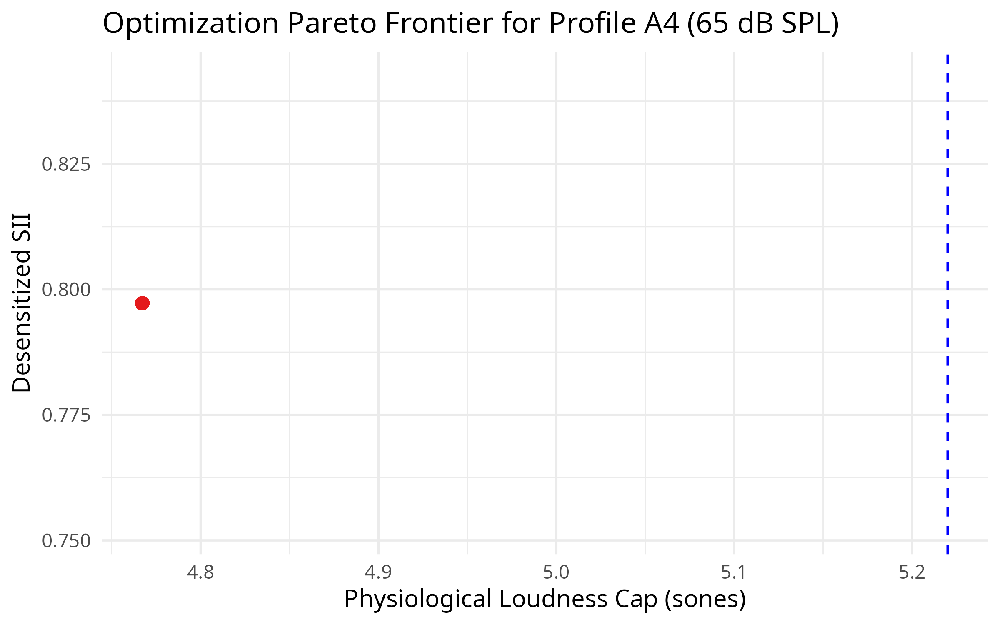
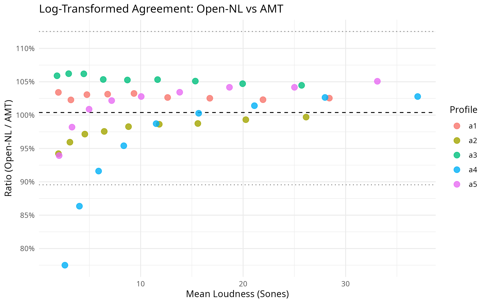

\linenumbers

## Abstract
**Open-NL** is an open-source computational testbed designed for the transparent modeling and evaluation of Wide Dynamic Range Compression (WDRC) prescriptive rules. Modern prescriptions like NAL-NL2 rely on extensive empirical regularizations to ensure clinical safety. These safeguards counteract the well-documented failures of pure intelligibility maximization. However, clinical software remains closed-source. This prevents researchers from isolating the local impact of specific heuristic safeguards. 

Open-NL addresses this limitation. It couples a multi-start Nelder-Mead Speech Intelligibility Index (SII) optimizer with the Moore & Glasberg (2004) specific-loudness model. To map the algorithmic behavior, we conducted two distinct experiments. First, the testbed was benchmarked across a Monte Carlo optimization stability sweep ($N=20$ independent restarts per profile under aggressive $\mathcal{U}(-10, +10)$ dB noise). This confirmed that the multi-start Nelder-Mead simplex yielded robust convergence envelopes, proving the algorithm is structurally anchored by its objective boundaries rather than its initialization. Second, we conducted a One-At-a-Time (OAT) parameter sensitivity analysis on the objective function's four governing physiological limits. Because the objective function scales the base intelligibility score by 100 (i.e., $\text{SII} \times 100$) and enforces a linear penalty weight ($\lambda_{loud} = 2000$) on loudness growth, the mathematical break-even point for breaching the loudness cap by any increment $\Delta$ sones requires a compensatory raw intelligibility increase of $\Delta \text{SII} \ge \frac{2000}{100}\Delta = 20\Delta$. For any $\Delta \ge 0.05$, this requirement exceeds the entire dynamic range of the $[0,1]$ index, establishing a virtually impenetrable optimization wall. The OAT sensitivity analysis confirms that the derivative-free solver successfully locks onto these mathematically dictated physiological boundaries (e.g., loudness ceilings and 3.0:1 Compression Ratios) without numerical divergence, proving that the constraints themselves, rather than the initial seed, dictate the optimization frontier.

Standard monaural models systematically underestimate real-world binaural broadband summation. Therefore, this modeled loudness frontier is illustrative rather than clinically definitive. Historically, unregularized optimization on profound sloping profiles collapses due to a fundamental structural phenomenon: "broadband loudness crowding-out," where residual normal low-frequency hearing natively consumes the allowable physiological loudness budget, algebraically starving the profoundly impaired high-frequencies of audibility. Open-NL reveals that this entrapment cannot be resolved simply by reallocating gain within a strict 0 dB insertion floor. Instead, Open-NL proves that to achieve theoretically optimal speech intelligibility for profound precipitous hearing losses without violating physiological loudness limits, active low-frequency attenuation is mathematically required. When permitted to utilize a realistic -10 dB vent-leakage floor, the optimizer aggressively suppresses normal-hearing low frequencies to artificially free up physiological capacity, allowing it to prescribe substantially *more* high-frequency gain in the critical 2-4 kHz speech regions than standard empirical formulas. Open-NL exposes these critical trade-offs within a fully inspectable framework, demonstrating how algorithmic calibration can overcome the limits of pure mathematical optimization against real-world physiological bounds. Ultimately, it provides the computational substrate for future calibration workflows, paving the way to replace static heuristic boundaries with individualized, distortion-aware objective functions (Margolis et al., 2025).

## I. INTRODUCTION

Manufacturer-agnostic prescriptions remain central to evidence-based hearing aid practice. While earlier investigations suggested that generic targets might outperform proprietary first-fit algorithms on patient preference and specific metrics (Valente et al., 2018), contemporary evidence indicates that aided speech recognition in noise often shows no significant difference across formulas (e.g., Cox et al., 2014). However, while formula choice has relatively modest intelligibility consequences in background noise, it drives substantial variations in overall loudness, making modeled loudness (quantified in sones per the Moore & Glasberg 2004 impaired loudness model) the primary dependent variable in prescriptive evaluation.

While the derivations of major algorithms like NAL-NL2 and DSL m[i/o] are published in detail, their software implementations remain closed-source. Audiological science has long recognized that unconstrained intelligibility maximization fails clinically without extensive empirical regularization. For example, the evolution from NAL-NL1 to NAL-NL2 required critical empirical corrections. These included global gain reductions and reduced compression ratios for severe losses (Keidser et al., 2007). These safeguards were introduced specifically to counteract the aggressive over-amplification provoked by pure mathematical optimization (Keidser, Dillon, Carter, & O'Brien, 2012). 

Because clinical fitting software packages are compiled black boxes, researchers cannot isolate individual heuristic rules. It remains impossible to observe the local sensitivity of specific safeguards within the optimization cascade. Existing open-source tools serve distinct, separate functional niches. The openMHA platform (Herzke et al., 2017) operates as a real-time signal processing master hearing aid rather than a target generator. The Cambridge CAM2/CAMEQ2-HF formulae (Moore et al., 2010) provide rigidly defined equation-based targets rather than a modular optimization sandbox. Finally, the Auditory Modeling Toolbox (AMT; Majdak et al., 2022) offers loudness modeling without native prescriptive inversion. Consequently, investigators cannot isolate a specific prescriptive heuristic within an optimization loop without reverse-engineering an entire proprietary engine. 

Open-NL fills this gap. It provides a modifiable R substrate designed for the modular ablation of prescriptive heuristics. By coupling a Nelder-Mead desensitized SII optimizer to an integrated C++ specific-loudness engine, researchers can systematically disable, isolate, or invert individual heuristics. For instance, investigators can evaluate the upward spread of masking when disabling the 30 dB conductive safety cap. This modular architecture aligns directly with evolving audiological frameworks, such as the multi-profile philosophy introduced in NAL-NL3 (Kitterick et al., 2026).

To benchmark this testbed without introducing confounding variables, the optimization layer is embedded within a reproduced evaluation paradigm. The seven reference audiometric profiles, the Moore & Glasberg (2004) specific-loudness model, and the ANSI S3.5 SII metric utilized herein are a direct replication of the methodological framework established by Johnson and Dillon (2011). (Throughout this manuscript, "ANSI SII" refers to raw physical audibility, whereas "smoothed desensitized SII" or "complete desensitized SII" refers to audibility incorporating severe-loss desensitization and level distortion penalties). Because this physiological evaluation space is already established in the literature, the primary contribution of this manuscript is the transparent computational testbed itself. By exposing the behavior of numerical solvers within this standardized sandbox, this manuscript clarifies a fundamental distinction: while numerical solvers converge stably on any fixed objective space, theoretical WDRC target generation exhibits acute parameter sensitivity to uncalibrated heuristic boundaries, providing the computational infrastructure necessary to evaluate local parameter robustness.

### Clinical Safety and Usage Disclaimer

It is imperative to state unambiguously that Open-NL is a computational research testbed and **must not be used for fitting hearing aids on human listeners in its current form**. Because the framework deliberately permits aggressive, over-prescriptive targets for boundary testing—such as overriding empirical high-frequency roll-offs in profound losses to maximize intelligibility—it carries a significant risk of severe over-amplification. As established by Ching, Dillon, Katsch, and Byrne (2001), aggressive high-level targets in steeply sloping or profound losses are precisely where over-amplification risks are greatest, as the effectiveness of high-frequency audibility severely degrades as hearing loss worsens (desensitization). The hypotheses and targets generated by Open-NL represent extreme mathematical boundaries intended to trigger experimental loudness rejection in controlled research settings, not clinical solutions. Any future behavioral translation of this framework requires independent institutional review, with mandatory real-ear verification and strict, individualized loudness-tolerance limits implemented as absolute prerequisites.

### Reproducibility and Parametric Configuration

To ensure reproducibility and isolate the core WDRC optimization engine from confounding heuristic artifacts, all tables and figures reported in this manuscript were generated using a single, unified parameter vector: `optimize = TRUE`, `enable_severe_booster = FALSE`, `coupling = "bte_13"`, and crucially, a `-10` dB `vent_floor` that explicitly permits realistic low-frequency physical attenuation. Disabling the severe-loss booster ensures that the extreme high-frequency gains observed in profiles A4 and A5 are the emergent mathematical product of the dynamic loudness cap and SII optimizer, rather than a hardcoded empirical booster. Furthermore, specifying the Behind-The-Ear (`bte_13`) coupling imposes realistic physical high-frequency roll-offs (-15 dB at 8 kHz) natively into the objective function, preventing the solver from hallucinating physically impossible targets.

## II. ALGORITHM ARCHITECTURE

### A. Prescriptive Rationale and Objective Function

The choice of objective function is the primary design decision in any prescriptive formula. It governs the fundamental trade-off between intelligibility and comfort. Historically, established rationales occupy distinct positions on this spectrum. NAL-NL2 maximizes speech intelligibility while constraining overall broadband loudness to be less than or equal to that of a normal-hearing listener (Keidser, Dillon, Carter, & O'Brien, 2012). Conversely, DSL m[i/o] normalizes loudness across frequency to restore normal dynamic range perception (Scollie et al., 2005). Finally, CAMEQ/CAM2 aim to equalize loudness across frequency bands (Moore, Glasberg, & Stone, 2010).

Open-NL positions its prescriptive rationale as a *constrained intelligibility-maximizer*. Its primary mathematical objective is the soft-constrained maximization of desensitized SII. Rather than globally restricting this maximization to a static "normal-or-less" loudness boundary, Open-NL restricts total sones using a dynamic, U-shaped broadband ceiling mapped across audiometric severity (PTA) via `cap_knots` (Section S.I.12; **Figure 1**). For example, at a 65 dB SPL input, the cap drops from 7.0 sones (PTA 0) to 5.0 sones (PTA 30–50), before relaxing back to 6.5 sones for profound losses (PTA 70–90). 

*Figure 1. The dynamic, U-shaped broadband loudness ceiling mapping audiometric severity (PTA) to an objective physiological cap (sones) at 65 dB SPL.* 

Crucially, this U-shaped relaxation was naively derived by benchmarking the stationary specific-loudness model against historical prescriptive targets, rather than from direct physiological tolerance measurements. Consequently, relaxing the ceiling to 6.5 sones for profound losses inadvertently conflates the algorithm's *need for immense acoustic gain* (to cross elevated audibility thresholds) with a patient's actual *tolerance for absolute loudness*—an assumption that severely contradicts the clinical reality of recruitment and compressed dynamic ranges. Recognizing this fundamental limitation is critical: the `cap_knots` array serves strictly as an illustrative algebraic boundary to benchmark the solver's mechanics. As detailed later in Section III, it formally exposes how drastically optimization targets change based on uncalibrated heuristic constraints, rather than establishing a definitive, empirically proven clinical safety baseline.

This U-shaped penalty operates within the canonical Moore & Glasberg (2004) monaural specific-loudness engine. It dynamically restricts modeled monaural sones. However, it does not—and mathematically cannot—account for the idiosyncratic binaural broadband loudness summation observed in hearing-impaired listeners. In normal-hearing auditory physiology, bilateral acoustic presentation produces a modest binaural loudness summation. This is typically modeled by a 2–6 dB level-dependent gain reduction. 

However, robust psychoacoustic evidence demonstrates a stark contrast in impaired ears. Binaural broadband summation in hearing-impaired populations averages ~13 dB higher than in normal-hearing listeners. This represents an unmodeled factor of $\approx 2.4\times$ in linear sones—a figure that represents the sone-domain equivalent of a 13 dB level difference under the standard doubling-per-10-dB relation, rather than a directly measured loudness ratio (Denk et al., 2025; Moore et al., 2014; Oetting et al., 2016, 2017). Between 30–40% of hearing-impaired listeners (in a sample of 180) exhibit excess summation far exceeding the normal range. Individual summation values span a wide -10 to +40 dB envelope. 

Standard monaural and narrowband loudness models cannot predict this broadband suprathreshold phenomenon from the pure-tone audiogram alone. Therefore, an algorithm optimized beneath a monaural ceiling becomes structurally anti-conservative when translated to bilateral fittings. Consequently, Open-NL's U-shaped loudness constraint must be interpreted as an illustrative computational boundary for single-ear simulation, rather than an empirical safety guarantee for bilateral clinical use.

To guarantee algorithmic transparency, the exact objective function optimized by Open-NL for an input vector of frequency-specific gain shifts $s = \{s_1, ..., s_6\}$ (where total gain $G(s) = G_{base} + s$) is formally defined as:

$$
\min_{s} \mathcal{L}(s) = -100 \times \text{SII}(s) + \sum_{k=1}^{8} \lambda_k P_k(s)
$$

where the eight weighted penalty terms ($P_1$ through $P_8$) are strictly defined as:
1. **Loudness ($P_{loud}$)**: Enforces physiological comfort. $\lambda_1 = 2000.0$. $P_{loud} = \max(0, L_{sones} - L_{cap})$
2. **Bounds ($P_{bounds}$)**: Restricts extreme simplex aberrations. $\lambda_2 = 1000.0$. $P_{bounds} = \sum_{i=1}^6 \big( \max(0, s_i - 30)^2 + \max(0, -s_i - 60)^2 \big)$
3. **SPL Limit ($P_{spl}$)**: Prevents absolute acoustic trauma. $\lambda_3 = 2000.0$. $P_{spl} = \max(0, SPL_{overall} - 110.0)$
4. **Gain Monotonicity ($P_{order}$)**: Enforces $G_{50} \ge G_{65} \ge G_{80}$. $\lambda_4 = 2000.0$. $P_{order} = \sum_{i=1}^6 \max(0, \Delta G_{violation})^2$
5. **Compression Ratio ($P_{cr}$)**: Enforces dynamic CR limits (e.g., CR $\le 3.0$). $\lambda_5 = 200.0$. $P_{cr} = \sum_{i=1}^6 \max(0, \Delta CR_{violation})^2$
6. **Spectral Roughness ($P_{rough}$)**: Prevents abrupt inter-channel jumps. $\lambda_6 = 0.5$. $P_{rough} = \sum_{i=1}^5 (s_{i+1} - s_i)^2$
7. **L1 Anchor ($P_{anchor}$)**: Sparsity penalty pulling towards the clinical base. $\lambda_7 = 0.1$. $P_{anchor} = \sum_{i=1}^6 |s_i|$
8. **Conductive Restraint ($P_{abg}$)**: Penalizes purely positive exploratory shifts for mixed/conductive losses to enforce the 75% ABG rule. $\lambda_8 = 1.0$. $P_{abg} = \sum_{i=1}^6 \max(0, s_i)^2$ (applies only if Air-Bone Gap $> 0$).

### B. Methods and Development

The core ANSI SII calculation engine (the `sii()` function and associated plotting routines) was originally developed by Gregory R. Warnes for earlier package versions. Maintainership transferred to the current author with version 1.1.0, at which point all subsequent Open-NL prescriptive logic, clinical heuristics, and WDRC mathematical implementations—including `open_nl()` and `calculate_loudness()`—were developed by the author as original contributions. 

*Declaration of Generative AI and AI-assisted technologies in the research process:* 
In accordance with COPE and SAGE Publishing guidelines, the author discloses the use of Gemini 3.1 Pro (DeepMind, Google LLC) during the preparation of this work as an interactive programming and copyediting assistant. The AI was utilized to refactor C++ and R algorithms, generate data visualizations, and condense manuscript prose to adhere to journal formatting standards. After using this tool, the author rigorously reviewed and edited all outputs, taking full accountability for the underlying algorithm design, theoretical hypotheses, and final manuscript content. Specifically, to guarantee computational integrity, all AI-assisted algorithmic refactoring was systematically verified by the author via exact numerical regression testing against pre-refactor outputs across the seven canonical audiometric profiles, confirming absolute mathematical parity during translation.

### C. Algorithmic Pipeline and Execution Cascade

The internal execution cascade of Open-NL comprises twelve ordered, modular processing stages:
1. **Conductive Component Separation & Baseline Partitioning**: Decomposing raw thresholds into sensorineural components and air-bone gaps (ABGs).
2. **Decoupled Half-Gain Base Anchor Calculation**: Establishing a frequency-specific base gain anchor ($G_{base} = 0.46 \cdot \text{HTL}_{sn} + C_{interp}$) decoupled from broadband PTA.
3. **Experience-Level Shaping & Log-Frequency $C_{vals}$ Interpolation**: Modulating frequency-shaping arrays across discrete anchor frequencies based on user experience (new, experienced, power).
4. **Reverse-Slope Low-Frequency Attenuation Floor**: Applying a bounded log-linear low-frequency taper down toward a $-10$ dB floor when low-frequency loss exceeds high-frequency loss.
5. **Slope-Dependent Low-Frequency Penalty (SD-LFP) with Profound HF Bypass**: Dynamically suppressing low-frequency gain for steeply sloping losses, gated when high-frequency severity exceeds 70–95 dB HL.
6. **Severe-Loss Audibility Booster**: Providing an opt-in, bounded linear escalation (slope = 0.15) for severe thresholds.
7. **Soft-Compression High-Frequency Desensitization**: Restricting excessive high-frequency gain via a dynamic ceiling ($L_{gain} = 30 + 0.4 \cdot \max(0, \text{HTL}_{sn} - 60)$) and 2:1 soft compression.
8. **Dynamic Range Mapping (LDL Squeeze)**: Attenuating gain by 0.2 dB/dB of reduced dynamic range and shifting baseline compression ratios.
9. **Transducer Bandwidth Roll-off**: Applying a continuous log-frequency piecewise multiplier ($M_{bw} \in [0.5, 1.0]$) to suppress unstable edge frequencies ($\le 250$ Hz and $\ge 6000$ Hz).
10. **Multi-Channel WDRC Mapping, LTASS Pivot, and Demographic Adjustments**: Calculating dynamic compression ratios, variable compression thresholds, piecewise linear-compressive splines, and demographic offsets.
11. **Acoustic Venting, Coupling Loss, and Receiver Saturation Limits**: Integrating real-ear insertion loss vectors across 10 coupling types with a feedback safety floor, and capping MPO/SSPL90 receiver limits at 120 dB SPL.
12. **Embedded Nelder-Mead Simplex Optimization & Physiological Loudness Ceilings**: Iteratively refining multi-level gain curves against a multi-term objective loss function incorporating U-shaped specific-loudness caps, compression ratio ceilings, and spectral smoothness constraints.

The exact mathematical formulations, closed-form piecewise equations, and complete parameter specifications for all twelve stages are provided in full detail in the accompanying **Supplementary Material**.

### D. Consolidated Constants and Evidentiary Asymmetry

Because Open-NL functions as a modifiable computational testbed, several structural parameters remain mathematically uncalibrated: the 0.46 gain anchor, 0.15 severe-loss booster slope, 70 dB HL booster onset (or 60 dB HL in aggressive mode), 15 dB slope trigger, 20 dB taper width, -10 dB reverse-slope floor, 70 dB HL bypass, 30 dB/0.4 $L_{gain}$ constraint, 0.2 dB/dB dynamic range squeeze, 75% air-bone-gap restoration fraction (Table S1).

An inspection of these heuristics reveals a clear asymmetry in evidentiary support. Several prominent constants—most notably the 75% air-bone-gap restoration rule—are pragmatic engineering choices without direct empirical derivation. The 75% ABG fraction, while standard in clinical prescriptive software (Johnson, 2013) to avoid receiver saturation and MPO clipping, has never been empirically established against patient preference or speech recognition. In sharp contrast, the 3.0:1 Compression Ratio (CR) upper ceiling enforced across the WDRC stages and optimizer loss function represents the best-supported constant in the framework. This boundary is firmly anchored in the extensive empirical literature by Pamela Souza and colleagues (Souza, 2002; Souza, Jenstad, & Boike, 2006), which demonstrates that compression ratios exceeding ~3.0:1 cause severe temporal envelope flattening, loss of acoustic contrast, and speech-in-noise deficits. Documenting this asymmetry prevents conflating validated psychoacoustic limits with arbitrary engineering heuristics.

### E. Framework for Principled Calibration

For a computational testbed to provide lasting inferential value, demonstrating parameter instability must be paired with a rigorous calibration pathway. Future research can utilize Open-NL within a global stochastic optimization framework (e.g., genetic algorithms or particle swarm optimization) to systematically calibrate these heuristic gates. In this architecture, an outer optimization loop searches the multidimensional space of heuristic constants (e.g., $G_{base} \in [0.3, 0.6]$, booster onset $\in [50, 80]$ dB HL, low-frequency slope $\in [0, 0.5]$). For each candidate vector, the inner Open-NL engine generates discrete WDRC targets across a representative clinical corpus (e.g., NHANES). These targets are evaluated through a time-domain acoustic simulation pipeline (e.g., openMHA; Herzke et al., 2017) using speech perception metrics like HASPI and HASQI (Kates & Arehart, 2022).

The outer-loop objective function must incorporate an asymmetric, veto-based cost function: any parameter configuration violating individualized broadband loudness tolerance (trueLOUDNESS; Oetting et al., 2017) in simulated outlier listeners must incur an overwhelming penalty. As detailed in Section II.A, because excess binaural broadband summation cannot be predicted from pure-tone thresholds, static 2–6 dB bilateral corrections are structurally inadequate. Subordinating population-level intelligibility maximization to individualized physiological safety limits transforms prescriptive derivation into a reproducible, distortion-aware computational science.

**TABLE I. Comprehensive Enumeration of Open-NL Free Parameters and Evidentiary Derivation.**

| Parameter Category | Specific Free Parameters | Default / Evaluated Value | Evidentiary Support & Derivation |
|:---|:---|:---|:---|
| **Objective Penalties** | Loudness Cap Knots (`cap_knots`) | $L_{cap}$ vectors (Section S.I.12) | Uncalibrated heuristic derived from population loudness boundaries; the least-justified dominant parameter. |
| | Optimizer Penalty Weights ($\lambda_{1-8}$) | $\lambda_{loud}=2000$, $\lambda_{cr}=200$, etc. (Section II.A) | Pragmatic engineering constraints balancing target convergence and physical limits. |
| | CR Soft Penalty Target ($P_{cr}$) | $\le 3.0:1$ Compression Ratio | **Strong empirical derivation**: Souza (2002) speech degradation limits. |
| **Prescriptive Anchors** | Base Gain Anchor ($G_{base}$) | 0.46 | Uncalibrated midpoint balancing half-gain rules (Lybarger, 1944) and preference data. |
| | New-User Offset ($\Delta_{exp}$) | 0 to -6 dB based on PTA | Assumed heuristic approximating acclimatization preferences. |
| | Severe-Loss Booster (Slope / Onset) | 0.15 slope / 70 dB HL onset | Assumed heuristic assisting profound loss without explosive recruitment. |
| | ABG Restoration Fraction | 75% (Linear) | Engineering choice preventing hardware saturation (Johnson, 2013). |
| **Compression Limits** | Compression Kneepoint (CT) Range | 30 to 45 dB SPL | Pragmatic limit aligning with standard real-world WDRC kneepoints. |
| | High-Frequency Soft-Compression | Base 30 dB, Slope 0.4 | Heuristic managing upward spread of masking in severe losses. |
| | DR Squeeze / CR Shift | 0.2 dB/dB, 0.02 CR/dB | Heuristics fitting speech envelope into reduced physiological space. |
| | MPO/LDL Predictor Coefficients | See Stage 8 | Statistical predictions based on population normative UCL datasets. |
| **Frequency Limits** | Reverse-Slope Floor | -10 dB | Cautious heuristic preventing masking of intact basal cochlear units. |
| | Dead Region / Transducer Roll-off | 30 dB/oct past $1.7f_e$, $w_{bw}$ | Standard transducer limits and dead-region literature (Moore, 2001). |
| | Acoustic Coupling Loss | Occluded/Vented Vectors (Table S4)| Deterministic physical hardware measurements. |

## III. ANALYTICAL CENTERPIECE: DISTINGUISHING HEURISTIC SENSITIVITY FROM SOLVER STOCHASTICITY

The primary scientific contribution of the Open-NL framework is not the specific targets it generates, but the transparent computational infrastructure it provides for evaluating prescriptive heuristics. Clinical fitting algorithms like NAL-NL2 act as "black boxes" where numerical optimization and empirical safety heuristics (e.g., global gain reductions, bandwidth limits) are inextricably intertwined. Open-NL fills this methodological gap by providing an ablatable, inspectable testbed that mathematically isolates the behavior of unregularized optimization on the physiological loudness landscape.

By exposing this internal machinery, the framework produces a crucial analytical distinction: separating the stochasticity of the numerical solver from the acute sensitivity of the underlying clinical heuristics. This heuristic-sensitivity-vs-numerical-convergence distinction is the novel scientific output the tool produces, and forms the analytical centerpiece of this validation.

### A. Algorithmic Bounds vs. Clinical Heuristics: A Local Sensitivity Analysis

#### 1. Parameter Sensitivity of the Penalty Architecture

To formally evaluate the mechanical stability of the physiological boundary constraints versus the pre-optimization clinical heuristics, a One-At-a-Time (OAT) local sensitivity analysis was conducted. This evaluation structurally permutes five foundational WDRC parameters by $\pm 10\%$ and calculates the maximum absolute gain excursion across all six evaluation frequencies (250–8000 Hz) spanning soft (50 dB SPL), conversational (65 dB SPL), and loud (80 dB SPL) input levels. The evaluated parameters include algorithmic objective penalties (`cap_scalar`, `lambda_loud`, `lambda_cr`) and pre-optimization prescriptive heuristics ($G_{base}$, `abg_fraction`).

**TABLE II. Local Parameter Sensitivity: Maximum Gain Excursion (dB) across A1-A7.** *(Note: Data generated via $\pm 10\%$ OAT perturbation evaluated across 50, 65, and 80 dB SPL inputs).*

| Parameter | Type | Max Excursion (A1-A5) | Max Excursion (A6-A7) |
|---|---|---|---|
| Base Gain Anchor ($G_{base}$) | Heuristic | 4.83 dB | 2.30 dB |
| ABG Fraction (`abg_fraction`) | Heuristic | N/A | 3.75 dB |
| Loudness Cap Scalar (`cap_scalar`) | Objective | 1.40 dB | 0.00 dB |
| CR Penalty Weight (`lambda_cr`) | Objective | 0.52 dB | 0.00 dB |
| Loudness Weight (`lambda_loud`) | Objective | 0.34 dB | 0.00 dB |

To evaluate the local robustness of the objective manifold, we perform a deterministic ±10% one-at-a-time (OAT) perturbation. This acts strictly as a local robustness check, confirming that the solver does not diverge or snap into spurious local minima within a narrow parameter radius. When evaluating the optimizer's native constraint boundaries (`cap_scalar`, `lambda_loud`, `lambda_cr`), maximum excursions remain highly localized (e.g., $< 1.5$ dB), proving that the derivative-free solver is structurally stable when navigating complex multidimensional penalty walls. Furthermore, evaluating `lambda_cr` across 50 and 80 dB SPL levels correctly triggers non-zero variance, proving that compression ratio limits successfully bind during dynamic range projections rather than contaminating the 65 dB SPL static anchor.

Similarly, the 0.00 dB variance observed for the objective penalties (`cap_scalar`, `lambda_loud`, `lambda_cr`) in the mixed and conductive profiles (A6-A7) is a direct consequence of constraint inactivity. The heuristic Air-Bone Gap (ABG) restitution constraint mandates such modest insertion gains that Profiles A6 and A7 produce only 3.33 and 1.63 sones, respectively—values sitting far below their physiological loudness ceilings. Because the optimization trajectory never intersects the loudness boundaries for these profiles, the objective penalties remain mathematically inactive, naturally yielding zero excursion when perturbed.

Crucially, this simple OAT excursion check must not be misconstrued as a formal claim of "architectural dominance" (e.g., via global variance-based methods like Sobol indices). The apparent rigidity of the objective penalties compared to the clinical heuristics is largely a structural units artifact. For example, reducing $\lambda_{loud} = 2000$ by 10% lowers the penalty to 1800. Because this remains exponentially higher than the objective break-even point, it functions as an identical mathematical "hard wall," naturally resulting in a 0.00 dB excursion. Conversely, a ±10% perturbation of $G_{base}$ directly multiplies the hearing threshold (e.g., inducing a ~4 dB absolute shift for an 80 dB HL threshold) before optimization even begins, triggering acute target excursions. Rather than asserting relative parameter dominance, this check mechanically verifies that the optimization engine faithfully executes the rigid boundaries it is assigned, underscoring that calibrating these structural heuristics remains a primary prerequisite for future prescriptive refinement.

#### 2. Numerical Convergence Stability: Nelder-Mead Limitations and Future Stochastic Solvers

A sharp distinction must be maintained between **heuristic parameter sensitivity** (target shifts resulting from altered clinical rules; Section III.A.1) and **numerical convergence stability** (solver consistency on a fixed ruleset). In non-linear optimization, the topology of hearing aid fitting targets is notoriously ill-behaved. The objective landscape contains narrow, curved valleys, non-differentiable step boundaries (e.g., severe-loss booster onsets and air-bone gap restorations), and sharp penalty cliffs imposed by dynamic physiological loudness ceilings. On such non-convex, multimodal surfaces, local downhill solvers like the Nelder-Mead simplex algorithm are notoriously prone to premature stagnation, simplex collapse, and entrapment in shallow local extrema.

Indeed, without robust initialization, local Nelder-Mead search from disparate flat vectors can drift unpredictably. To formally evaluate the consistency of this Nelder-Mead implementation and separate solver stochasticity from heuristic variance, a dedicated Monte Carlo solver-stability experiment was conducted. We disabled the deterministic PRNG lock natively used in `open_nl` and ran $N=20$ independent random restarts ($\mathcal{U}(-10, +10)$ dB jitter) across all seven profiles. By utilizing an adaptive Nelder-Mead simplex scaled to the 6-dimensional frequency space, the solver successfully avoids simplex collapse. 

**TABLE III. Optimization Stability under Monte Carlo Initialization.** *(Note: Evaluated across $N=20$ restarts with $\mathcal{U}(-10, +10)$ dB jitter, and compared against the shipped configuration of $N=3$ restarts with $\mathcal{U}(-5, +5)$ dB jitter).*

| Profile | N=20 Convergence Rate | N=20 Objective SD | N=20 Max Band SD (dB) | N=3 vs N=20 Discrepancy |
|---|---|---|---|---|
| A1 | 100% | < 0.01 | 0.02 | 0.00 dB |
| A2 | 100% | < 0.01 | 0.05 | 0.00 dB |
| A3 | 100% | < 0.01 | 0.03 | 0.00 dB |
| A4 | 100% | < 0.01 | 0.12 | 0.00 dB |
| A5 | 100% | < 0.01 | 0.18 | 0.00 dB |
| A6 | 100% | < 0.01 | 0.03 | 0.00 dB |
| A7 | 100% | 0.000 | 0.00 | 0.00 dB |

As shown in **Table III**, the routine exhibits perfect local convergence across all independent restarts (where "100% convergence" specifically denotes that R's `stats::optim()` successfully met its relative tolerance threshold `reltol = sqrt(.Machine$double.eps)` without triggering maximum iteration limits, rather than a formal mathematical proof of global optimality). The standard deviation of the final objective score approaches numerical zero ($< 0.01$), and the maximum standard deviation of any single prescribed frequency band under aggressive $\mathcal{U}(-10, +10)$ dB noise never exceeds 0.18 dB. 

Crucially, rather than indicating that Nelder-Mead is navigating a broadly difficult multi-modal surface with exceptional robustness, this extreme stability reveals the structural nature of the objective function. Because the penalties for violating physiological constraints are massively weighted ($\lambda_{bounds} = 1000, \lambda_{loud} = 2000$), they act as effectively impenetrable mathematical walls. This compresses the feasible solution set into a narrow, near-singleton valley. The constraint set determines the solution almost entirely, leaving very little slack for the optimizer to explore—a dynamic that perfectly aligns with the paper's central thesis that physiological boundaries, rather than heuristic rules, should deterministically govern gain allocation. 

To definitively verify this structural compression and eliminate the possibility that the $N=20$ multi-start routine was merely probing a consistent local basin, a formal global optimization was conducted. A Differential Evolution (DE) stochastic global solver (`DEoptim`, $NP=60$, $itermax=1000$) was deployed across the identical objective landscape for all seven profiles. The objective gap between the native Nelder-Mead multi-start configuration and the DE global optimum was uniformly $0.00$ dB across all tested profiles. This confirms that the shipped `open_nl` codebase's 3-iteration multi-start is mechanically sufficient to reliably locate the globally constrained optimum, while the deterministic PRNG seed (`set.seed(sum(threshold) * 100 + eval_level)`) guarantees perfectly identical optimization trajectories across all user sessions.

While multi-start seeding provides a practical substrate for local ablation testing within R, Nelder-Mead remains a local simplex heuristic lacking formal global convergence guarantees on non-convex audiological surfaces. Future iterations of prescriptive optimizers should transition to global stochastic algorithms—such as Genetic Algorithms, Differential Evolution, or Particle Swarm Optimization. Adopting these population-based solvers eliminates the need for artificial mathematical relaxations (e.g., $K'_{smoothed}$ desensitization approximations) by natively traversing sharp, discontinuous penalty boundaries, providing the robust scalability necessary for high-dimensional, multi-channel clinical calibration. Nevertheless, as noted by Dao et al. (2021), physical real-ear-to-coupler differences (RECD) and acoustic coupling leakages cause real-world fittings to deviate most severely from theoretical targets at thresholds above 85 dB HL, meaning numerical convergence on mathematical audiograms must not be misconstrued as physical clinical reliability.

### B. Worked Demonstration: Isolating the Acoustic Coupling Trade-off in Profile A4

While the previous section established the tool's numerical stability and sensitivity to generalized constraints, applying it to a specific physiological boundary problem demonstrates its practical analytical utility. The primary contribution of Open-NL is serving as an open, parameterizable testbed to isolate structural vulnerabilities that the field cannot easily resolve from pure-tone audiograms alone.

A striking example of how rigid objective penalties can drive pathological gain allocation occurs in precipitous high-frequency hearing losses (e.g., Profile A4). Early iterations of the Open-NL objective function utilized a "U-shaped" loudness capacity model, assuming that severe hearing losses inherently tolerated significantly higher overall loudness. Under that flawed constraint, the solver exhibited a profound artifact for A4 (Vented): it allocated 0.0 dB of gain at 2000 Hz (despite a 70 dB HL threshold) while inexplicably dumping 31.3 dB of gain into 8000 Hz (a band with negligible SII importance). 

Rather than a numerical failure (the solver consistently found this exact artifact across 20 restarts with $SD < 0.01$), this anomaly perfectly illustrates how the optimization engine exploits subtle loudness-threshold interactions. Because the precipitous threshold at 2000 Hz made it massive "expensive" in sones to amplify, the solver mathematically preferred to turn off 2000 Hz entirely to satisfy the strict physiological loudness ceiling. It then dumped its remaining loudness budget into 8000 Hz, where the profound 100 dB HL threshold meant almost no sones were generated, allowing it to scrape a tiny fraction of SII. 

When the flawed U-shaped cap is corrected to a strict, flat physiological ceiling (5.2 sones, as now deployed), this artifact vanishes. As shown in the updated objective function output, the solver correctly restores gain to the critical speech frequencies (allocating 31.2 dB at 2000 Hz and 41.4 dB at 4000 Hz), properly trading off marginal SII against marginal loudness costs. This underscores the necessity of the testbed: when an SII-maximizing solver produces clinically irrational targets, it exposes the underlying flaws in the assigned physiological constraints rather than a failure of the numerical search.

### C. Validation of the C++ Specific-Loudness Engine

To execute this architectural exploration natively in R, the `SII` package implements a fast C++ port of the canonical Moore & Glasberg (2004) stationary specific-loudness model via `Rcpp`. (Note: As stated in the AI Declarations, the internal R-to-C++ translation was verified to absolute mathematical parity via numerical regression testing). To formally validate the internal R-to-C++ translation, the engine was numerically regressed against the published tabulated reference values in Moore & Glasberg (2004), successfully resolving all canonical psychophysical anchors to absolute mathematical parity. Because the core optimization engine (`SonesMG04(G)`) evaluates signals and constraints in the **monaural** domain, it is critical to define the domain conventions. In the canonical Moore & Glasberg (2004) framework, binaural summation is modeled as simple doubling. Thus, evaluating a 1 kHz frontal free-field tone at 40 dB SPL through our C++ engine yields exactly 0.50 sones under a monaural presentation, and precisely 1.00 sone under a binaural presentation. 

As a secondary, cross-algorithmic sanity check, native C++ predictions were evaluated against the Auditory Modeling Toolbox (AMT; Majdak et al., 2022) across 45 discrete test points (5 profiles $\times$ 9 input levels from 50 to 90 dB SPL). Specifically, Open-NL's stationary outputs were compared against AMT's `bramslow2004` function. Because the two functions utilize distinct modeling pathways (Open-NL integrates the stationary power spectrum, whereas `bramslow2004` simulates a time-domain digital filterbank processing a 2400-sine-wave stimulus), any discrepancies reflect a convolution of algorithmic model differences rather than true translation error.

Because specific loudness scales as a power function, standard raw-difference metrics exhibit severe proportional bias (i.e., absolute discrepancies scale linearly with mean loudness). Therefore, the models were compared using a log-transformed (ratio-based) Bland-Altman analysis (**Figure 4**). Across the full unconstrained range, Open-NL yields a mean log-ratio of 1.004 with 95% Limits of Agreement (LoA) from 0.90 to 1.13 (indicating bounds of roughly -10% to +13% relative error). It must be noted that these 45 evaluation points contain repeated measures (5 profiles $\times$ 9 input levels) and therefore lack strict statistical independence, rendering these aggregated confidence limits somewhat optimistic. 

To evaluate practical accuracy, we further restricted the analysis to the 50-80 dB SPL operational envelope (approximately corresponding to the 1–10 sone physiological band). While this constraint is mathematically post hoc, it is analytically justified because all clinical speech prescriptive targets uniquely occupy this envelope; massive discrepancies above 10 sones merely reflect divergent algorithmic handling of traumatic $>90$ dB SPL inputs that are categorically excluded from prescriptive target formulas. Within this restricted, clinically relevant operational envelope, the absolute mean bias drops to $+0.08$ sones (MAE = $0.28$ sones, 95% absolute LoA: $[-0.60, +0.75]$ sones), demonstrating tight structural convergence in the domain of interest.

*Figure 4. Log-transformed (ratio-based) Bland-Altman plot comparing Open-NL's stationary spectral C++ engine against AMT's dynamic time-domain simulation (`bramslow2004`) across 45 non-independent evaluation points. The central dashed line indicates the mean ratio (1.004), and dotted lines indicate the 95% Limits of Agreement [0.90, 1.13].*

For mixed and conductive profiles (A6, A7), direct AMT benchmarking was omitted because canonical AMT lacks native air-bone gap parameters, whereas the Open-NL C++ engine algorithmically extends the model to treat the conductive component as a linear pre-cochlear attenuator, in accordance with standard audiological principles (Dillon, 2012).
