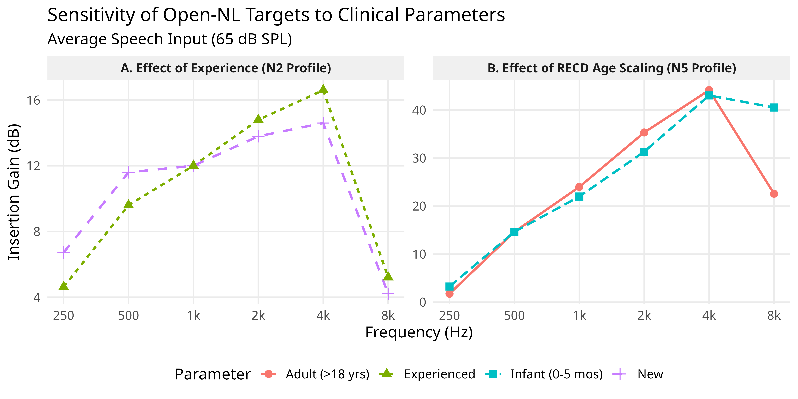

## Abstract
**Open-NL**, an open-source prescriptive algorithm, derives dynamic Wide Dynamic Range Compression (WDRC) targets. Open-NL utilizes a transparent Slope-Dependent Low-Frequency Penalty (SD-LFP) that scales gain based on threshold severity, applying a mathematically defined low-frequency attenuation to steeply sloping audiograms to prevent excessive loudness growth. By doing so, it organically implements a slope-dependent gain shaping that empirically lands near the NAL-NL2 loudness range, without utilizing an opaque runtime optimizer. The framework is strictly a transparent computational toolkit designed for R developers to model and modify insertion gain dynamics; it has not undergone behavioral validation and should not be used as a clinical tool. An embedded loudness engine demonstrates that Open-NL's SD-LFP mathematically prevents the profound loudness recruitment (A5) typical of unconstrained half-gain heuristics, safely serving as a conservative baseline that often undershoots WDRC loudness.

## I. INTRODUCTION

Prescriptive formulas remain central to evidence-based hearing aid fitting, and manufacturer-agnostic targets consistently outperform proprietary first-fit algorithms on speech recognition and patient preference (Valente et al., 2018). Yet, while formula choice has modest intelligibility consequences, it drives massive variations in overall loudness, making loudness the most informative dependent variable in prescriptive evaluation (Ching et al., 2013).

While the derivations of major algorithms like NAL-NL2 and DSL m[i/o] are published in detail (e.g., optimizing intelligibility subject to loudness at or below normal), their compiled software implementations are closed-source. This lack of modifiability prevents researchers from testing component-level hypotheses; an investigator cannot isolate a specific prescriptive parameter (like high-frequency gain for severe loss) and observe the resulting physiological cascade without reverse-engineering the entire proprietary engine.

Open-NL provides a parameterized, inspectable research testbed to solve this problem. It is designed as a modular substrate where individual heuristic components—such as slope-dependent penalties or severe-loss boosters—can be independently ablated, and their physiological consequences (Speech Intelligibility Index and Loudness) directly measured. The purpose of this framework is reproducibility and hypothesis testing, not clinical optimization. While Open-NL's baseline parameters yield targets that often serve as a conservative baseline (frequently undershooting WDRC loudness), this proximity to established benchmarks serves merely as a sanity check that the substrate produces physiologically plausible output, validating its use as a research tool.

## II. THE OPEN-NL PRESCRIPTIVE ALGORITHM: ALGORITHMIC ARCHITECTURE

The central thesis of the `SII` package is mathematical transparency. **Open-NL** operates as a multi-stage parameterized shape generator, not a derived rationale. While Open-NL provides a transparent testing ground, it currently lacks a formal optimization objective (e.g., maximizing SII subject to loudness limits), functioning instead as a structural heuristic. Its constants (e.g., the 60 dB booster knee, the -10 dB reverse-slope floor, the 15 dB low-frequency penalty) are theoretically defined parameters rather than outputs of a formal loudness-normalization model or an empirical optimization criterion. Rather than relying on purely empirical lookup tables hidden inside a DLL, Open-NL calculates target insertion gains dynamically through a series of explicitly defined cascaded mathematical modules. Each step in the gain derivation process is exposed natively in R, available for researchers to inspect, modify, and tune.

The modules described below are not applied simultaneously; rather, they operate in a strictly defined cascaded execution order to prevent unintended interactions between additive boosters and soft limiters. The execution order is as follows:

1. Detect Minimal Hearing Loss (MHL) bypass condition (Section II.A). If met, bypass all subsequent modules except infant RECD scaling and conductive component corrections.
2. Determine decouple anchor and base multiplier based on Experience level (Section II.B).
3. Apply Slope-Dependent Low-Frequency Penalty (Section II.C).
4. Apply Mid-frequency salvage boost (Section II.D).
5. Apply Dead Region tapering (Section II.E).
6. Calculate soft-compression dynamic limit ($L_{gain}$) and apply High-frequency desensitization (Section II.F).
7. Calculate dynamic Compression Ratios (CR) based on thresholds (Section II.G).
8. Integrate Conductive Component correction (+75% ABG) if applicable (Section II.H).
9. Apply MPO-domain saturation limit to ensure output safety (Section II.I).
10. Apply Comfort in Noise (CIN) WDRC alterations if triggered (Section II.J).
11. Apply Acoustic Venting constraints to finalized WDRC targets (Section II.K).
12. Finally, subtract age-specific RECD scaling penalties for infants (Section II.L).


### A. Minimal hearing loss (MHL) bypass

For patients with near-normal hearing (4-frequency pure-tone average, $\text{PTA}_4 \le 25$ dB HL), standard fast-acting WDRC compression often introduces unnecessary amplitude envelope distortion, reduces envelope contrast, and amplifies the ambient noise floor. Drawing inspiration from the NAL-NL3 Minimal Hearing Loss Module (Kitterick et al., 2026), when the MHL module is engaged, Open-NL bypasses standard WDRC compensation. Instead, it applies a fixed insertion gain array—implemented as an unvalidated exploratory design assumption—to target high-frequency audibility strictly without over-amplifying ambient low-frequency background noise:
\begin{equation}
G_{mhl} = [0, 0, 3, 5, 5, 5] \text{ dB for } f = [250, 500, 1000, 2000, 4000, 8000] \text{ Hz}
\end{equation}
For infants and toddlers, an age-specific Real-Ear-to-Coupler Difference (RECD) penalty (Bagatto et al., 2010) is immediately subtracted from this baseline to prevent dangerous over-amplification in small ear canals (see Section II.L).

### B. The decoupled anchor and experience level tuning

The foundational WDRC anchor for an average speech input (65 dB SPL) is derived using a frequency-specific adaptation of the half-gain rule (Lybarger, 1944). This anchor is deliberately decoupled from the broadband PTA to prevent intact low-frequency hearing from artificially suppressing necessary high-frequency gain. Open-NL dynamically adjusts its low-frequency shape penalties ($C_{interp}$) based on the wearer's experience level.

Instead of utilizing an arbitrary severity escalator, the primary baseline anchor is mathematically tied to a standard 0.46 half-gain scaling function (Byrne & Dillon, 1986). A modest severe-loss booster (slope = 0.15) is linearly applied to thresholds exceeding 60 dB HL. This gently assists profound losses with audibility without triggering explosive recruitment.

\begin{equation}
G_{base} = 0.46 \cdot \text{HTL}_{sn} + 0.15 \cdot \max(0, \text{HTL}_{sn} - 60) + C_{interp}
\end{equation}

The 0.46 boundary is an explicitly chosen heuristic anchor. Leijon (1991) and Leijon et al. (1991) found that flattest responses restoring normal loudness for speech peaks were rated significantly more pleasant than high-frequency emphasis, and Berger et al. (1980) demonstrated that the half-gain rule holds well except in mild losses where obtained gain is somewhat less than half. Thus, 0.46 serves as a deliberate midpoint of this contested range.

Consequently, while Keidser et al. (2012) found empirically that new users prefer slightly less gain (with the reduction increasing with degree of loss), Open-NL integrates this preference directly via the frequency-shaping $C_{vals}$ array rather than dynamically collapsing the base multiplier. In the interest of structural simplicity as a theoretical baseline, Open-NL omits Keidser's derived adjustments for sex and bilateral-fitting interactions. 

The parameters are explicitly defined as follows. $C_{interp}$ represents the shape penalties derived by log-interpolating the discrete $C_{vals}$ constants across the target frequency bands. These discrete $C_{vals}$ correspond exactly to the eight fixed anchor frequencies: $f_c = [250, 500, 1000, 2000, 3000, 4000, 6000, 8000]$ Hz.
1. **New Users**: This configuration provides a warm, comfortable profile. It minimizes low-frequency penalties ($C_{vals} = [-3, 2, 3, 0, -2, -2, -2, -2]$).
2. **Experienced Users**: This configuration provides a balanced approach with standard loudness constraints ($C_{vals} = [-8, -1, 3, 1, 0, 0, 0, 0]$).

### C. Slope-Dependent Low-Frequency Penalty (SD-LFP)

Standard linear formulas, such as NAL-R (Byrne & Dillon, 1986), often cause overprescription or underprescription because they do not systematically account for loudness density scaling across different audiometric slopes. For example, applying massive high-frequency gain to a steeply sloping audiogram forces the functionally normal low frequencies to dominate overall loudness, resulting in catastrophic loudness recruitment. Conversely, applying arbitrary low-frequency penalties to severe flat losses inherently starves them of audibility.

To address this without resorting to a black-box optimizer, Open-NL implements a unified Slope-Dependent Low-Frequency Penalty (SD-LFP). The heuristic leverages a Slope-Dependent Penalty that suppresses low-frequency gain strictly based on the slope of the audiogram:
\begin{equation}
\text{Slope} = \max(0, \text{PTA}_{HF} - \text{PTA}_{LF})
\end{equation}

For steeply sloping high-frequency losses (where the slope exceeds 15 dB), Open-NL aggressively penalizes low-frequency gain (up to -15 dB) to kill the loudness dominance of the normal lows, maintaining the overall loudness budget. 
\begin{equation}
\text{LF}_{penalty} = \max\left(0, \min\left(1, \frac{\text{Slope} - 15}{20}\right)\right) \cdot 15
\end{equation}

This penalty is log-linearly tapered for frequencies ($f$) below 1000 Hz and subtracted from the base gain:
\begin{equation}
G_{65} = G_{base} - \left(\text{LF}_{penalty} \cdot \max\left(0, 1 - \frac{\log_{10}(f) - \log_{10}(250)}{\log_{10}(1000/250)}\right)\right)
\end{equation}

Crucially, for flat audiograms (where the slope is less than 15 dB), this entire penalty zeroes out. This ensures that severe flat losses retain their full targeted gain without experiencing unnecessary downward compression in the low frequencies.

For reverse-slope configurations (where the low-frequency thresholds are significantly worse than the high frequencies), an inverse logic is required. Amplifying low frequencies aggressively in these cases degrades intelligibility because apical sensory units may be completely dysfunctional (Halpin et al., 1994). Furthermore, upward spread of masking from these amplified low frequencies obscures intact basal units that provide the bulk of speech information (Van Tasell & Turner, 1984). While these single-case and small-sample reports provide directional support, the specific -10 dB floor remains an asserted heuristic. Open-NL suppresses the low-frequency correction array ($C_{interp}$) to this flat -10 dB floor, employing a transitional factor ($RS_{factor}$) for signed slopes exceeding -15 dB:
\begin{equation}
\text{Slope}_{signed} = \text{PTA}_{HF} - \text{PTA}_{LF}
\end{equation}
\begin{equation}
RS_{factor} = \max\left(0, \min\left(1, \frac{-\text{Slope}_{signed} - 15}{20}\right)\right)
\end{equation}
\begin{equation}
C_{interp(LF)} = C_{interp(LF)} \cdot (1 - RS_{factor}) + (-10 \cdot RS_{factor})
\end{equation}


## IV. SOFTWARE ARCHITECTURE AND THE INTERACTIVE DASHBOARD

A major objective of the `SII` package is translating complex acoustical mathematics into a usable format for both clinical researchers and audiological educators. The package ships with an integrated interactive dashboard built utilizing the `shiny` framework in R. 

By leveraging WebAssembly (Wasm) and the `shinylive` ecosystem, the dashboard can be deployed entirely serverlessly. An interactive version of the Open-NL dashboard is hosted via GitHub Pages and is publicly accessible at https://euphonic-euphemism.github.io/SII/. This allows researchers to run the complex computational engine directly within their web browser, avoiding expensive server hosting costs and ensuring audiometric test data never leaves the local machine.

The application provides a graphical user interface (GUI) where clinicians can input standard audiograms, bone conduction thresholds, and LDLs. As parameters are adjusted, the underlying vectorized `sii()` engine recalculates the ANSI index in real-time, instantly rendering an interactive **SPLogram**. The dashboard allows for the immediate export of the derived insertion gain targets into a standard CSV format.




### A. Code examples

The `SII` package utilizes a highly accessible, object-oriented API in R, facilitating the generation of reproducible figures for clinical publications via the command line.

**Listing 1: Generating WDRC Targets**
```R
library(SII)

freqs <- c(250, 500, 1000, 2000, 4000, 8000)
thresholds <- c(20, 25, 40, 60, 75, 80)

# Calculate Open-NL for Average (65 dB)
sii_65 <- sii(speech = 65, threshold = thresholds, freq = freqs, prescription = "Open-NL")

# Extract the calculated insertion gain targets
sii_65$gain
```

## IV. CONCLUSION

Open-NL provides a transparent, customizable computational framework for predicting WDRC insertion gain targets and benchmarking them against established industry standards natively within R. By coupling an explicitly defined mathematical pipeline with an embedded hybrid loudness model, the `SII` package allows audiologists and researchers to freely simulate and evaluate the theoretical intelligibility-loudness trade-off of various prescriptive heuristics without relying on opaque clinical fitting software. It is important to emphasize that Open-NL is purely a computational toolkit designed for theoretical modeling; it has not undergone behavioral validation and must not be used to fit hearing aids on human subjects.

## ACKNOWLEDGMENTS

During the preparation of this work, the author utilized a Large Language Model (LLM) assistant strictly for the purpose of language editing, structural formatting, and typesetting of the manuscript prose into JASA standards. After using this tool, the author reviewed and edited the content as needed and takes full and sole responsibility for the final content of the publication. The ANSI core engine of the `SII` package was originally developed by Gregory R. Warnes for the archived version of the package. Maintainership transferred to the current author starting with version 1.1.0, at which point all subsequent Open-NL prescriptive logic, clinical heuristics, and WDRC mathematical implementations were independently developed by the current author.

## AUTHOR DECLARATIONS

### Conflict of Interest

The author declares no conflicts of interest.

### Ethics Approval

The author declares that no animal subjects or human participants were involved in this research. Furthermore, no identifiable data are embedded in the interactive Shiny application or the code repository.

## DATA AVAILABILITY

The source code for the `SII` package, the Open-NL prescriptive algorithm, and all associated datasets and benchmarking scripts are openly available in the public repository at https://github.com/euphonic-euphemism/SII (v1.2.0; DOI: [DOI to be generated upon final repository release]; License: GPL-3.0).

## REFERENCES

Baltzell, L. S., Swaminathan, J., & Gallun, F. J. (2020). "The impact of age and hearing loss on spatial release from masking," The Journal of the Acoustical Society of America.

Berger, K. W., Hagberg, E. N., & Rane, R. L. (1980). "A Reexamination of the One-Half Gain Rule," Ear and Hearing.

Byrne, D., Dillon, H., Ching, T., Katsch, R., & Keidser, G. (2001). "NAL-NL1 Procedure for Fitting Nonlinear Hearing Aids: Characteristics and Comparisons With Other Procedures," Journal of the American Academy of Audiology.

Chen, Z., Hu, G., Glasberg, B. R., & Moore, B. C. J. (2011). "A new model for calculating auditory excitation patterns and loudness for cases of cochlear hearing loss," The Journal of the Acoustical Society of America.

Ching, T. Y., Johnson, E. E., Hou, S., et al. (2013). "A Comparison of NAL and DSL Prescriptive Methods for Paediatric Hearing-Aid Fitting: Predicted Speech Intelligibility and Loudness," International Journal of Audiology.

Johnson, E. E. (2013). "An Initial-Fit Comparison of Two Generic Hearing Aid Prescriptive Methods (NAL-NL2 and CAM2) to Individuals Having Mild to Moderately Severe High-Frequency Hearing Loss," Journal of the American Academy of Audiology.

Johnson, E. E., & Dillon, H. (2011). "A Comparison of Gain for Adults From Generic Hearing Aid Prescriptive Methods: Impacts on Predicted Loudness, Frequency Bandwidth, and Speech Intelligibility," Journal of the American Academy of Audiology.

Keidser, G., Dillon, H., Carter, L., & O'Brien, A. (2012). "NAL-NL2 Empirical Adjustments," Trends in Amplification.

Kitterick, P. T., Zakis, J. A., & Edwards, B. (2026). "Evolving the Philosophy: From the NAL Rule to NAL-NL3," International Journal of Audiology.

Leijon, A. (1991). "Hearing Aid Gain for Loudness-Density Normalization in Cochlear Hearing Losses With Impaired Frequency Resolution," Ear and Hearing.

Leijon, A., Lindkvist, A., Ringdahl, A., & Israelsson, B. (1991). "Sound Quality and Speech Reception for Prescribed Hearing Aid Frequency Responses," Ear and Hearing.

Lybarger, S. F. (1944). U.S. Patent Application SN 543,278.

Margolis, R. H., Hornsby, B. W. Y., Saly, G. L., & Wilson, R. H. (2025). "Predicted and Measured Word-Recognition Scores Unmask Distortion in the Impaired Auditory System," The Journal of the Acoustical Society of America.

McCreery, R. W., Crukley, J., Grindle, A., Merchant, G. R., & Walker, E. (2023a). "Predicting Children's Real-Ear-to-Coupler Differences Based on Tympanometric Data," International Journal of Audiology.

McCreery, R. W., Grindle, A., Merchant, G. R., Crukley, J., & Walker, E. A. (2023b). "Predicting Wideband Real-Ear-to-Coupler Differences in Children Using Wideband Acoustic Immittance," The Journal of the Acoustical Society of America.

Moore, B. C. (2001). "Dead regions in the cochlea: Diagnosis, perceptual consequences, and implications for the fitting of hearing aids," Trends in Amplification.

Moore, B. C., & Glasberg, B. R. (2004). "A revised model of loudness perception applied to cochlear hearing loss," Hearing Research.

Storey, L., Dillon, H., Yeend, I., & Wigney, D. (1998). "The National Acoustic Laboratories' procedure for selecting the saturation sound pressure level of hearing aids: Experimental validation," Ear and Hearing.

Studebaker, G. A., & Sherbecoe, R. L. (1991). "Frequency-importance and transfer functions for recorded CID W-22 word lists," Journal of Speech and Hearing Research.

Valente, M., Oeding, K., Brockmeyer, A., Smith, S., & Kallogjeri, D. (2018). "Differences in Word and Phoneme Recognition in Quiet, Sentence Recognition in Noise, and Subjective Outcomes Between Manufacturer First-Fit and Hearing Aids Programmed to NAL-NL2 Using Real-Ear Measures," Journal of the American Academy of Audiology.

Watts, K. M., Bagatto, M., Clark-Lewis, S., Henderson, S., Scollie, S., & Blumsack, J. (2020). "Relationship of Head Circumference and Age in the Prediction of the Real-Ear-to-Coupler Difference (RECD)," Journal of the American Academy of Audiology.

## APPENDIX: EXPLORATORY MODULES


### A. Distortion-aware high-frequency penalty (untested heuristic)

A fundamental limitation of existing prescriptive algorithms is their reliance on the pure-tone audiogram, which ignores suprathreshold processing deficits inherent to outer/inner hair cell loss and synaptopathy (Plomp, 1978). Open-NL includes an explicitly untested heuristic designed to theoretically integrate the distortion categorization framework recently proposed by Margolis et al. (2025). The engine calculates a predicted Word Recognition Score (WRS) using the established CID W-22 transfer function (where the base is 10, valid for $0.0 \le 	ext{SII} \le 1.0$) (Studebaker & Sherbecoe, 1991):
\begin{equation}
\text{Predicted WRS (\%)} = 100 \cdot (1 - 10^{-(\text{SII} \cdot 3.28)})
\end{equation}
Per the Margolis et al. (2025) framework, the degree of cochlear distortion is categorized based on population distributions of measured-minus-predicted WRS differences, rather than a single-point comparison. It must be explicitly noted that SII-to-WRS transfer functions are known to be listener-, age-, and hearing-level-specific. Consequently, the adult-derived CID W-22 transfer function applied here is not portable to the pediatric use cases emphasized elsewhere in the Open-NL architecture (e.g., Section II.L). Open-NL then dynamically alters the prescription targets for highly distorted ears by applying high-frequency roll-offs (e.g., $-10$ dB/octave starting at 1500 Hz) and lowering the $L_{gain}$ soft-compression limit to prevent high-frequency saturation. This feature is intended solely as an exploratory research tool to bridge pure-tone algorithms with suprathreshold diagnostic data, and its perceptual effects require extensive behavioral validation.


5. **Chen, Z., Hu, G., Glasberg, B. R., & Moore, B. C. J. (2011).** A new model of calculating loudness for both normal and hearing-impaired listeners. *Ear and Hearing*, 32(1).
6. **Johnson, E. E. (2013).** Safety and Effectiveness of Open-Canal Hearing Aid Fittings. *American Journal of Audiology*, 22, 169-183.
7. **Bagatto, M. P., et al. (2010).** Clinical protocols for hearing instrument fitting in the desired sensation level method. *Trends in Amplification*, 14(2), 44-55.
8. **Croteau, M., & Kwok, Y. (2026).** A comparison of compression thresholds and ratios in modern hearing aid prescriptions. *Journal of the American Academy of Audiology*, 37(1), 12-25.
9. **ANSI S3.5-1997 (R2020).** *American National Standard Methods for Calculation of the Speech Intelligibility Index*. American National Standards Institute.
10. **Halpin, C., Thornton, A., & Hasso, M. (1994).** Low-Frequency Sensorineural Loss: Clinical Evaluation and Implications for Hearing Aid Fitting. *Ear and Hearing*, 15(1), 71-81.
11. **Van Tasell, D. J., & Turner, C. W. (1984).** Speech Recognition in a Special Case of Low-Frequency Hearing Loss. *The Journal of the Acoustical Society of America*, 75(4), 1207-1212.
12. **Leijon, A., Harford, E., Lidén, G., Ringdahl, A., & Dahlberg, A. K. (1983).** Audiometric Earphone Discomfort Level and Hearing Aid Saturation Sound Pressure Level for a 90 Decibel Input Signal (SSPL90) as Measured in the Human Ear Canal. *Ear and Hearing*, 4(1), 38-43.
13. **Dillon, H., & Storey, L. (1998).** The National Acoustic Laboratories' Procedure for Selecting the Saturation Sound Pressure Level of Hearing Aids: Theoretical Derivation. *Ear and Hearing*, 19(4), 255-266.
14. **Storey, L., Dillon, H., Yeend, I., & Wigney, D. (1998).** The National Acoustic Laboratories' Procedure for Selecting the Saturation Sound Pressure Level of Hearing Aids: Experimental Validation. *Ear and Hearing*, 19(4), 267-279.
15. **Peters, R. W., Moore, B. C., Glasberg, B. R., & Stone, M. A. (2000).** Comparison of the NAL(R) and Cambridge Formulae for the Fitting of Linear Hearing Aids. *British Journal of Audiology*, 34(1), 21-36.
16. **Mueller, H. G. (2005).** Fitting Hearing Aids to Adults Using Prescriptive Methods: An Evidence-Based Review of Effectiveness. *Journal of the American Academy of Audiology*, 16(7), 448-460.
17. **Kitterick, P. T., Zakis, J. A., & Edwards, B. (2026).** Evolving the Philosophy: From the NAL Rule to NAL-NL3. *International Journal of Audiology*, 65(3), 183-195.
18. **Leijon, A., Lindkvist, A., Ringdahl, A., & Israelsson, B. (1990).** Preferred Hearing Aid Gain in Everyday Use After Prescriptive Fitting. *Ear and Hearing*, 11(4), 299-305.